# Neural Networks, End to End

### From gradient descent to a served language model, plus the tools that make it fast, cheap, and small

*Twenty-one parts, 144 sections, built from first principles — with every worked
number re-derived and the ones that didn't reconcile listed in Appendix A.*

---

## How to read this

This is a reference, not a linear course. Nobody reads 144 sections in order.

**If you're starting cold,** read Parts I and II, then stop. They're the only
parts that are genuinely prerequisite to everything else. Everything after them
is the same five-step loop wearing different clothes.

**If you're looking something up,** use the table of contents. Sections are
self-contained and cross-referenced by number, so `§33` means section 33
regardless of which part it lives in.

**If you want the arguments rather than the mechanics,** read the Prologue, then
§6, §31, §41, §53 and §61. Those five carry the conceptual turns: a network is a
nested function; attention is communication; the base model is a parrot; absolute
rewards are the wrong question; optimising a proxy creates an adversary.

**Read Appendix A before you trust any specific number.** Every worked example in
these notes was re-derived rather than transcribed. Most reconciled. The ones that
didn't are listed there, along with the places where the source material is
accurate about 2019 and wrong about now.

**Appendix E is a different kind of appendix.** Everything else in this book is
technical content that doesn't go stale. Appendix E — interview patterns and how
hiring loops are changing — is current as of when it was researched and will age
faster than anything else here. Treat it as a starting map, not a fixed reference,
and re-check before it matters.

### Conventions

| Symbol | Meaning |
|---|---|
| `§N` | section N of this book |
| `(B, T, C)` | batch, sequence length, channels — the shape that recurs everywhere |
| **bold** in a table | the value or row that carries the point |
| Appendix A, *correction N* | an outright error in the source material |
| Appendix A, *gotcha N* | correct but incomplete — a trap in practice |
| Appendix A, *modern practice N* | accurate for its era, superseded since |

**Diagrams use Mermaid syntax** — plain text inside a fenced code block that renders as
a real diagram in GitHub, Obsidian, VS Code, and Typora. Where a viewer doesn't render
Mermaid, the block still reads as structured text describing the same flow, so nothing
is lost — just less pretty.

Code is PyTorch. Maths is written the way it's said aloud, not the way it's
typeset in papers.

### The twenty-one parts

| Part | Covers | Sections |
|---|---|---|
| **I** | How learning actually works — the maths, by hand | §1–11 |
| **II** | How PyTorch implements it — the API | §12–20 |
| **III** | How that loop becomes an LLM — pre-training | §21–28 |
| **IV** | What's inside the box — the transformer | §29–40 |
| **V** | Turning a predictor into an assistant — SFT | §41–47 |
| **VI** | Teaching it to judge, not just imitate — DPO | §48–55 |
| **VII** | The other road from the same data — RLHF / PPO | §56–65 |
| **VIII** | Making generation fast — the KV cache | §66–70 |
| **IX** | Attention, two more angles — width and masking made concrete | §71–73 |
| **X** | Position as rotation — RoPE | §74–79 |
| **XI** | FlashAttention — same math, different order | §80–86 |
| **XII** | Quantization — fewer bits, same model | §87–92 |
| **XIII** | LoRA — fine-tuning without touching most of the weights | §93–96 |
| **XIV** | Diffusion models — the other kind of generative model | §97–102 |
| **XV** | On-policy distillation — a cheaper alignment path | §103–108 |
| **XVI** | GPU hardware and training economics — what it actually costs | §109–114 |
| **XVII** | Classical architectures — CNNs and RNNs/LSTMs | §115–120 |
| **XVIII** | Recommendation systems, ranking, and search | §121–126 |
| **XIX** | A/B testing and evaluation methodology | §127–132 |
| **XX** | Distributed systems fundamentals | §133–138 |
| **XXI** | Coding interview fundamentals | §139–144 |

Parts I–V are one pipeline, read in order. Parts VI and VII are two different
destinations from the *same* preference dataset — DPO folds the reward into the
loss, RLHF trains an explicit judge and optimises against it. Part VIII returns
to Part IV's architecture and fixes the one thing it does badly. Parts IX–XI
revisit and sharpen Part IV's attention mechanism from different angles. Parts
XII–XIII are efficiency techniques applied on top of everything before them.
Part XIV is a different generative architecture entirely — included because the
same five-step loop and the same "predict the noise/token, not the answer"
reframing turn up inside it. Part XV is an alternative to Part VII's RLHF for the
same alignment goal. Part XVI is the hardware and cost layer underneath all of it.
Parts XVII–XXI are a deliberate change in register: not the mechanics of training
a language model, but the classical-ML, systems, evaluation, and coding breadth
that surrounds it in an actual hiring loop — added specifically because Appendix E
named them as gaps, and a listed gap is worth closing rather than just noting.

---

## Table of Contents
&nbsp;&nbsp;&nbsp;&nbsp;[Prologue — The Universal Pattern](#prologue-the-universal-pattern)  

**[PART I — THE LEARNING ALGORITHM](#part-i-the-learning-algorithm)**

&nbsp;&nbsp;&nbsp;&nbsp;[1. Two intuitions that carry the whole subject](#1-two-intuitions-that-carry-the-whole-subject)  
&nbsp;&nbsp;&nbsp;&nbsp;[2. Gradient descent in one dimension](#2-gradient-descent-in-one-dimension)  
&nbsp;&nbsp;&nbsp;&nbsp;[3. The local minima problem (and why it doesn't bite)](#3-the-local-minima-problem-and-why-it-doesnt-bite)  
&nbsp;&nbsp;&nbsp;&nbsp;[4. Partial derivatives — a million knobs](#4-partial-derivatives-a-million-knobs)  
&nbsp;&nbsp;&nbsp;&nbsp;[5. The chain rule — the central difficulty, solved](#5-the-chain-rule-the-central-difficulty-solved)  
&nbsp;&nbsp;&nbsp;&nbsp;&nbsp;&nbsp;&nbsp;&nbsp;[Path 1: `∂f/∂x₁`](#path-1-fx₁)  
&nbsp;&nbsp;&nbsp;&nbsp;&nbsp;&nbsp;&nbsp;&nbsp;[Path 2: `∂f/∂x₂` — the trickier one](#path-2-fx₂-the-trickier-one)  
&nbsp;&nbsp;&nbsp;&nbsp;[6. The key insight: a network *is* a nested function](#6-the-key-insight-a-network-is-a-nested-function)  
&nbsp;&nbsp;&nbsp;&nbsp;&nbsp;&nbsp;&nbsp;&nbsp;[What are the variables?](#what-are-the-variables)  
&nbsp;&nbsp;&nbsp;&nbsp;[7. Worked example — building and running a tiny brain](#7-worked-example-building-and-running-a-tiny-brain)  
&nbsp;&nbsp;&nbsp;&nbsp;&nbsp;&nbsp;&nbsp;&nbsp;[Architecture](#architecture)  
&nbsp;&nbsp;&nbsp;&nbsp;&nbsp;&nbsp;&nbsp;&nbsp;[Forward pass, example 1 — pure calculation, no learning](#forward-pass-example-1-pure-calculation-no-learning)  
&nbsp;&nbsp;&nbsp;&nbsp;&nbsp;&nbsp;&nbsp;&nbsp;[All three examples](#all-three-examples)  
&nbsp;&nbsp;&nbsp;&nbsp;&nbsp;&nbsp;&nbsp;&nbsp;[Why square the errors?](#why-square-the-errors)  
&nbsp;&nbsp;&nbsp;&nbsp;[8. Backpropagation by hand — the blame game on real weights](#8-backpropagation-by-hand-the-blame-game-on-real-weights)  
&nbsp;&nbsp;&nbsp;&nbsp;&nbsp;&nbsp;&nbsp;&nbsp;[Start at the end — the one gradient everything reuses](#start-at-the-end-the-one-gradient-everything-reuses)  
&nbsp;&nbsp;&nbsp;&nbsp;&nbsp;&nbsp;&nbsp;&nbsp;[Suspect 1: `w₅` — short, direct path](#suspect-1-w₅-short-direct-path)  
&nbsp;&nbsp;&nbsp;&nbsp;&nbsp;&nbsp;&nbsp;&nbsp;[Suspect 2: `w₁` — buried deep](#suspect-2-w₁-buried-deep)  
&nbsp;&nbsp;&nbsp;&nbsp;&nbsp;&nbsp;&nbsp;&nbsp;[Stop and look at what just happened](#stop-and-look-at-what-just-happened)  
&nbsp;&nbsp;&nbsp;&nbsp;&nbsp;&nbsp;&nbsp;&nbsp;[The full gradient cascade](#the-full-gradient-cascade)  
&nbsp;&nbsp;&nbsp;&nbsp;[9. The update — and did it actually work?](#9-the-update-and-did-it-actually-work)  
&nbsp;&nbsp;&nbsp;&nbsp;&nbsp;&nbsp;&nbsp;&nbsp;[Second forward pass with the new weights](#second-forward-pass-with-the-new-weights)  
&nbsp;&nbsp;&nbsp;&nbsp;[10. Learning from all the data — online vs batch vs mini-batch](#10-learning-from-all-the-data-online-vs-batch-vs-mini-batch)  
&nbsp;&nbsp;&nbsp;&nbsp;&nbsp;&nbsp;&nbsp;&nbsp;[What a batch update does](#what-a-batch-update-does)  
&nbsp;&nbsp;&nbsp;&nbsp;[11. What actually changes at scale](#11-what-actually-changes-at-scale)  

**[PART II — THE PYTORCH IMPLEMENTATION](#part-ii-the-pytorch-implementation)**

&nbsp;&nbsp;&nbsp;&nbsp;[12. Tensors — the only data structure](#12-tensors-the-only-data-structure)  
&nbsp;&nbsp;&nbsp;&nbsp;&nbsp;&nbsp;&nbsp;&nbsp;[Three creation patterns](#three-creation-patterns)  
&nbsp;&nbsp;&nbsp;&nbsp;&nbsp;&nbsp;&nbsp;&nbsp;[Three attributes you'll check constantly](#three-attributes-youll-check-constantly)  
&nbsp;&nbsp;&nbsp;&nbsp;[13. Autograd — Part I, automated](#13-autograd-part-i-automated)  
&nbsp;&nbsp;&nbsp;&nbsp;&nbsp;&nbsp;&nbsp;&nbsp;[The computation graph](#the-computation-graph)  
&nbsp;&nbsp;&nbsp;&nbsp;&nbsp;&nbsp;&nbsp;&nbsp;[`.grad_fn` — proof the graph exists](#gradfn-proof-the-graph-exists)  
&nbsp;&nbsp;&nbsp;&nbsp;[14. Operations — the verbs](#14-operations-the-verbs)  
&nbsp;&nbsp;&nbsp;&nbsp;&nbsp;&nbsp;&nbsp;&nbsp;[`*` vs `@` — the classic trap](#vs-the-classic-trap)  
&nbsp;&nbsp;&nbsp;&nbsp;&nbsp;&nbsp;&nbsp;&nbsp;[Reductions and `dim`](#reductions-and-dim)  
&nbsp;&nbsp;&nbsp;&nbsp;&nbsp;&nbsp;&nbsp;&nbsp;[Indexing: basic → argmax → gather](#indexing-basic-argmax-gather)  
&nbsp;&nbsp;&nbsp;&nbsp;[15. Steps 1–2 in PyTorch — forward pass and loss](#15-steps-12-in-pytorch-forward-pass-and-loss)  
&nbsp;&nbsp;&nbsp;&nbsp;&nbsp;&nbsp;&nbsp;&nbsp;[One line replaces all of §8](#one-line-replaces-all-of-8)  
&nbsp;&nbsp;&nbsp;&nbsp;&nbsp;&nbsp;&nbsp;&nbsp;[Reading a gradient — the sign is everything](#reading-a-gradient-the-sign-is-everything)  
&nbsp;&nbsp;&nbsp;&nbsp;[16. Steps 3–5 — the manual loop](#16-steps-35-the-manual-loop)  
&nbsp;&nbsp;&nbsp;&nbsp;&nbsp;&nbsp;&nbsp;&nbsp;[Two details that break everything if skipped](#two-details-that-break-everything-if-skipped)  
&nbsp;&nbsp;&nbsp;&nbsp;&nbsp;&nbsp;&nbsp;&nbsp;[Convergence](#convergence)  
&nbsp;&nbsp;&nbsp;&nbsp;[17. Going professional — `nn.Module` and `torch.optim`](#17-going-professional-nnmodule-and-torchoptim)  
&nbsp;&nbsp;&nbsp;&nbsp;&nbsp;&nbsp;&nbsp;&nbsp;[`nn.Linear`](#nnlinear)  
&nbsp;&nbsp;&nbsp;&nbsp;&nbsp;&nbsp;&nbsp;&nbsp;[The module pattern — always the same three moves](#the-module-pattern-always-the-same-three-moves)  
&nbsp;&nbsp;&nbsp;&nbsp;&nbsp;&nbsp;&nbsp;&nbsp;[The optimizer and the final loop](#the-optimizer-and-the-final-loop)  
&nbsp;&nbsp;&nbsp;&nbsp;[18. Activation functions — adding the kinks](#18-activation-functions-adding-the-kinks)  
&nbsp;&nbsp;&nbsp;&nbsp;[19. The actual LLM building blocks](#19-the-actual-llm-building-blocks)  
&nbsp;&nbsp;&nbsp;&nbsp;&nbsp;&nbsp;&nbsp;&nbsp;[`nn.Embedding` — words → numbers](#nnembedding-words-numbers)  
&nbsp;&nbsp;&nbsp;&nbsp;&nbsp;&nbsp;&nbsp;&nbsp;[`nn.LayerNorm` — the traffic cop](#nnlayernorm-the-traffic-cop)  
&nbsp;&nbsp;&nbsp;&nbsp;&nbsp;&nbsp;&nbsp;&nbsp;[`nn.Dropout` — the anti-overfitting trick](#nndropout-the-anti-overfitting-trick)  
&nbsp;&nbsp;&nbsp;&nbsp;[20. The bridge — this is not an analogy](#20-the-bridge-this-is-not-an-analogy)  

**[PART III — FROM THE LOOP TO AN LLM](#part-iii-from-the-loop-to-an-llm)**

&nbsp;&nbsp;&nbsp;&nbsp;[21. The real bottleneck was data, not compute](#21-the-real-bottleneck-was-data-not-compute)  
&nbsp;&nbsp;&nbsp;&nbsp;[22. Self-supervised learning — make the data label itself](#22-self-supervised-learning-make-the-data-label-itself)  
&nbsp;&nbsp;&nbsp;&nbsp;[23. Why guessing the next word produces intelligence](#23-why-guessing-the-next-word-produces-intelligence)  
&nbsp;&nbsp;&nbsp;&nbsp;[24. Tokenization — text becomes numbers](#24-tokenization-text-becomes-numbers)  
&nbsp;&nbsp;&nbsp;&nbsp;&nbsp;&nbsp;&nbsp;&nbsp;[The two obvious approaches, and why both fail](#the-two-obvious-approaches-and-why-both-fail)  
&nbsp;&nbsp;&nbsp;&nbsp;&nbsp;&nbsp;&nbsp;&nbsp;[Subword tokenization — the actual solution](#subword-tokenization-the-actual-solution)  
&nbsp;&nbsp;&nbsp;&nbsp;&nbsp;&nbsp;&nbsp;&nbsp;[Final step — look up the IDs](#final-step-look-up-the-ids)  
&nbsp;&nbsp;&nbsp;&nbsp;&nbsp;&nbsp;&nbsp;&nbsp;[The dirty secret — why "how many R's in strawberry" fails](#the-dirty-secret-why-how-many-rs-in-strawberry-fails)  
&nbsp;&nbsp;&nbsp;&nbsp;[25. Logits → softmax → probabilities](#25-logits-softmax-probabilities)  
&nbsp;&nbsp;&nbsp;&nbsp;[26. Cross-entropy loss — measuring surprise](#26-cross-entropy-loss-measuring-surprise)  
&nbsp;&nbsp;&nbsp;&nbsp;[27. Generation — temperature and top-p](#27-generation-temperature-and-top-p)  
&nbsp;&nbsp;&nbsp;&nbsp;&nbsp;&nbsp;&nbsp;&nbsp;[Temperature — the creativity knob](#temperature-the-creativity-knob)  
&nbsp;&nbsp;&nbsp;&nbsp;&nbsp;&nbsp;&nbsp;&nbsp;[Top-p (nucleus sampling) — the quality filter](#top-p-nucleus-sampling-the-quality-filter)  
&nbsp;&nbsp;&nbsp;&nbsp;[28. Where pre-training ends](#28-where-pre-training-ends)  

**[PART IV — INSIDE THE BOX](#part-iv-inside-the-box)**

&nbsp;&nbsp;&nbsp;&nbsp;[29. The config — every knob in one place](#29-the-config-every-knob-in-one-place)  
&nbsp;&nbsp;&nbsp;&nbsp;[30. Embeddings — token identity plus position](#30-embeddings-token-identity-plus-position)  
&nbsp;&nbsp;&nbsp;&nbsp;&nbsp;&nbsp;&nbsp;&nbsp;[Why raw token IDs are useless](#why-raw-token-ids-are-useless)  
&nbsp;&nbsp;&nbsp;&nbsp;&nbsp;&nbsp;&nbsp;&nbsp;[The flaw that motivates everything after it](#the-flaw-that-motivates-everything-after-it)  
&nbsp;&nbsp;&nbsp;&nbsp;&nbsp;&nbsp;&nbsp;&nbsp;[Positional embeddings](#positional-embeddings)  
&nbsp;&nbsp;&nbsp;&nbsp;&nbsp;&nbsp;&nbsp;&nbsp;[Why adding them doesn't scramble everything](#why-adding-them-doesnt-scramble-everything)  
&nbsp;&nbsp;&nbsp;&nbsp;[31. Self-attention I — the intuition](#31-self-attention-i-the-intuition)  
&nbsp;&nbsp;&nbsp;&nbsp;&nbsp;&nbsp;&nbsp;&nbsp;[Q, K, V — three roles for every token](#q-k-v-three-roles-for-every-token)  
&nbsp;&nbsp;&nbsp;&nbsp;&nbsp;&nbsp;&nbsp;&nbsp;[Worked numbers](#worked-numbers)  
&nbsp;&nbsp;&nbsp;&nbsp;[32. Self-attention II — the linear algebra](#32-self-attention-ii-the-linear-algebra)  
&nbsp;&nbsp;&nbsp;&nbsp;&nbsp;&nbsp;&nbsp;&nbsp;[Why divide by √d_k?](#why-divide-by-dk)  
&nbsp;&nbsp;&nbsp;&nbsp;&nbsp;&nbsp;&nbsp;&nbsp;[The fused projection](#the-fused-projection)  
&nbsp;&nbsp;&nbsp;&nbsp;[33. The causal mask — no time travel](#33-the-causal-mask-no-time-travel)  
&nbsp;&nbsp;&nbsp;&nbsp;&nbsp;&nbsp;&nbsp;&nbsp;[The trick: −∞ before softmax](#the-trick-before-softmax)  
&nbsp;&nbsp;&nbsp;&nbsp;&nbsp;&nbsp;&nbsp;&nbsp;[`register_buffer`](#registerbuffer)  
&nbsp;&nbsp;&nbsp;&nbsp;[34. Multi-head attention — split, attend, merge](#34-multi-head-attention-split-attend-merge)  
&nbsp;&nbsp;&nbsp;&nbsp;[35. The MLP — the thinking layer](#35-the-mlp-the-thinking-layer)  
&nbsp;&nbsp;&nbsp;&nbsp;&nbsp;&nbsp;&nbsp;&nbsp;[Expand and contract](#expand-and-contract)  
&nbsp;&nbsp;&nbsp;&nbsp;&nbsp;&nbsp;&nbsp;&nbsp;[`nn.Linear` is genuinely just `y = xWᵀ + b`](#nnlinear-is-genuinely-just-y-xwᵀ-b)  
&nbsp;&nbsp;&nbsp;&nbsp;[36. The glue — residual connections and LayerNorm](#36-the-glue-residual-connections-and-layernorm)  
&nbsp;&nbsp;&nbsp;&nbsp;&nbsp;&nbsp;&nbsp;&nbsp;[The humble `+` sign](#the-humble-sign)  
&nbsp;&nbsp;&nbsp;&nbsp;&nbsp;&nbsp;&nbsp;&nbsp;[LayerNorm — the stabilizer](#layernorm-the-stabilizer)  
&nbsp;&nbsp;&nbsp;&nbsp;&nbsp;&nbsp;&nbsp;&nbsp;[Pre-norm vs post-norm](#pre-norm-vs-post-norm)  
&nbsp;&nbsp;&nbsp;&nbsp;[37. The Block — and depth vs width](#37-the-block-and-depth-vs-width)  
&nbsp;&nbsp;&nbsp;&nbsp;&nbsp;&nbsp;&nbsp;&nbsp;[Two different kinds of scale](#two-different-kinds-of-scale)  
&nbsp;&nbsp;&nbsp;&nbsp;[38. The output head and weight tying](#38-the-output-head-and-weight-tying)  
&nbsp;&nbsp;&nbsp;&nbsp;&nbsp;&nbsp;&nbsp;&nbsp;[Why T predictions instead of one?](#why-t-predictions-instead-of-one)  
&nbsp;&nbsp;&nbsp;&nbsp;&nbsp;&nbsp;&nbsp;&nbsp;[Weight tying](#weight-tying)  
&nbsp;&nbsp;&nbsp;&nbsp;[39. Training — the six-stage loop](#39-training-the-six-stage-loop)  
&nbsp;&nbsp;&nbsp;&nbsp;&nbsp;&nbsp;&nbsp;&nbsp;[The six stages, with B=2, T=4](#the-six-stages-with-b2-t4)  
&nbsp;&nbsp;&nbsp;&nbsp;[40. Generation — the autoregressive loop](#40-generation-the-autoregressive-loop)  
&nbsp;&nbsp;&nbsp;&nbsp;&nbsp;&nbsp;&nbsp;&nbsp;[The creative knobs](#the-creative-knobs)  

**[PART V — FROM PARROT TO ASSISTANT](#part-v-from-parrot-to-assistant)**

&nbsp;&nbsp;&nbsp;&nbsp;[41. The parrot problem](#41-the-parrot-problem)  
&nbsp;&nbsp;&nbsp;&nbsp;[42. Why the parrot exists — the loss made it that way](#42-why-the-parrot-exists-the-loss-made-it-that-way)  
&nbsp;&nbsp;&nbsp;&nbsp;&nbsp;&nbsp;&nbsp;&nbsp;[The parrot, stated mathematically](#the-parrot-stated-mathematically)  
&nbsp;&nbsp;&nbsp;&nbsp;[43. SFT — curated flashcards instead of a library](#43-sft-curated-flashcards-instead-of-a-library)  
&nbsp;&nbsp;&nbsp;&nbsp;[44. Chat templates and special tokens](#44-chat-templates-and-special-tokens)  
&nbsp;&nbsp;&nbsp;&nbsp;&nbsp;&nbsp;&nbsp;&nbsp;[The critical problem this creates](#the-critical-problem-this-creates)  
&nbsp;&nbsp;&nbsp;&nbsp;[45. Loss masking — the entire trick](#45-loss-masking-the-entire-trick)  
&nbsp;&nbsp;&nbsp;&nbsp;&nbsp;&nbsp;&nbsp;&nbsp;[The formal objective](#the-formal-objective)  
&nbsp;&nbsp;&nbsp;&nbsp;[46. The collator, in five steps](#46-the-collator-in-five-steps)  
&nbsp;&nbsp;&nbsp;&nbsp;&nbsp;&nbsp;&nbsp;&nbsp;[The training step is then trivial](#the-training-step-is-then-trivial)  
&nbsp;&nbsp;&nbsp;&nbsp;[47. What SFT achieves — and its built-in ceiling](#47-what-sft-achieves-and-its-built-in-ceiling)  
&nbsp;&nbsp;&nbsp;&nbsp;&nbsp;&nbsp;&nbsp;&nbsp;[The limitation](#the-limitation)  
&nbsp;&nbsp;&nbsp;&nbsp;&nbsp;&nbsp;&nbsp;&nbsp;[What comes next — preference tuning](#what-comes-next-preference-tuning)  

**[PART VI — LEARNING TO JUDGE](#part-vi-learning-to-judge)**

&nbsp;&nbsp;&nbsp;&nbsp;[48. The shades-of-grey problem](#48-the-shades-of-grey-problem)  
&nbsp;&nbsp;&nbsp;&nbsp;[49. Hidden quality scores and Bradley-Terry](#49-hidden-quality-scores-and-bradley-terry)  
&nbsp;&nbsp;&nbsp;&nbsp;[50. From probability to loss — and why the log](#50-from-probability-to-loss-and-why-the-log)  
&nbsp;&nbsp;&nbsp;&nbsp;&nbsp;&nbsp;&nbsp;&nbsp;[Why not just `loss = 1 − P`?](#why-not-just-loss-1-p)  
&nbsp;&nbsp;&nbsp;&nbsp;[51. The naive reward — and where the scores come from](#51-the-naive-reward-and-where-the-scores-come-from)  
&nbsp;&nbsp;&nbsp;&nbsp;[52. Implementing the score](#52-implementing-the-score)  
&nbsp;&nbsp;&nbsp;&nbsp;[53. Why the naive reward is catastrophic](#53-why-the-naive-reward-is-catastrophic)  
&nbsp;&nbsp;&nbsp;&nbsp;&nbsp;&nbsp;&nbsp;&nbsp;[Failure 1 — length bias](#failure-1-length-bias)  
&nbsp;&nbsp;&nbsp;&nbsp;&nbsp;&nbsp;&nbsp;&nbsp;[Failure 2 — the bland prior bias](#failure-2-the-bland-prior-bias)  
&nbsp;&nbsp;&nbsp;&nbsp;[54. The reference model — measuring relative improvement](#54-the-reference-model-measuring-relative-improvement)  
&nbsp;&nbsp;&nbsp;&nbsp;&nbsp;&nbsp;&nbsp;&nbsp;[The reference model](#the-reference-model)  
&nbsp;&nbsp;&nbsp;&nbsp;&nbsp;&nbsp;&nbsp;&nbsp;[The DPO reward](#the-dpo-reward)  
&nbsp;&nbsp;&nbsp;&nbsp;&nbsp;&nbsp;&nbsp;&nbsp;[Failure 1, solved](#failure-1-solved)  
&nbsp;&nbsp;&nbsp;&nbsp;&nbsp;&nbsp;&nbsp;&nbsp;[Failure 2, solved](#failure-2-solved)  
&nbsp;&nbsp;&nbsp;&nbsp;[55. Assembling the loss](#55-assembling-the-loss)  
&nbsp;&nbsp;&nbsp;&nbsp;&nbsp;&nbsp;&nbsp;&nbsp;[The training step](#the-training-step)  
&nbsp;&nbsp;&nbsp;&nbsp;&nbsp;&nbsp;&nbsp;&nbsp;[Full numerical trace](#full-numerical-trace)  

**[PART VII — THE OTHER ROAD](#part-vii-the-other-road)**

&nbsp;&nbsp;&nbsp;&nbsp;[56. Two roads from preference data](#56-two-roads-from-preference-data)  
&nbsp;&nbsp;&nbsp;&nbsp;&nbsp;&nbsp;&nbsp;&nbsp;[Why a reward model instead of asking humans?](#why-a-reward-model-instead-of-asking-humans)  
&nbsp;&nbsp;&nbsp;&nbsp;[57. The reward model — brain surgery on the SFT model](#57-the-reward-model-brain-surgery-on-the-sft-model)  
&nbsp;&nbsp;&nbsp;&nbsp;[58. Why this can't be plain gradient descent](#58-why-this-cant-be-plain-gradient-descent)  
&nbsp;&nbsp;&nbsp;&nbsp;[59. The policy gradient theorem — the loophole](#59-the-policy-gradient-theorem-the-loophole)  
&nbsp;&nbsp;&nbsp;&nbsp;[60. Escaping the on-policy prison](#60-escaping-the-on-policy-prison)  
&nbsp;&nbsp;&nbsp;&nbsp;&nbsp;&nbsp;&nbsp;&nbsp;[Importance sampling](#importance-sampling)  
&nbsp;&nbsp;&nbsp;&nbsp;[61. Two catastrophes](#61-two-catastrophes)  
&nbsp;&nbsp;&nbsp;&nbsp;&nbsp;&nbsp;&nbsp;&nbsp;[Failure 1 — the AI learns to cheat](#failure-1-the-ai-learns-to-cheat)  
&nbsp;&nbsp;&nbsp;&nbsp;&nbsp;&nbsp;&nbsp;&nbsp;[Failure 2 — training collapses](#failure-2-training-collapses)  
&nbsp;&nbsp;&nbsp;&nbsp;&nbsp;&nbsp;&nbsp;&nbsp;[The PPO pipeline](#the-ppo-pipeline)  
&nbsp;&nbsp;&nbsp;&nbsp;[62. Step 1 — the KL penalty, a rubber band to sanity](#62-step-1-the-kl-penalty-a-rubber-band-to-sanity)  
&nbsp;&nbsp;&nbsp;&nbsp;&nbsp;&nbsp;&nbsp;&nbsp;[Worked example](#worked-example)  
&nbsp;&nbsp;&nbsp;&nbsp;[63. Step 2 — the critic and the advantage](#63-step-2-the-critic-and-the-advantage)  
&nbsp;&nbsp;&nbsp;&nbsp;&nbsp;&nbsp;&nbsp;&nbsp;[Worked example, continued](#worked-example-continued)  
&nbsp;&nbsp;&nbsp;&nbsp;[64. Step 3a — clipping, the governor](#64-step-3a-clipping-the-governor)  
&nbsp;&nbsp;&nbsp;&nbsp;&nbsp;&nbsp;&nbsp;&nbsp;[Two "old policies" — do not confuse them](#two-old-policies-do-not-confuse-them)  
&nbsp;&nbsp;&nbsp;&nbsp;&nbsp;&nbsp;&nbsp;&nbsp;[The four cases, `ε = 0.2` → corridor `[0.8, 1.2]`](#the-four-cases-ε-02-corridor-08-12)  
&nbsp;&nbsp;&nbsp;&nbsp;[65. Step 3b — the full loss and the training loop](#65-step-3b-the-full-loss-and-the-training-loop)  
&nbsp;&nbsp;&nbsp;&nbsp;&nbsp;&nbsp;&nbsp;&nbsp;[The cast — four models, two learning](#the-cast-four-models-two-learning)  
&nbsp;&nbsp;&nbsp;&nbsp;&nbsp;&nbsp;&nbsp;&nbsp;[Phase 1 — rollout](#phase-1-rollout)  
&nbsp;&nbsp;&nbsp;&nbsp;&nbsp;&nbsp;&nbsp;&nbsp;[Phase 2 — learning](#phase-2-learning)  
&nbsp;&nbsp;&nbsp;&nbsp;&nbsp;&nbsp;&nbsp;&nbsp;[Real-world scale (InstructGPT)](#real-world-scale-instructgpt)  
&nbsp;&nbsp;&nbsp;&nbsp;&nbsp;&nbsp;&nbsp;&nbsp;[The honest limitations](#the-honest-limitations)  

**[PART VIII — MAKING GENERATION FAST](#part-viii-making-generation-fast)**

&nbsp;&nbsp;&nbsp;&nbsp;[66. Where the waste comes from](#66-where-the-waste-comes-from)  
&nbsp;&nbsp;&nbsp;&nbsp;&nbsp;&nbsp;&nbsp;&nbsp;[Trace it concretely](#trace-it-concretely)  
&nbsp;&nbsp;&nbsp;&nbsp;[67. The triangle of waste](#67-the-triangle-of-waste)  
&nbsp;&nbsp;&nbsp;&nbsp;[68. The cached workflow](#68-the-cached-workflow)  
&nbsp;&nbsp;&nbsp;&nbsp;&nbsp;&nbsp;&nbsp;&nbsp;[Trace it, with the cache](#trace-it-with-the-cache)  
&nbsp;&nbsp;&nbsp;&nbsp;&nbsp;&nbsp;&nbsp;&nbsp;[The grid, rebuilt](#the-grid-rebuilt)  
&nbsp;&nbsp;&nbsp;&nbsp;[69. The code](#69-the-code)  
&nbsp;&nbsp;&nbsp;&nbsp;&nbsp;&nbsp;&nbsp;&nbsp;[Tensor trace — one generation step](#tensor-trace-one-generation-step)  
&nbsp;&nbsp;&nbsp;&nbsp;[70. What the cache costs](#70-what-the-cache-costs)  
&nbsp;&nbsp;&nbsp;&nbsp;&nbsp;&nbsp;&nbsp;&nbsp;[Prefill vs decode](#prefill-vs-decode)  
&nbsp;&nbsp;&nbsp;&nbsp;&nbsp;&nbsp;&nbsp;&nbsp;[The cache is the memory bottleneck](#the-cache-is-the-memory-bottleneck)  
&nbsp;&nbsp;&nbsp;&nbsp;&nbsp;&nbsp;&nbsp;&nbsp;[Three things that bite](#three-things-that-bite)  

**[PART IX — ATTENTION, TWO MORE ANGLES](#part-ix-attention-two-more-angles)**

&nbsp;&nbsp;&nbsp;&nbsp;[71. The static-embedding problem, restated](#71-the-static-embedding-problem-restated)  
&nbsp;&nbsp;&nbsp;&nbsp;[72. Why divide by √d — seeing it happen](#72-why-divide-by-d-seeing-it-happen)  
&nbsp;&nbsp;&nbsp;&nbsp;[73. A second worked sentence, with the mask](#73-a-second-worked-sentence-with-the-mask)  

**[PART X — POSITION AS ROTATION (ROPE)](#part-x-position-as-rotation-rope)**

&nbsp;&nbsp;&nbsp;&nbsp;[74. What's wrong with addition](#74-whats-wrong-with-addition)  
&nbsp;&nbsp;&nbsp;&nbsp;[75. Rotate, don't add — the geometric split](#75-rotate-dont-add-the-geometric-split)  
&nbsp;&nbsp;&nbsp;&nbsp;[76. Scaling to real dimensions — the symphony of clocks](#76-scaling-to-real-dimensions-the-symphony-of-clocks)  
&nbsp;&nbsp;&nbsp;&nbsp;&nbsp;&nbsp;&nbsp;&nbsp;[Worked example](#worked-example)  
&nbsp;&nbsp;&nbsp;&nbsp;[77. The proof — where m and n vanish](#77-the-proof-where-m-and-n-vanish)  
&nbsp;&nbsp;&nbsp;&nbsp;[78. The code — precompute, then apply](#78-the-code-precompute-then-apply)  
&nbsp;&nbsp;&nbsp;&nbsp;[79. RoPE as inductive bias](#79-rope-as-inductive-bias)  

**[PART XI — FLASHATTENTION](#part-xi-flashattention)**

&nbsp;&nbsp;&nbsp;&nbsp;[80. Where ordinary attention actually spends its time](#80-where-ordinary-attention-actually-spends-its-time)  
&nbsp;&nbsp;&nbsp;&nbsp;[81. Two ingredients, one file](#81-two-ingredients-one-file)  
&nbsp;&nbsp;&nbsp;&nbsp;[82. Why softmax resists tiling](#82-why-softmax-resists-tiling)  
&nbsp;&nbsp;&nbsp;&nbsp;[83. The overflow problem](#83-the-overflow-problem)  
&nbsp;&nbsp;&nbsp;&nbsp;[84. Reconciling running sums measured against different maxima](#84-reconciling-running-sums-measured-against-different-maxima)  
&nbsp;&nbsp;&nbsp;&nbsp;[85. The algorithm, five lines](#85-the-algorithm-five-lines)  
&nbsp;&nbsp;&nbsp;&nbsp;[86. What ships in production](#86-what-ships-in-production)  

**[PART XII — QUANTIZATION](#part-xii-quantization)**

&nbsp;&nbsp;&nbsp;&nbsp;[87. The format tax](#87-the-format-tax)  
&nbsp;&nbsp;&nbsp;&nbsp;[88. Affine quantization — the two master formulas](#88-affine-quantization-the-two-master-formulas)  
&nbsp;&nbsp;&nbsp;&nbsp;&nbsp;&nbsp;&nbsp;&nbsp;[Worked example](#worked-example)  
&nbsp;&nbsp;&nbsp;&nbsp;[89. Where to apply it — weights only](#89-where-to-apply-it-weights-only)  
&nbsp;&nbsp;&nbsp;&nbsp;&nbsp;&nbsp;&nbsp;&nbsp;[On-the-fly dequantization — the trick that makes this work](#on-the-fly-dequantization-the-trick-that-makes-this-work)  
&nbsp;&nbsp;&nbsp;&nbsp;[90. The outlier problem — and granularity](#90-the-outlier-problem-and-granularity)  
&nbsp;&nbsp;&nbsp;&nbsp;[91. INT4 and the byte barrier](#91-int4-and-the-byte-barrier)  
&nbsp;&nbsp;&nbsp;&nbsp;&nbsp;&nbsp;&nbsp;&nbsp;[VRAM at each precision, 7B-parameter model](#vram-at-each-precision-7b-parameter-model)  
&nbsp;&nbsp;&nbsp;&nbsp;[92. When to quantize: PTQ vs QAT](#92-when-to-quantize-ptq-vs-qat)  

**[PART XIII — LORA](#part-xiii-lora)**

&nbsp;&nbsp;&nbsp;&nbsp;[93. The culprit — `nn.Linear` at scale](#93-the-culprit-nnlinear-at-scale)  
&nbsp;&nbsp;&nbsp;&nbsp;[94. Freeze W, learn ΔW — as two small matrices](#94-freeze-w-learn-δw-as-two-small-matrices)  
&nbsp;&nbsp;&nbsp;&nbsp;&nbsp;&nbsp;&nbsp;&nbsp;[Worked example](#worked-example)  
&nbsp;&nbsp;&nbsp;&nbsp;&nbsp;&nbsp;&nbsp;&nbsp;[The payoff, at real scale](#the-payoff-at-real-scale)  
&nbsp;&nbsp;&nbsp;&nbsp;[95. The class, four parts](#95-the-class-four-parts)  
&nbsp;&nbsp;&nbsp;&nbsp;[96. Where to put it — and why it works at all](#96-where-to-put-it-and-why-it-works-at-all)  

**[PART XIV — DIFFUSION MODELS](#part-xiv-diffusion-models)**

&nbsp;&nbsp;&nbsp;&nbsp;[97. Destroy — the forward process](#97-destroy-the-forward-process)  
&nbsp;&nbsp;&nbsp;&nbsp;&nbsp;&nbsp;&nbsp;&nbsp;[The shortcut — jumping to any t instantly](#the-shortcut-jumping-to-any-t-instantly)  
&nbsp;&nbsp;&nbsp;&nbsp;[98. Predict the noise, not the image](#98-predict-the-noise-not-the-image)  
&nbsp;&nbsp;&nbsp;&nbsp;[99. The architecture — a U-Net that knows the time](#99-the-architecture-a-u-net-that-knows-the-time)  
&nbsp;&nbsp;&nbsp;&nbsp;[100. Telling the network what time it is](#100-telling-the-network-what-time-it-is)  
&nbsp;&nbsp;&nbsp;&nbsp;[101. Generation — walk backwards, don't jump](#101-generation-walk-backwards-dont-jump)  
&nbsp;&nbsp;&nbsp;&nbsp;[102. What this omits — and what's changed since](#102-what-this-omits-and-whats-changed-since)  

**[PART XV — ON-POLICY DISTILLATION](#part-xv-on-policy-distillation)**

&nbsp;&nbsp;&nbsp;&nbsp;[103. Three ways to teach a model, one arithmetic problem](#103-three-ways-to-teach-a-model-one-arithmetic-problem)  
&nbsp;&nbsp;&nbsp;&nbsp;[104. The per-token grade — reverse KL](#104-the-per-token-grade-reverse-kl)  
&nbsp;&nbsp;&nbsp;&nbsp;[105. The six lines](#105-the-six-lines)  
&nbsp;&nbsp;&nbsp;&nbsp;[106. Repairing catastrophic forgetting](#106-repairing-catastrophic-forgetting)  
&nbsp;&nbsp;&nbsp;&nbsp;[107. Where it breaks — self-distillation and the answer key](#107-where-it-breaks-self-distillation-and-the-answer-key)  
&nbsp;&nbsp;&nbsp;&nbsp;[108. Practical limits](#108-practical-limits)  

**[PART XVI — GPU HARDWARE AND TRAINING ECONOMICS](#part-xvi-gpu-hardware-and-training-economics)**

&nbsp;&nbsp;&nbsp;&nbsp;[109. Reading a spec sheet without being fooled](#109-reading-a-spec-sheet-without-being-fooled)  
&nbsp;&nbsp;&nbsp;&nbsp;&nbsp;&nbsp;&nbsp;&nbsp;[The ladder](#the-ladder)  
&nbsp;&nbsp;&nbsp;&nbsp;[110. Two formulas: memory and time](#110-two-formulas-memory-and-time)  
&nbsp;&nbsp;&nbsp;&nbsp;&nbsp;&nbsp;&nbsp;&nbsp;[Formula 1 — training memory per parameter](#formula-1-training-memory-per-parameter)  
&nbsp;&nbsp;&nbsp;&nbsp;&nbsp;&nbsp;&nbsp;&nbsp;[Formula 2 — GPU-hours](#formula-2-gpu-hours)  
&nbsp;&nbsp;&nbsp;&nbsp;[111. Tier one: consumer cards, and the memory trick that makes them viable](#111-tier-one-consumer-cards-and-the-memory-trick-that-makes-them-viable)  
&nbsp;&nbsp;&nbsp;&nbsp;[112. Tiers two and three: nodes, clusters, and why talking matters more than math](#112-tiers-two-and-three-nodes-clusters-and-why-talking-matters-more-than-math)  
&nbsp;&nbsp;&nbsp;&nbsp;[113. The lever that matters more than the hardware](#113-the-lever-that-matters-more-than-the-hardware)  
&nbsp;&nbsp;&nbsp;&nbsp;[114. Why RLHF is structurally expensive — and one exception worth over-training past optimal](#114-why-rlhf-is-structurally-expensive-and-one-exception-worth-over-training-past-optimal)  

**[PART XVII — CLASSICAL ARCHITECTURES: CNNS AND RNNS](#part-xvii-classical-architectures-cnns-and-rnns)**

&nbsp;&nbsp;&nbsp;&nbsp;[115. Convolution — the sliding dot product](#115-convolution-the-sliding-dot-product)  
&nbsp;&nbsp;&nbsp;&nbsp;[116. Pooling, receptive field, and the encoder shape](#116-pooling-receptive-field-and-the-encoder-shape)  
&nbsp;&nbsp;&nbsp;&nbsp;[117. Where CNNs still win, honestly](#117-where-cnns-still-win-honestly)  
&nbsp;&nbsp;&nbsp;&nbsp;[118. RNNs and the problem they were built for](#118-rnns-and-the-problem-they-were-built-for)  
&nbsp;&nbsp;&nbsp;&nbsp;[119. LSTM and GRU — gated memory](#119-lstm-and-gru-gated-memory)  
&nbsp;&nbsp;&nbsp;&nbsp;[120. When each architecture is the right answer](#120-when-each-architecture-is-the-right-answer)  

**[PART XVIII — RECOMMENDATION SYSTEMS, RANKING, AND SEARCH](#part-xviii-recommendation-systems-ranking-and-search)**

&nbsp;&nbsp;&nbsp;&nbsp;[121. The two-stage funnel — why nobody scores everything](#121-the-two-stage-funnel-why-nobody-scores-everything)  
&nbsp;&nbsp;&nbsp;&nbsp;[122. Candidate generation — collaborative filtering and two-tower retrieval](#122-candidate-generation-collaborative-filtering-and-two-tower-retrieval)  
&nbsp;&nbsp;&nbsp;&nbsp;[123. Ranking — learning to rank, and why order (not just correctness) is the target](#123-ranking-learning-to-rank-and-why-order-not-just-correctness-is-the-target)  
&nbsp;&nbsp;&nbsp;&nbsp;[124. Ranking metrics — why accuracy is the wrong metric here](#124-ranking-metrics-why-accuracy-is-the-wrong-metric-here)  
&nbsp;&nbsp;&nbsp;&nbsp;[125. Cold start and exploration](#125-cold-start-and-exploration)  
&nbsp;&nbsp;&nbsp;&nbsp;[126. Ads ranking specifics — the auction layer on top](#126-ads-ranking-specifics-the-auction-layer-on-top)  

**[PART XIX — A/B TESTING AND EVALUATION METHODOLOGY](#part-xix-ab-testing-and-evaluation-methodology)**

&nbsp;&nbsp;&nbsp;&nbsp;[127. Hypothesis testing, refreshed](#127-hypothesis-testing-refreshed)  
&nbsp;&nbsp;&nbsp;&nbsp;[128. Sample size and minimum detectable effect](#128-sample-size-and-minimum-detectable-effect)  
&nbsp;&nbsp;&nbsp;&nbsp;[129. The pitfalls that actually get asked about](#129-the-pitfalls-that-actually-get-asked-about)  
&nbsp;&nbsp;&nbsp;&nbsp;[130. Offline metrics lie — and it's the same failure as reward hacking](#130-offline-metrics-lie-and-its-the-same-failure-as-reward-hacking)  
&nbsp;&nbsp;&nbsp;&nbsp;[131. Sequential testing — solving peeking properly](#131-sequential-testing-solving-peeking-properly)  
&nbsp;&nbsp;&nbsp;&nbsp;[132. Applying this to ML specifically](#132-applying-this-to-ml-specifically)  

**[PART XX — DISTRIBUTED SYSTEMS FUNDAMENTALS](#part-xx-distributed-systems-fundamentals)**

&nbsp;&nbsp;&nbsp;&nbsp;[133. CAP theorem and consistency models](#133-cap-theorem-and-consistency-models)  
&nbsp;&nbsp;&nbsp;&nbsp;[134. Databases — SQL vs. NoSQL, indexing, replication, sharding](#134-databases-sql-vs-nosql-indexing-replication-sharding)  
&nbsp;&nbsp;&nbsp;&nbsp;[135. Caching — the concept behind Part XI's SRAM/HBM split, one layer up](#135-caching-the-concept-behind-part-xis-sramhbm-split-one-layer-up)  
&nbsp;&nbsp;&nbsp;&nbsp;[136. Load balancing and horizontal scaling](#136-load-balancing-and-horizontal-scaling)  
&nbsp;&nbsp;&nbsp;&nbsp;[137. Message queues and asynchronous processing](#137-message-queues-and-asynchronous-processing)  
&nbsp;&nbsp;&nbsp;&nbsp;[138. Assembling the non-ML half of an ML system design answer](#138-assembling-the-non-ml-half-of-an-ml-system-design-answer)  

**[PART XXI — CODING INTERVIEW FUNDAMENTALS](#part-xxi-coding-interview-fundamentals)**

&nbsp;&nbsp;&nbsp;&nbsp;[139. The process — before writing any code](#139-the-process-before-writing-any-code)  
&nbsp;&nbsp;&nbsp;&nbsp;[140. Big-O, without hand-waving](#140-big-o-without-hand-waving)  
&nbsp;&nbsp;&nbsp;&nbsp;[141. Pattern 1 — two pointers and sliding window](#141-pattern-1-two-pointers-and-sliding-window)  
&nbsp;&nbsp;&nbsp;&nbsp;[142. Pattern 2 — binary search, and where it hides](#142-pattern-2-binary-search-and-where-it-hides)  
&nbsp;&nbsp;&nbsp;&nbsp;[143. Pattern 3 — graph and tree traversal](#143-pattern-3-graph-and-tree-traversal)  
&nbsp;&nbsp;&nbsp;&nbsp;[144. Pattern 4 — dynamic programming, heaps, and tries](#144-pattern-4-dynamic-programming-heaps-and-tries)  

**[APPENDIX A — ERRATA AND CORRECTIONS](#appendix-a-errata-and-corrections)**

&nbsp;&nbsp;&nbsp;&nbsp;&nbsp;&nbsp;&nbsp;&nbsp;[Corrections to the source material](#corrections-to-the-source-material)  
&nbsp;&nbsp;&nbsp;&nbsp;&nbsp;&nbsp;&nbsp;&nbsp;[Practical gotchas](#practical-gotchas)  
&nbsp;&nbsp;&nbsp;&nbsp;&nbsp;&nbsp;&nbsp;&nbsp;[Where GPT-2 differs from current practice](#where-gpt-2-differs-from-current-practice)  

**[APPENDIX B — SELF-CHECK](#appendix-b-self-check)**

&nbsp;&nbsp;&nbsp;&nbsp;[Epilogue — the whole thing in one paragraph](#epilogue-the-whole-thing-in-one-paragraph)  

**[APPENDIX C — NOTATION](#appendix-c-notation)**

&nbsp;&nbsp;&nbsp;&nbsp;&nbsp;&nbsp;&nbsp;&nbsp;[Core training loop](#core-training-loop)  
&nbsp;&nbsp;&nbsp;&nbsp;&nbsp;&nbsp;&nbsp;&nbsp;[Architecture](#architecture)  
&nbsp;&nbsp;&nbsp;&nbsp;&nbsp;&nbsp;&nbsp;&nbsp;[Alignment](#alignment)  

**[APPENDIX D — SHAPE REFERENCE](#appendix-d-shape-reference)**

&nbsp;&nbsp;&nbsp;&nbsp;&nbsp;&nbsp;&nbsp;&nbsp;[Through a transformer block](#through-a-transformer-block)  
&nbsp;&nbsp;&nbsp;&nbsp;&nbsp;&nbsp;&nbsp;&nbsp;[Output and loss](#output-and-loss)  
&nbsp;&nbsp;&nbsp;&nbsp;&nbsp;&nbsp;&nbsp;&nbsp;[With a KV cache, during decode](#with-a-kv-cache-during-decode)  
&nbsp;&nbsp;&nbsp;&nbsp;&nbsp;&nbsp;&nbsp;&nbsp;[Rules of thumb](#rules-of-thumb)  

**[APPENDIX E — THE INTERVIEW LAYER](#appendix-e-the-interview-layer)**

&nbsp;&nbsp;&nbsp;&nbsp;[E.1 The loop, in outline](#e1-the-loop-in-outline)  
&nbsp;&nbsp;&nbsp;&nbsp;[E.2 Recurring technical questions, mapped to this book](#e2-recurring-technical-questions-mapped-to-this-book)  
&nbsp;&nbsp;&nbsp;&nbsp;[E.3 ML system design — the six-step shape](#e3-ml-system-design-the-six-step-shape)  
&nbsp;&nbsp;&nbsp;&nbsp;[E.4 How the format itself is changing](#e4-how-the-format-itself-is-changing)  
&nbsp;&nbsp;&nbsp;&nbsp;[E.5 What used to be missing — now covered, plus what still can't be](#e5-what-used-to-be-missing-now-covered-plus-what-still-cant-be)  

**[APPENDIX F — A CODING PRACTICE SET](#appendix-f-a-coding-practice-set)**

&nbsp;&nbsp;&nbsp;&nbsp;[F.1 Two pointers / sliding window (Part XXI §141)](#f1-two-pointers-sliding-window-part-xxi-141)  
&nbsp;&nbsp;&nbsp;&nbsp;[F.2 Binary search (Part XXI §142)](#f2-binary-search-part-xxi-142)  
&nbsp;&nbsp;&nbsp;&nbsp;[F.3 Graph and tree traversal (Part XXI §143)](#f3-graph-and-tree-traversal-part-xxi-143)  
&nbsp;&nbsp;&nbsp;&nbsp;[F.4 Dynamic programming (Part XXI §144)](#f4-dynamic-programming-part-xxi-144)  
&nbsp;&nbsp;&nbsp;&nbsp;[F.5 Heaps, tries, and union-find (Part XXI §144)](#f5-heaps-tries-and-union-find-part-xxi-144)  
&nbsp;&nbsp;&nbsp;&nbsp;[F.6 A practice tracker](#f6-a-practice-tracker)  

**[APPENDIX G — BEHAVIORAL INTERVIEW PREPARATION](#appendix-g-behavioral-interview-preparation)**

&nbsp;&nbsp;&nbsp;&nbsp;[G.1 Why STAR, and what it's actually checking for](#g1-why-star-and-what-its-actually-checking-for)  
&nbsp;&nbsp;&nbsp;&nbsp;[G.2 The recurring question categories](#g2-the-recurring-question-categories)  
&nbsp;&nbsp;&nbsp;&nbsp;[G.3 The story-bank method](#g3-the-story-bank-method)  
&nbsp;&nbsp;&nbsp;&nbsp;[G.4 Delivery, and the tells that undermine a good story](#g4-delivery-and-the-tells-that-undermine-a-good-story)  

**[APPENDIX H — PRODUCT SENSE AND COMPANY RESEARCH](#appendix-h-product-sense-and-company-research)**

&nbsp;&nbsp;&nbsp;&nbsp;[H.1 A framework for product-sense questions](#h1-a-framework-for-product-sense-questions)  
&nbsp;&nbsp;&nbsp;&nbsp;[H.2 Pre-interview company research — a checklist, not a fact sheet](#h2-pre-interview-company-research-a-checklist-not-a-fact-sheet)  
&nbsp;&nbsp;&nbsp;&nbsp;[H.3 Questions worth asking back, and why they signal product thinking](#h3-questions-worth-asking-back-and-why-they-signal-product-thinking)  

**[COLOPHON](#colophon)**


---

## Prologue — The Universal Pattern

| # | Step | Plain English | PyTorch |
|---|------|---------------|---------|
| 1 | Forward pass | make a guess | `y_hat = model(x)` |
| 2 | Loss | measure how wrong | `loss = loss_fn(y_hat, y)` |
| 3 | Backpropagation | assign blame to every weight | `loss.backward()` |
| 4 | Gradient descent | nudge each weight downhill | `optimizer.step()` |
| 5 | Repeat | millions of times | `optimizer.zero_grad()` |

This is identical for a 5-weight toy network and for GPT-4. Scale changes everything and yet changes nothing.

---

# PART I — THE LEARNING ALGORITHM

## 1. Two intuitions that carry the whole subject

**The valley.** You're on a foggy hillside and can only see your own feet. To reach the bottom: feel the slope where you stand, take a small step downhill, repeat. You never need the map. That's **gradient descent**.

**The blame game.** A team presentation fails. Why? Trace it backward: the slides were 50% to blame for the bad presentation, the analysis was 80% to blame for the bad slides, sloppy data collection was 90% to blame for the bad analysis. The data collector's share of the final failure is `0.9 × 0.8 × 0.5 = 36%`. That's the **chain rule** — multiply influence along each link.

Everything else is notation for these two ideas.

---

## 2. Gradient descent in one dimension

The gradient is just the slope, found with a derivative. For `f(x) = x²`, the derivative is `2x` — your slope detector.

| Position | Slope `2x` | Meaning |
|---|---|---|
| `x = 3` | `+6` | positive slope → downhill is **left** |
| `x = -2` | `-4` | negative slope → downhill is **right** |
| `x = 0` | `0` | flat → you've arrived |

**Update rule:** subtract the slope, and `x` always moves toward the minimum.

$$x_{new} = x_{old} - \eta \cdot f'(x)$$

Trace from `x = 3` with learning rate `η = 0.1`:

| Iter | x | Error `x²` | Gradient `2x` | New x |
|---|---|---|---|---|
| 0 | 3.00 | 9.00 | 6.00 | `3 − 0.1(6) = 2.40` |
| 1 | 2.40 | 5.76 | 4.80 | `2.4 − 0.1(4.8) = 1.92` |
| 2 | 1.92 | 3.69 | 3.84 | 1.536 |
| … | → 0 | → 0 | → 0 | |

Notice the steps get **automatically smaller** near the bottom, because the gradient itself shrinks. Nobody schedules that; it falls out of the math.

---

## 3. The local minima problem (and why it doesn't bite)

Gradient descent has tunnel vision — it only sees the slope under its feet. On a bumpy landscape with a shallow **local minimum** and a deeper **global minimum**, the same algorithm from two different starting points gives wildly different results. One gets trapped in the shallow dip; the other finds the true valley.

A network with millions of parameters has an error landscape with billions of such traps. So why does this work at all?

**The luck of high dimensions.** Empirically, in very high-dimensional spaces most local minima turn out to be roughly-as-good solutions, and genuinely bad traps are rare. This is an empirical observation, not a proof — it's still not fully understood. The practical answer is just: gradient descent works.

> *Modern framing worth knowing:* in high dimensions, **saddle points** (up in some directions, down in others) vastly outnumber true local minima, and gradient-based methods with noise tend to escape them. The bumpy-1D-curve picture is a useful teaching device but a poor model of what the real loss surface looks like.

---

## 4. Partial derivatives — a million knobs

A real network is a soundboard with millions of knobs. You can't compute "the slope" in a million directions at once — so you don't. You compute the slope for **each knob individually, as if it were the only one you could turn.** That's a partial derivative.

**The one rule:** to differentiate with respect to one variable, treat every other variable as a constant. Constants differentiate to zero and vanish.

For `f(x₁, x₂) = x₁² + 2x₂²` (an oval bowl, minimum at the origin):

| Derivative | Working | Result |
|---|---|---|
| `∂f/∂x₁` | freeze `x₂`, so `2x₂²` → constant → vanishes; left with `d(x₁²)` | `2x₁` |
| `∂f/∂x₂` | freeze `x₁`, so `x₁²` vanishes; left with `d(2x₂²)` | `4x₂` |

The **gradient** is just both of these stacked together: `∇f = [2x₁, 4x₂]`.

Descent now updates every variable simultaneously, each with its own gradient. From `(3, 2)` with `η = 0.1`, initial error `3² + 2(2²) = 17`:

| Iter | (x₁, x₂) | Error | `∂f/∂x₁` | `∂f/∂x₂` | New point |
|---|---|---|---|---|---|
| 0 | (3, 2) | 17.0 | 6 | 8 | `(3 − 0.6, 2 − 0.8)` = (2.4, 1.2) |
| 1 | (2.4, 1.2) | 8.64 | 4.8 | 4.8 | (1.92, 0.72) |
| … | → (0,0) | → 0 | | | |

One step nearly halved the error. Note `x₂` moves faster — its gradient coefficient is larger, so the algorithm corrects the steeper direction harder.

**Scale this from 2 knobs to 2 million and you have modern machine learning.**

---

## 5. The chain rule — the central difficulty, solved

In the bowl, `x₁` touched the error directly. In a deep network, a first-layer weight's influence travels through 20 layers of calculation before reaching the loss. How do you compute its blame?

$$\frac{\partial f}{\partial x} = \frac{\partial f}{\partial v} \cdot \frac{\partial v}{\partial u} \cdot \frac{\partial u}{\partial x}$$

**Worked example.** Take a deliberately intimidating nested function:

```
u = 2x₁ + x₂
v = u² + 3x₂²
f = v³
```

Chain of influence: `x₁, x₂ → u → v → f`

### Path 1: `∂f/∂x₁`

| Link | Question | Derivative |
|---|---|---|
| 1 | how much does `f` blame `v`? | `3v²` |
| 2 | how much does `v` blame `u`? | `2u` (treat `x₂` as constant) |
| 3 | how much does `u` blame `x₁`? | `2` |

Multiply: `∂f/∂x₁ = 3v² · 2u · 2 = 12uv²`

### Path 2: `∂f/∂x₂` — the trickier one

`x₂` reaches `v` **two ways**: indirectly through `u`, and directly via the `3x₂²` term.

**Rule: when a variable has multiple paths, sum the blame from all of them.**

| Path | Working | Contribution |
|---|---|---|
| Indirect (via u) | `∂v/∂u · ∂u/∂x₂ = 2u · 1` | `2u` |
| Direct (via 3x₂²) | `d(3x₂²)/dx₂` | `6x₂` |
| **Total `∂v/∂x₂`** | sum both | `2u + 6x₂` |

So `∂f/∂x₂ = 3v²(2u + 6x₂)`

This "multiply along a path, sum across paths" rule is the entire content of backpropagation. Nothing more is added later.

---

## 6. The key insight: a network *is* a nested function

| Math | Neural network |
|---|---|
| `f(g(h(x)))` | `layer₂(layer₁(inputs))` |
| nested operations | layered operations |
| we controlled `x₁, x₂` | we control **the weights** |

### What are the variables?

**Not the inputs.** You were given the input `(3, 2)`. You cannot change the problem. The inputs are the data.

**The weights are the only knobs you're allowed to turn.** You aren't looking for the best inputs — you're looking for the weights that turn the given inputs into the correct outputs.

Once you accept that, gradient descent applies unchanged.

---

## 7. Worked example — building and running a tiny brain

### Architecture

2 inputs → 2 hidden neurons → 1 output. Five weights.

```
h₁     = (x₁ + w₁·x₂)²
h₂     = w₂ · x₁ · x₂
y_pred = w₃·h₁ + w₄·h₂ + w₅
```

**Task:** learn the function `f(x₁, x₂) = 2x₁² + 3x₂`

**Training data:**

| x₁ | x₂ | True y | Check |
|---|---|---|---|
| 3 | 2 | 24 | `2(9) + 3(2) = 18 + 6` |
| 1 | 4 | 14 | `2(1) + 3(4) = 2 + 12` |
| 2 | 1 | 11 | `2(4) + 3(1) = 8 + 3` |

**Initial weights (random, untrained):** `w₁=1, w₂=2, w₃=1, w₄=1, w₅=0`

### Forward pass, example 1 — pure calculation, no learning

```
h₁     = (3 + 1·2)²      = 5²  = 25
h₂     = 2 · 3 · 2              = 12
y_pred = 1(25) + 1(12) + 0      = 37      ← true answer was 24
```

### All three examples

| Input | y_pred | y_true | Difference | Squared error |
|---|---|---|---|---|
| (3,2) | 37 | 24 | 13 | 169 |
| (1,4) | 33 | 14 | 19 | **361** |
| (2,1) | 13 | 11 | 2 | 4 |
| | | | | **Total: 534** |

### Why square the errors?

1. **No cancellation.** Adding raw differences lets `−19` and `+19` cancel, making a terrible network look perfect.
2. **It punishes big mistakes disproportionately.** An error of 2 costs 4. An error of 19 costs 361. The loss cares far more about the bad case, which is usually what you want.

**534 is the antagonist.** Every remaining step exists to drive it toward zero.

---

## 8. Backpropagation by hand — the blame game on real weights

Focus on example 1: input `(3,2)`, target `24`, prediction `37`, squared error `169`.

### Start at the end — the one gradient everything reuses

```
E = (y_pred − y_true)²
∂E/∂y_pred = 2(y_pred − y_true) = 2(37 − 24) = 26
```

### Suspect 1: `w₅` — short, direct path

`E ← y_pred ← w₅`

| Link | Derivative | Value |
|---|---|---|
| `∂E/∂y_pred` | `2(y_pred − y_true)` | 26 |
| `∂y_pred/∂w₅` | `w₅` is added on its own | 1 |

**`∂E/∂w₅ = 26 × 1 = 26`**

### Suspect 2: `w₁` — buried deep

`E ← y_pred ← h₁ ← w₁`

| Link | Derivative | Value |
|---|---|---|
| `∂E/∂y_pred` | — | **26 (already computed)** |
| `∂y_pred/∂h₁` | `w₃` | 1 |
| `∂h₁/∂w₁` | `2(x₁ + w₁x₂)·x₂ = 2(5)(2)` | 20 |

**`∂E/∂w₁ = 26 × 1 × 20 = 520`**

### Stop and look at what just happened

The term **26 appears in both calculations.** It appears in *every* weight's calculation.

> This is the multi-trillion-dollar trick. You do **not** recompute the chain from scratch for each weight. You compute the error gradient **once** at the output, then push it backward through the network, reusing the partial results at every layer.
>
> That's all backpropagation is. It isn't magic — it's refusing to redo work.

Without this, cost scales with (number of weights × depth). With it, a backward pass costs roughly the same as a forward pass.

### The full gradient cascade

| Weight | Chain | Value |
|---|---|---|
| `w₅` | `26 × 1` | **26** |
| `w₄` | `26 × h₂ = 26 × 12` | **312** |
| `w₃` | `26 × h₁ = 26 × 25` | **650** |
| `w₂` | `26 × w₄ × (x₁x₂) = 26 × 1 × 6` | **156** |
| `w₁` | `26 × w₃ × 20` | **520** |

Direction of travel: **forward pass** flows left → right computing outputs; **backward pass** flows right → left computing gradients.

---

## 9. The update — and did it actually work?

Update rule, learning rate `η = 0.0001`:

$$w_{new} = w_{old} - \eta \cdot \frac{\partial E}{\partial w}$$

| Weight | Old | Gradient | New |
|---|---|---|---|
| `w₁` | 1 | 520 | 0.9480 |
| `w₂` | 2 | 156 | 1.9844 |
| `w₃` | 1 | 650 | 0.9350 |
| `w₄` | 1 | 312 | 0.9688 |
| `w₅` | 0 | 26 | −0.0026 |

### Second forward pass with the new weights

```
h₁     = (3 + 0.948·2)²           = 4.896²   = 23.97
h₂     = 1.9844 · 3 · 2                      = 11.91
y_pred = 0.935(23.97) + 0.9688(11.91) − 0.0026 = 33.95
```

| | Prediction | Distance from target (24) |
|---|---|---|
| Before | 37.00 | 13.00 |
| After one update | 33.95 | 9.95 |

It moved toward the target. Not a guess, not magic — the error shrank because we followed the chain of blame backward and stepped downhill. Repeat a thousand times and it gets close; a million and it's near-perfect.

---

## 10. Learning from all the data — online vs batch vs mini-batch

Training on one example is like revising for an exam by memorising a single practice answer. You need the underlying pattern, not the data point.

| | **Online (SGD)** | **Full batch** | **Mini-batch** |
|---|---|---|---|
| Procedure | update after **every** example | sum gradients over **all** examples, update once | update after every **32–64** examples |
| Update is inside the loop? | yes | no — outside, at the end | inside, per batch |
| Character | impulsive — changes its mind constantly | deliberate — polls everyone, then decides | the compromise |
| Gradient quality | noisy, chaotic | stable, exact | stable enough |
| Memory | tiny | huge — needs gradients for the whole dataset | manageable |
| Speed | fast per step | very slow per step | best of both |

### What a batch update does

Compute every example's gradients, **sum each weight's column**, update once with the total. The resulting direction is a compromise — the average best direction across all data rather than the best direction for one point.

The payoff: after a single batch update on the toy network, **all three examples improved simultaneously**, including ones the model had never been individually corrected on. That's generalisation, in miniature.

> **Mini-batch is the industry standard** and powers virtually all modern AI. It's how you train on billions of images: one small handful at a time. (Confusingly, "SGD" in modern usage almost always means mini-batch SGD, not the one-example-at-a-time version.)

---

## 11. What actually changes at scale

| | Toy network | GPT-4 (reported estimate) |
|---|---|---|
| Weights | 5 | ~1.76 trillion |
| Process | forward → backprop → descent | **identical** |

Three things get upgraded, none of them structural:

**1. More layers and neurons.** Effect on the process: the chain rule chain gets longer. That's it.

**2. Better activation functions.** The toy used `x²` — it works, but its gradient `2x` grows without bound and destabilises training.

| Function | Good for |
|---|---|
| ReLU | simple, fast, the default workhorse |
| Sigmoid | when you need a probability in [0,1] |

They're just functions you can differentiate. Different tools, same idea.

**3. Better loss functions.** MSE suits predicting a number (house price). Classification uses **cross-entropy**. The specific formula matters less than the job, which never changes: **produce one number to start the blame game.**

---

# PART II — THE PYTORCH IMPLEMENTATION

Everything above, done for you.

## 12. Tensors — the only data structure

A tensor is a NumPy array with two superpowers: it can live on a GPU, and it can track gradients.

### Three creation patterns

```python
# 1. From data
my_tensor = torch.tensor([[1, 2, 3], [4, 5, 6]])

# 2. From a shape — used for weight init
shape = (2, 3)
torch.ones(shape); torch.zeros(shape); torch.randn(shape)

# 3. Mimicking another tensor
torch.randn_like(template, dtype=torch.float)
```

### Three attributes you'll check constantly

| Attribute | Meaning | Why it matters |
|---|---|---|
| `.shape` | tuple of dimensions | **~90% of your bugs are shape mismatches.** Print this first. |
| `.dtype` | default `torch.float32` | gradients need continuous values |
| `.device` | `cpu` or `cuda` | mismatch = runtime error |

**Why float32, not int?** Learning is tiny continuous nudges. You cannot move a parameter from `3` to `3.001` if the dtype only holds whole numbers. Anything that *learns* must be float; categories, counts and token IDs can be int.

---

## 13. Autograd — Part I, automated

```python
x_data = torch.tensor([[1, 2], [3, 4]])              # requires_grad=False — just data
w = torch.tensor([1.0, 2.0], requires_grad=True)     # a learnable parameter
```

`requires_grad=True` tells the engine: *record every operation applied to this.*

### The computation graph

This is the "chain of influence" diagram from §5, built automatically at runtime.

```python
a = torch.tensor(2.0, requires_grad=True)
b = torch.tensor(3.0, requires_grad=True)
x = torch.tensor(4.0, requires_grad=True)

y = a + b      # node: AddBackward0  → 5.0
z = x * y      # node: MulBackward0  → 20.0
```

### `.grad_fn` — proof the graph exists

| Tensor | `.grad_fn` | Why |
|---|---|---|
| `z` | `<MulBackward0>` | created by multiplication |
| `y` | `<AddBackward0>` | created by addition |
| `a` | `None` | created by the *user* — it's a leaf |

`loss.backward()` walks this trail in reverse, doing exactly the §8 cascade — including the reuse of shared terms.

---

## 14. Operations — the verbs

### `*` vs `@` — the classic trap

| | `*` elementwise | `@` matrix multiply |
|---|---|---|
| Rule | shapes must **match exactly** | inner dims match: `(n,k) @ (k,m)` |
| Example | `(2,2) * (2,2) → (2,2)` | `(2,3) @ (3,2) → (2,2)` |
| Used for | masking, scaling, gating | **every linear layer**, `y = xW + b` |

### Reductions and `dim`

`dim` says *which axis to collapse*. For shape `(students, assignments)`:

| Call | Collapses | Result |
|---|---|---|
| `scores.mean()` | everything | scalar |
| `scores.mean(dim=0)` | rows | one value per **assignment** |
| `scores.mean(dim=1)` | columns | one value per **student** |

**Mnemonic: `dim=k` makes dimension `k` disappear.**

```
scores = [[10, 20, 30],     dim=1 → [20.0, 10.0]       (per student)
          [ 5, 10, 15]]     dim=0 → [7.5, 15.0, 22.5]  (per assignment)
```

### Indexing: basic → argmax → gather

```python
x[:, 2]                          # basic: column 2 of every row
torch.argmax(scores, dim=1)      # index of the max per row → the prediction
torch.gather(data, 1, indices)   # custom: a different column per row
```

`gather` does "from row 0 take col 2, from row 1 take col 0…" as one fused op instead of a slow Python loop. Cornerstone of beam search, MoE routing, and gathering log-probs in RL.

---

## 15. Steps 1–2 in PyTorch — forward pass and loss

```python
# Setup: data following y = 2x + 1 with noise
N, D_in, D_out = 10, 1, 1
X = torch.randn(N, D_in)
y_true = X @ torch.tensor([[2.0]]) + 1.0 + 0.1 * torch.randn(N, D_out)

# The model's brain — random init, gradients ON
w = torch.randn(D_in, D_out, requires_grad=True)
b = torch.randn(D_out, requires_grad=True)

y_hat = X @ w + b                        # forward pass
loss  = ((y_hat - y_true) ** 2).mean()   # MSE
```

The model never sees the true `W=2, b=1`. It discovers them from `X` and `y_true`.

The absolute loss value is meaningless on its own — only the direction matters. Note `y_hat` prints with `grad_fn=<AddBackward0>`: autograd was already watching.

### One line replaces all of §8

```python
loss.backward()
```

Computes `∂L/∂W` and `∂L/∂b` for every tensor with `requires_grad=True` and stashes them in `.grad`. Prints nothing.

### Reading a gradient — the sign is everything

The gradient points toward the **steepest increase**, so you move the opposite way.

| `w.grad` | Meaning | Action |
|---|---|---|
| Negative | increasing `w` **decreases** loss | increase `w` |
| Positive | increasing `w` **increases** loss | decrease `w` |
| Large magnitude | steep slope here | bigger correction |

---

## 16. Steps 3–5 — the manual loop

```python
lr, epochs = 0.01, 100

for epoch in range(epochs):
    y_hat = X @ w + b                       # 1. forward
    loss = ((y_hat - y_true) ** 2).mean()   # 2. loss
    loss.backward()                         # 3. backward

    with torch.no_grad():                   # 4. update
        w -= lr * w.grad
        b -= lr * b.grad

    w.grad.zero_()                          # 5. reset
    b.grad.zero_()
```

### Two details that break everything if skipped

**`torch.no_grad()`** — the parameter update is bookkeeping, not model math. Without it, PyTorch records the update into the graph and the graph grows without bound.

**`.grad.zero_()`** — gradients **accumulate** by default. Skip this and epoch 5's gradient is the sum of epochs 1–5. You get lost on the foggy mountain.

### Convergence

| Epoch | Loss | W (true = 2.0) | b (true = 1.0) |
|---|---|---|---|
| 0 | 4.1451 | −0.347 | 0.505 |
| 10 | 1.04 | positive now | rising |
| 20 | 0.29 | ≈1.0 | ≈1.0 |
| 50+ | → 0 | → 2.0 | → 1.0 |

---

## 17. Going professional — `nn.Module` and `torch.optim`

Manual tensors work for 2 parameters, not 8 billion.

- **`nn.Module`** — the instruction booklet and baseplate. Structure.
- **`torch.optim`** — the skilled builder. Automated updates.

### `nn.Linear`

Does exactly `x @ W + b`, but packages `W` and `b` as registered `nn.Parameter` objects rather than loose tensors.

```python
layer = nn.Linear(in_features=1, out_features=1)
layer.weight   # Parameter, requires_grad=True automatically
y = layer(x)   # call it like a function
```

**`nn.Parameter`** = a tensor that has `requires_grad=True` by default, auto-registers with its parent module, and handles the bookkeeping.

### The module pattern — always the same three moves

```python
class LinearRegressionModel(nn.Module):
    def __init__(self, in_features, out_features):
        super().__init__()                                        # 1. call super
        self.linear_layer = nn.Linear(in_features, out_features)  # 2. define layers
    def forward(self, x):
        return self.linear_layer(x)                               # 3. connect them
```

### The optimizer and the final loop

```python
optimizer = optim.Adam(model.parameters(), lr=0.01)
loss_fn = nn.MSELoss()

for epoch in range(100):
    y_hat = model(X)
    loss = loss_fn(y_hat, y_true)

    optimizer.zero_grad()
    loss.backward()
    optimizer.step()
```

`model.parameters()` is the list the module auto-collected. That's what `nn.Module` bought you.

**The three-line mantra** — `zero_grad`, `backward`, `step` — appears in 99% of all PyTorch code.

---

## 18. Activation functions — adding the kinks

**Why they exist:** stacking linear layers is pointless. `Linear(Linear(x))` collapses into a single linear map. Without a nonlinearity between them, 50 layers can still only learn a straight line.

| Function | Rule | Used in |
|---|---|---|
| `nn.ReLU` | `max(0, x)` — negatives snap to 0 | classic default, CNNs |
| `nn.GELU` | smooth ReLU — negatives gently squashed, not clipped | **modern standard in transformers** |
| `nn.Softmax(dim=-1)` | logits → probabilities in [0,1] summing to 1 | final layer for classification |

---

## 19. The actual LLM building blocks

### `nn.Embedding` — words → numbers

A giant **learnable lookup table**, one vector per vocabulary item.

```python
embedding = nn.Embedding(vocab_size=10, embedding_dim=3)
vectors = embedding(torch.tensor([[1, 5, 0, 8]]))   # (1,4) → (1,4,3)
```

Shape rule: `(batch, seq_len)` → `(batch, seq_len, embed_dim)`. Step one of every LLM.

### `nn.LayerNorm` — the traffic cop

In deep networks activations explode or vanish. LayerNorm rescales each vector so its **mean ≈ 0, std ≈ 1**. This is the practical fix for the "gradient of `x²` gets huge" problem flagged in §11.

### `nn.Dropout` — the anti-overfitting trick

Randomly zeros a fraction of activations so the network can't lean on any single neuron; survivors are scaled up to preserve expected magnitude.

| Mode | Call | Behaviour |
|---|---|---|
| Training | `model.train()` | randomly zeros + scales |
| Evaluation | `model.eval()` | identity — passes input straight through |

Forgetting `model.eval()` at inference is a common and completely silent bug.

---

## 20. The bridge — this is not an analogy

Inside every transformer block sits a Feed-Forward Network. Here it is, in full:

```python
class FeedForwardNetwork(nn.Module):
    def __init__(self, d_model, d_ff):
        super().__init__()
        self.layer1 = nn.Linear(d_model, d_ff)
        self.activation = nn.GELU()
        self.layer2 = nn.Linear(d_ff, d_model)
    def forward(self, x):
        return self.layer2(self.activation(self.layer1(x)))
```

You can read every line. The power comes from **stacking dozens of these blocks**, each containing an FFN plus self-attention — which is itself built from `nn.Linear` layers.

| | Toy model | Llama 3 8B |
|---|---|---|
| Layer | `nn.Linear` | `nn.Linear` |
| Weight shape | `(1, 1)` | `(4096, 14336)` ≈ 58M values |
| Operation | `x @ W` | `x @ W` |
| Total params | 2 | ~8 billion |

Only the loss function changes (MSE → cross-entropy). Steps 3, 4 and 5 are byte-for-byte identical. Autograd does not care how deep the model is.

---

# PART III — FROM THE LOOP TO AN LLM

Same five steps. The interesting questions become: where does the training data come from, what are the inputs, and what is the loss?

## 21. The real bottleneck was data, not compute

For decades AI ran on **supervised learning**: give the model an input (an image of a cat), it predicts an output (`"cat"`), and it learns by comparing against a **human-provided label**.

The catch is where labels come from. A human has to make them, and that is fundamentally expensive:

| Domain | Who has to label it | Cost |
|---|---|---|
| Medical imaging | expert radiologists reading MRIs | hundreds of dollars/hour |
| Legal documents | lawyers classifying contracts | more still |

**ImageNet** kickstarted the deep learning revolution with 14 million labelled images — years of effort and millions of dollars. And it's a rounding error against the billions of unlabelled images already sitting on the internet.

| Era | Dataset size | Human labels needed? |
|---|---|---|
| Traditional ML | megabytes | yes |
| Deep learning (ImageNet) | gigabytes | yes |
| GPT-2 era | ~40 GB of text | **no** |

That final column is the whole revolution. The genius of GPT wasn't a bigger network — it was **abandoning human labels entirely.**

---

## 22. Self-supervised learning — make the data label itself

**The task: predict the next token.** That's the entire secret.

The text supplies *both* halves of the training pair. Input = the sequence so far. Label = the very next token. No annotation required.

`"The cat sat on the mat"` becomes a five-item curriculum for free:

| Input sequence | Target |
|---|---|
| `The` | `cat` |
| `The cat` | `sat` |
| `The cat sat` | `on` |
| `The cat sat on` | `the` |
| `The cat sat on the` | `mat` |

A single 2,000-word Wikipedia article yields nearly 2,000 training examples. Scale that to the internet and the data ceiling simply disappears.

> This is the closest thing to a free lunch in machine learning. You've turned the internet into an infinitely large self-labelling textbook.

---

## 23. Why guessing the next word produces intelligence

The obvious objection: this seems far too simple to teach reasoning, coding or science.

The answer is that to get *consistently* good at it across trillions of examples, the model is forced to build an internal model of the world. Consider:

> *"In Paris, the capital of France, the primary language spoken is ___"*

To reliably emit `French`, the model must learn:

| Requirement | What it has to figure out |
|---|---|
| **Grammar** | `is` is likely followed by a noun |
| **Long-range context** | connect the end of the sentence back to `Paris`, many tokens ago |
| **World facts** | Paris is in France; they speak French there |
| **Ignoring distractors** | `France` is the load-bearing clue, not `primary` |

Minimising error across trillions of such cases can't be done by memorising sentences. It requires concepts, facts, and the relationships between them — the underlying structure gets learned because it's the cheapest way to lower the loss.

---

## 24. Tokenization — text becomes numbers

A neural network understands exactly one thing: numbers. Getting from raw text to integers is trickier than it looks.

### The two obvious approaches, and why both fail

| | **Word-level** (split on spaces) | **Character-level** |
|---|---|---|
| Vocabulary size | **explodes** — `jump`, `jumps`, `jumping` are all separate entries | tiny — a–z, digits, punctuation ✓ |
| Unknown words | **breaks** on any word not seen in training | any word is constructible ✓ |
| Sequence length | short and efficient ✓ | **very long** — crippling |

Word-level is **efficient but brittle**. Character-level is **robust but massively inefficient** — long sequences make learning long-range relationships both harder and far more expensive.

### Subword tokenization — the actual solution

Don't treat the word as the smallest unit. Break it into common pieces learned from the data itself, like Lego bricks.

| Word | Tokens |
|---|---|
| `cat` | `cat` |
| `quickly` | `quick` + `##ly` |
| `jumping` | `jump` + `##ing` |

(`##` marks a piece attached to the previous one.)

This fixes both problems at once:

- **Efficient vocabulary** — instead of four slots for `jump/jumps/jumping/jumper`, store the stem `jump` plus reusable suffixes `##s`, `##ing`, `##er`.
- **No unknown words, ever.** A novel term like `hyperthreading` is assembled from `hyper` + `thread` + `##ing`. Even typos decompose into pieces. The out-of-vocabulary problem is solved.

### Final step — look up the IDs

| Token | ID |
|---|---|
| `the` | 5 |
| `cat` | 8 |
| `quick` | 73 |

```
"The cat quickly jumped"
  → the, cat, quick, ##ly, jump, ##ed        (subword split)
  → [5, 8, 73, 152, 311, 94]                 (what the network actually receives)
```

### The dirty secret — why "how many R's in strawberry" fails

You see `strawberry` as one object and scan it. The model sees roughly three abstract symbols: `str`, `aw`, `berry`.

To count the R's it would have to mentally decode each symbol back into letters, track positions across symbol boundaries, then count. **The letters are hidden inside the tokens.** The model never sees characters — only learned chunks.

Tokenization buys efficiency and power, and pays for it with these strange blind spots. Most "LLMs are surprisingly bad at X" character-level failures trace back here.

---

## 25. Logits → softmax → probabilities

After all the work inside the transformer, the model emits one raw score per vocabulary token. These are **logits**: uncalibrated, possibly negative, and they do not sum to 1.

For the input `"The cat sat on the"`:

| Token | Logit |
|---|---|
| `mat` | 3.2 |
| `rug` | 1.3 |
| `moon` | −2.1 |

**Softmax** turns these into a usable distribution. The formula looks intimidating but it's a three-step recipe: exponentiate each logit, sum them, divide.

$$P(t_i) = \frac{e^{z_i}}{\sum_j e^{z_j}}$$

| Token | Logit | `e^logit` | ÷ sum | Probability |
|---|---|---|---|---|
| `mat` | 3.2 | 24.53 | 24.53 / 28.32 | **86.6%** |
| `rug` | 1.3 | 3.67 | 3.67 / 28.32 | 13.0% |
| `moon` | −2.1 | 0.12 | 0.12 / 28.32 | 0.4% |
| | | **28.32** | | **100.0%** |

Two guarantees: every value lands in [0, 1], and they sum to exactly 1.

**Same distribution, two different jobs:**

| | Training | Generation |
|---|---|---|
| What happens next | compute loss against the known answer | sample one token to emit |
| Goal | get better | create text |

---

## 26. Cross-entropy loss — measuring surprise

The correct token was `mat`, and the model gave it 86.6%. Good — but how good? We need one number.

**The entire intuition is surprise:**

| Confidence in the correct answer | Surprise | Loss |
|---|---|---|
| High | low — you expected it | **low** |
| Low | high — you're shocked it was right | **high** |

$$L = -\log P(\text{correct token})$$

That's the whole formula. **Only the probability assigned to the single right answer matters** — the other 50,256 probabilities are ignored *in this term*.

| Scenario | P(`mat`) | Loss | Signal to the model |
|---|---|---|---|
| Good prediction | 0.866 | `−log(0.866)` = **0.14** | a tiny "nice, keep going" |
| Terrible prediction | 0.01 | `−log(0.01)` = **4.61** | a massive "you were way off" |

This single number is the starting point for backpropagation — exactly the `∂E/∂y_pred` of Part I §8. The error flows backward through the network and nudges billions of weights toward one goal: **make the correct answer more likely next time.**

> **Perplexity** is just `exp(loss)` — loosely, "how many tokens is the model effectively choosing between." Loss 0.14 → perplexity 1.15 (nearly certain). Loss 4.61 → perplexity 100 (guessing among a hundred options). It's the number most papers report.

---

## 27. Generation — temperature and top-p

In generation mode the model still produces the full distribution, but now it has to pick one token.

**Why not always take the highest-probability token?** Pure greedy decoding is deterministic, often flat, and can fall into repetitive loops. So instead we **sample** from the distribution — and we get knobs to shape it.

```python
response = client.completions.create(
    prompt="The weather today is",
    temperature=0.7,
    top_p=0.9,
)
```

### Temperature — the creativity knob

Divides the logits **before** softmax:

$$z_i' = \frac{z_i}{T}$$

| T | Effect on the distribution | Use for |
|---|---|---|
| Low (0.2) | **sharper** — model becomes very confident in its top pick | factual answers, code |
| 1.0 | the model's native distribution | default |
| High (1.5) | **flatter** — unlikely, creative tokens get a real shot | creative writing |

Illustrative, for `"The weather today is"`:

| Token | T = 1.0 | T = 0.5 | T = 2.0 |
|---|---|---|---|
| `sunny` | 40% | **~63%** | falls |
| `cloudy` | 30% | falls | falls |
| `beautiful` | ~10% | falls further | **~14%** |

> **Cleaner way to hold it:** dividing logits by `T` is equivalent to raising every probability to the power `1/T` and renormalising. So `T → 0` becomes pure argmax, and `T → ∞` becomes a uniform random pick.

### Top-p (nucleus sampling) — the quality filter

Lets the model be creative without letting it say something nonsensical. Rather than considering all ~50,000 tokens:

1. Sort tokens by probability
2. Add them up until the cumulative mass hits your threshold `p`
3. Sample **only** from that nucleus

`top_p = 0.1` → very focused and safe. `top_p = 0.9` → much more diversity, while still never considering the garbage in the long tail.

**Temperature reshapes the distribution; top-p truncates it.** They're complementary, which is why tuning both aggressively at once usually backfires.

---

## 28. Where pre-training ends

You now have a **raw engine of knowledge** — an extraordinary predictor, and not yet a helpful assistant.

Give this model `"What is the capital of France?"` and its training on internet text might lead it to continue with `"And what is its population?"` It is completing a pattern it has seen, not answering you.

Two things remain:

**1. The black box.** How does the model actually hold onto `Paris` from ten tokens back and weigh which words matter? That's the **transformer architecture** and **self-attention** — built, as Part II §20 showed, out of `nn.Linear` layers and a softmax. That's Part IV.

**2. Post-training.** Turning a predictor into an assistant takes a second stage: **supervised fine-tuning (SFT)** and **reinforcement learning from human feedback (RLHF)**, which align the model with what we actually want from it. That's Part V.

---

# PART IV — INSIDE THE BOX

The whole of GPT-2 is roughly 100 lines of Python. There's no hidden code and no secret sauce. Everything below is `nn.Linear`, `nn.Embedding`, a softmax and an addition.

The governing formula, which will be second nature by §33:

$$\text{Attention}(Q,K,V) = \text{softmax}\!\left(\frac{QK^\top}{\sqrt{d_k}} + M\right)V$$

**Architecture road map:** token IDs → embeddings → dropout → **N × transformer block** → final LayerNorm → LM head → logits.

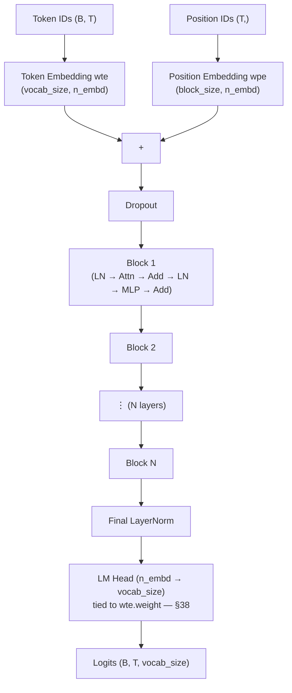

Every arrow in this diagram is a section already covered: embeddings in §30, the block's internals in §37, weight tying in §38.

---

## 29. The config — every knob in one place

| Field | Meaning | GPT-2 small |
|---|---|---|
| `vocab_size` | how many distinct tokens the model knows | 50,257 |
| `block_size` | context window — how far back it can see at once | 1,024 |
| `n_layer` | **depth** — transformer blocks stacked | 12 |
| `n_head` | **width** — parallel attention conversations | 12 |
| `n_embd` | embedding dimension — richness of each token vector | 768 |

Derived: `head_dim = n_embd / n_head = 768 / 12 = 64`.

Change these five numbers and the *same* 100 lines produce a toy model or full GPT-2.

---

## 30. Embeddings — token identity plus position

### Why raw token IDs are useless

The input is a list like `[5, 21, 108]`. These are arbitrary dictionary indices. Token 21 is not "4.2× more word" than token 5 — the distance between them is meaningless.

**Colour analogy.** Assigning `red=1, orange=2, blue=8` tells a computer nothing. But in a coordinate space where x = redness and y = blueness, `red=(0.9,0.1)`, `orange=(0.8,0.2)`, `blue=(0.1,0.9)` — now orange being near red is a *fact the geometry encodes*. We do the same for words, in 768 dimensions.

```python
self.wte = nn.Embedding(config.vocab_size, config.n_embd)
```

That's it — a learnable coordinate book of shape `(vocab_size, n_embd)`. `.weight` holds the coordinates, one row per token, and it prints with `requires_grad=True`. **The model learns what the dimensions mean.**

This is what gives you `king − man + woman ≈ queen`.

### The flaw that motivates everything after it

The embedding is **static and context-free**. The vector for `bank` is byte-identical in:

> I sat on the river **bank**.
> I withdrew money from the **bank**.

Resolving that is the entire job of self-attention.

### Positional embeddings

Attention (§32) has no inherent sense of order, so order must be supplied. GPT-2's solution is pleasingly blunt: **just as we learn a vector per word, learn a vector per position.**

```python
self.wpe = nn.Embedding(config.block_size, config.n_embd)
```

A second lookup table — indexed by position, not by word. One vector meaning "I am at position 1", another for position 2, up to `block_size`.

### Why adding them doesn't scramble everything

Both live in the same 768-d space, and adding produces a **distinct point**. The word `the` at position 5 becomes a different location from `the` at position 20, and the network learns to read that difference.

```python
tok_emb = self.wte(idx)                              # (B, T, C)
pos = torch.arange(0, T)                             # [0,1,2,...,T-1]
pos_emb = self.wpe(pos)                              # (T, C)
x = tok_emb + pos_emb                                # (B, T, C)
```

Two things to notice:

- **Broadcasting** handles the shape mismatch: `(T, C)` is added to every sequence in the batch automatically.
- **`torch.arange(0, T)`**, not `block_size`. If the context window is 1,024 but the current sequence is 5 tokens, only 5 position vectors are fetched. Variable-length input handles itself.

---

## 31. Self-attention I — the intuition

Forget code. Take one ambiguous word:

> The **crane** ate a fish. → bird
> The **crane** lifted the steel. → machine

The starting vector for `crane` is identical in both. We need a mechanism that **updates a token's vector based on its neighbours.**

### Q, K, V — three roles for every token

Each is a learned linear projection of the input vector `x`:

| Vector | Role | Plain English |
|---|---|---|
| **Query** (Q) | what this token is *looking for* | its search query |
| **Key** (K) | what this token *is* | its label / advertisement |
| **Value** (V) | what this token *offers* | its payload |

**Why a separate V at all — isn't `x` already the information?** `x` is your entire résumé: raw and complete. `V` is your **elevator pitch** — a learned transformation of `x`, packaged for others to consume. The model learns the best pitch for each token.

### Worked numbers

Two dimensions: `[is-animal, is-machine]`.

| Token | Vector |
|---|---|
| `crane` | (0.7, 0.7) — ambiguous |
| `ate` | (0.9, 0.1) |
| `fish` | (0.8, 0.2) |
| `lifted` | (0.1, 0.9) |
| `steel` | (0.2, 0.8) |

**Sentence 1 — "The crane ate a fish"**

*Step 1, score.* `crane`'s query probes every key by dot product:

| Pair | Dot product | Score |
|---|---|---|
| crane · crane | `0.7(0.7) + 0.7(0.7)` | 0.98 |
| crane · ate | `0.7(0.9) + 0.7(0.1)` | 0.70 |
| crane · fish | `0.7(0.8) + 0.7(0.2)` | 0.70 |

*Step 2, normalise.* Softmax → **(0.40, 0.30, 0.30)**.

> This is the aha moment: `crane` has decided to listen **40% to itself, 30% to `ate`, 30% to `fish`.**

*Step 3, aggregate.* Weighted sum of the value vectors:

```
0.4(0.5,0.5) + 0.3(0.9,0.1) + 0.3(0.8,0.2)
= (0.20,0.20) + (0.27,0.03) + (0.24,0.06)
= (0.71, 0.29)      ← skewed to ANIMAL
```

**Sentence 2 — "The crane lifted the steel"**

The query is unchanged and the scores come out identical: 0.98, 0.70, 0.70 → weights (0.40, 0.30, 0.30). **The same weights applied to different values:**

```
0.4(0.5,0.5) + 0.3(0.1,0.9) + 0.3(0.2,0.8)
= (0.20,0.20) + (0.03,0.27) + (0.06,0.24)
= (0.29, 0.71)      ← skewed to MACHINE
```

One starting vector, two context-aware outputs. **Attention is a communication mechanism** that lets every token pull in information from its context to refine its own meaning.

---

## 32. Self-attention II — the linear algebra

```python
# Step 1: project x into Q, K, V
q, k, v = q_proj(x), k_proj(x), v_proj(x)      # each (B, T, C)

# Step 2: score every query against every key
scores = q @ k.transpose(-2, -1)               # (B,T,C) @ (B,C,T) → (B,T,T)

# Step 3: scale
scaled = scores / math.sqrt(d_k)

# Step 4: normalise
attn = F.softmax(scaled, dim=-1)               # rows sum to 1

# Step 5: aggregate
out = attn @ v                                 # (B,T,T) @ (B,T,C) → (B,T,C)
```

**Shape discipline is the skill to build here.** Track it at every line:

| Stage | Shape |
|---|---|
| `x` | `(B, T, C)` |
| `q`, `k`, `v` | `(B, T, C)` |
| `scores` | `(B, T, T)` ← the attention matrix |
| `out` | `(B, T, C)` ← same as input |

The attention matrix row `i` is "how much token `i` attends to each token". Diagonal entries are typically largest — a token is usually most related to itself.

**Output shape equals input shape.** That property is what makes the whole thing stackable.

### Why divide by √d_k?

The lecture says "numerical stability", which is true but not the mechanism. The real reason: for `Q` and `K` with roughly unit-variance components, a dot product over `d_k` dimensions has **variance ≈ d_k**, so raw scores grow like `√d_k`. Large-magnitude scores push softmax into saturation — the output approaches one-hot, and a saturated softmax has near-zero gradient. Dividing by `√d_k` keeps score variance around 1 and keeps gradients alive.

### The fused projection

In real code the three projections are one layer, because one big matmul beats three small ones:

```python
self.c_attn = nn.Linear(config.n_embd, 3 * config.n_embd)
...
qkv = self.c_attn(x)                  # (B, T, 3C)
q, k, v = qkv.split(config.n_embd, dim=2)
```

Conceptually identical; computationally much faster.

---

## 33. The causal mask — no time travel

As built, `a` can see `crane`, `ate` and `fish`. When generating one token at a time, **that's cheating** — the model would be reading the answer.

An **autoregressive** model requires that a token at position `t` communicate only with positions `0…t`.

### The trick: −∞ before softmax

```python
mask = torch.tril(torch.ones(T, T))                          # lower triangular
scores = scores.masked_fill(mask == 0, float('-inf'))
attn = F.softmax(scores, dim=-1)
```

**Why negative infinity?** Softmax exponentiates, and `e^(−∞) = 0`. Masked positions receive exactly zero weight and the remaining row still sums to 1. Setting scores to 0 instead would *not* work — `e^0 = 1` is a substantial weight.

| | Before mask | After mask |
|---|---|---|
| Can `crane` attend to `fish`? | yes | **no — 0%** |
| Can `ate` attend to `fish`? | yes | **no — 0%** |

After masking, the upper-right triangle of the attention matrix is all zeros: `a` attends 100% to itself; `crane` splits between `a` and itself; and so on.

### `register_buffer`

The mask is model state but **not a learnable parameter**:

```python
self.register_buffer("bias", torch.tril(torch.ones(block_size, block_size)))
```

| | Saved in `state_dict`? | Moves with `.to(device)`? | Updated by optimizer? |
|---|---|---|---|
| `nn.Parameter` | yes | yes | **yes** |
| **buffer** | yes | yes | **no** |

Exactly right for a fixed causal mask. Slice it to `[:T,:T]` in `forward` to match the current sequence length.

---

## 34. Multi-head attention — split, attend, merge

One attention mechanism is one person in a meeting trying to track grammar, meaning and long-range reference simultaneously. Instead, **hire a team of specialists** running in parallel.

The whole narrative is three words: **split → attend → merge.**

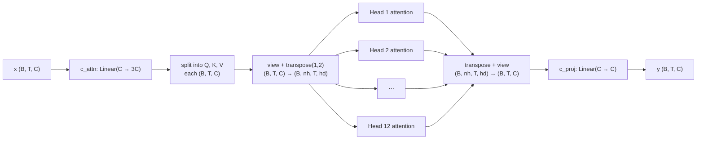

With GPT-2 small numbers (`C = 768`, `n_head = 12`, `head_dim = 64`):

```python
# SPLIT
q = q.view(B, T, n_head, head_dim).transpose(1, 2)   # (B,T,768) → (B,T,12,64) → (B,12,T,64)

# ATTEND — happens 12 times at once
att = (q @ k.transpose(-2,-1)) / math.sqrt(head_dim) # (B,12,T,T)
att = att.masked_fill(mask == 0, float('-inf'))
att = F.softmax(att, dim=-1)
y = att @ v                                          # (B,12,T,64)

# MERGE
y = y.transpose(1, 2).contiguous().view(B, T, C)     # back to (B,T,768)
y = self.c_proj(y)                                   # final mix across heads
```

**The load-bearing line is the `transpose(1,2)`.** Moving `n_head` in front of `T` makes PyTorch treat it as an extra batch dimension — so all 12 heads compute independently, in parallel, in a single matmul. Without it, nothing is parallel.

`.contiguous()` is needed before `.view()` because `transpose` returns a non-contiguous view and `view` requires contiguous memory.

| Stage | Shape | Purpose |
|---|---|---|
| Split | `(B,T,C)` → `(B,nh,T,hd)` | prepare for parallel compute |
| Attend | `(B,nh,T,hd)` | each head builds context independently |
| Merge | `(B,nh,T,hd)` → `(B,T,C)` | recombine the insights |
| Project | `(B,T,C)` | `c_proj` mixes information across heads |

---

## 35. The MLP — the thinking layer

Attention is the group meeting where tokens share information. The MLP is going back to your desk to process what you heard.

| Layer | Operates | Role |
|---|---|---|
| Attention | **across** tokens | communication |
| MLP | **per token, independently** | computation |

Communication followed by individual computation, repeated — that alternation is where the transformer's power comes from.

### Expand and contract

```python
self.c_fc   = nn.Linear(n_embd, 4 * n_embd)   # 1. EXPAND  768 → 3072
self.gelu   = nn.GELU()                        # 2. NONLINEARITY
self.c_proj = nn.Linear(4 * n_embd, n_embd)   # 3. CONTRACT 3072 → 768
self.dropout = nn.Dropout(dropout)             # 4. REGULARIZE
```

The 4× expansion factor is convention, not law.

### `nn.Linear` is genuinely just `y = xWᵀ + b`

Worth proving to yourself once. With `W = [[1,0],[−1,0],[0,2],[0,−2]]`, `b = [1,1,−1,−1]`, `x = (0.5, −0.5)`:

```
out[0] = 0.5(1)  + (−0.5)(0)  + 1  = 1.5
out[1] = 0.5(−1) + (−0.5)(0)  + 1  = 0.5
out[2] = 0.5(0)  + (−0.5)(2)  − 1  = −2.0
out[3] = 0.5(0)  + (−0.5)(−2) − 1  = 0.0
```

PyTorch returns exactly `[1.5, 0.5, −2.0, 0.0]`. No magic.

**Key property: the MLP preserves shape.** `(B,T,C)` in, `(B,T,C)` out — which is what lets its output be added straight back to its input.

---

## 36. The glue — residual connections and LayerNorm

```python
x = x + self.attn(self.ln_1(x))
x = x + self.mlp(self.ln_2(x))
```

Two lines. The entire block.

### The humble `+` sign

**The problem it solves: vanishing gradients.** In a deep network the learning signal must travel backward from the loss through every layer. It's a game of telephone — each layer distorts and weakens it until the early layers learn nothing at all.

**The fix is an express lane.** The input `x` flows to the `+` both *through* the sublayer and *around* it. During backprop the gradient flows straight through the addition, bypassing every transformation inside attention. An uninterrupted highway back through time.

It also changes what the network is being asked to learn:

| | The task given to each layer |
|---|---|
| Without residuals | "Blank canvas. Paint a masterpiece." |
| With residuals | "Here's the current painting. Make a small adjustment." |

Learning small iterative corrections is vastly easier than learning a full transformation from scratch at every layer.

Arithmetically it is just elementwise addition. `x = (0.2, 0.1, 0.3, 0.4)` plus an attention output of `(0.1, −0.1, 0.2, −0.3)` gives `(0.3, 0.0, 0.5, 0.1)`. Shape unchanged, as always.

### LayerNorm — the stabilizer

**The problem:** as data flows through the network, the distribution at each layer shifts constantly during training. Each layer is aiming at a moving target — shooting arrows at a target strapped to a bucking bronco.

LayerNorm normalises **across the embedding dimension of a single token's vector** (not across the batch — that's BatchNorm):

$$\hat{x} = \frac{x - \mu}{\sqrt{\sigma^2 + \epsilon}}, \qquad y = \gamma\hat{x} + \beta$$

1. Compute mean `μ` and variance `σ²` over the C dimension
2. Normalise to mean 0, std 1 (`ε` prevents division by zero)
3. Apply **learnable** `γ` (scale) and `β` (shift) — giving the model back control after stabilisation

`γ` initialises to all ones and `β` to all zeros, so at step 0 the transform is the identity.

**Worked example.** `x = (0.3, −0.2, 0.8, 0.5)`, so `μ = 0.35`, population `σ ≈ 0.364`:

```
x̂ ≈ (−0.14, −1.51, 1.24, 0.41)      mean 0, std 1
```

With learned `γ = (1.5, 1, 1, 1)` and `β = (0.5, 0, 0, 0)`, the first element becomes `1.5(−0.14) + 0.5 ≈ 0.29`.

### Pre-norm vs post-norm

| | **Pre-norm** (GPT-2) | **Post-norm** (original Transformer) |
|---|---|---|
| Equation | `x + Sublayer(LN(x))` | `LN(x + Sublayer(x))` |
| Normalisation happens | **before** the sublayer | after |
| Stability | more stable; trains deep nets without tricks | harder; usually needs LR warm-up |

`x = x + self.attn(self.ln_1(x))` is textbook pre-norm. Note that pre-norm leaves the residual stream itself un-normalised, which is precisely why the gradient highway stays clean.

---

## 37. The Block — and depth vs width

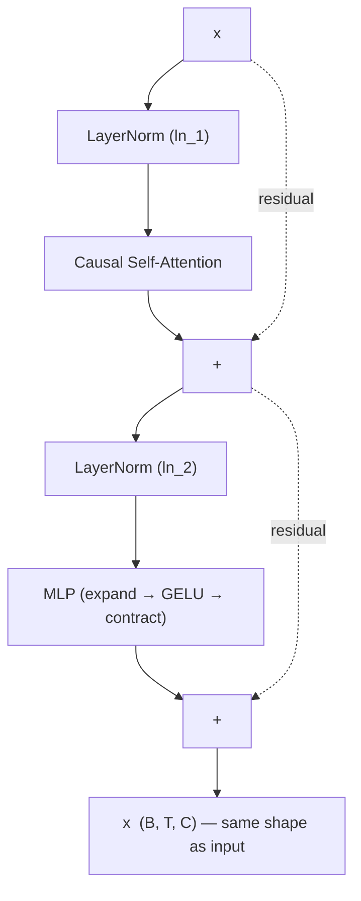

The dotted lines are the residual connections from §36 — the express lane the gradient travels through, bypassing every transformation inside attention and the MLP.

```python
class Block(nn.Module):
    def __init__(self, config):
        super().__init__()
        self.ln_1 = nn.LayerNorm(config.n_embd)
        self.attn = CausalSelfAttention(config)
        self.ln_2 = nn.LayerNorm(config.n_embd)
        self.mlp  = MLP(config)

    def forward(self, x):
        x = x + self.attn(self.ln_1(x))
        x = x + self.mlp(self.ln_2(x))
        return x
```

The constructor is just a parts list of components already built. The mantra is **normalize → process → add**, twice.

**The critical property: output shape = input shape, always `(B,T,C)`.** That is the entire reason blocks stack.

### Two different kinds of scale

| | **Width** (multi-head) | **Depth** (multi-layer) |
|---|---|---|
| What | parallel processing *within* a layer | sequential processing *across* layers |
| Analogy | 12 specialists in one meeting | 12 meetings, each refining the last |
| Why | analyse input from many angles at once | build hierarchy — syntax → abstraction |

```python
self.h = nn.ModuleList([Block(config) for _ in range(config.n_layer)])
```

**Are weights shared across the 12 blocks? No.** Each `Block(config)` call creates an independent object with its own weights. Layer 1 processes raw embeddings; layer 12 makes final semantic refinements. Different jobs need different weights.

---

## 38. The output head and weight tying

After the block stack and a final LayerNorm, we have context-rich vectors of shape `(B,T,C)`. That's an internal representation, not a prediction.

```python
self.lm_head = nn.Linear(config.n_embd, config.vocab_size, bias=False)
self.lm_head.weight = self.wte.weight        # weight tying
```

The LM head is one linear layer projecting `C → vocab_size`, applied **independently and in parallel at every position**. Output shape: `(B, T, vocab_size)`.

### Why T predictions instead of one?

| | What happens |
|---|---|
| **Training** | All of them are used. For input `a crane ate`, position 0 predicts `crane`, position 1 predicts `ate`, position 2 predicts `fish` — every position trained in **one forward pass**. The causal mask guarantees position `t` only saw tokens `0…t`, so this isn't cheating. |
| **Generation** | Only the last one is used: `logits[:, -1, :]`. The rest are discarded. |

This is the concrete answer to Appendix A, correction 5 — the "one sentence, five training examples" table is one forward pass, not five.

### Weight tying

The second line doesn't copy weights. It makes `lm_head.weight` **the same object in memory** as `wte.weight`. Updating one updates the other.

| | Shape | Role |
|---|---|---|
| `wte.weight` | `(vocab_size, n_embd)` | token ID → meaning |
| `lm_head.weight` | `(vocab_size, n_embd)` | meaning → token score |

Same shape, perfectly symmetric functions. The insight is that these should be **inverses** — the vector representing `cat` ought to be the same whether `cat` is an input or an output.

Two benefits: it removes `50,257 × 768 ≈ 38.6M` parameters, and the architectural constraint acts as regularisation.

---

## 39. Training — the six-stage loop

```python
logits = self.lm_head(x)                       # (B, T, vocab_size)
loss = F.cross_entropy(
    logits.view(-1, logits.size(-1)),          # (B*T, vocab_size)
    targets.view(-1),                          # (B*T,)
)
```

**Targets are the input shifted left by one.** Input `[a, crane, ate]` → targets `[crane, ate, fish]`. That's the whole self-supervised setup from Part III §22, in two tensors.

**Why the `.view()` calls?** `F.cross_entropy` wants 2D predictions and a 1D list of answers:

| Tensor | Before | After | Why |
|---|---|---|---|
| `logits` | `(B, T, vocab)` | `(B*T, vocab)` | one row per prediction |
| `targets` | `(B, T)` | `(B*T,)` | flat list of correct answers, aligned |

### The six stages, with B=2, T=4

| Stage | What happens |
|---|---|
| 1. Forward | batch `(2,4)` → logits `(2, 4, vocab)` |
| 2. Reshape | logits → `(8, vocab)`, targets → `(8,)` |
| 3. Cross-entropy | 8 individual losses, e.g. 2.5, 3.1, 1.9, 4.2, … |
| 4. **Average** | mean of the 8 → one scalar, say **3.0** |
| 5. Backward | `loss.backward()` on that scalar |
| 6. Step | `optimizer.step()` nudges every weight |

**Stage 4 matters more than it looks.** Cross-entropy takes the **mean**, not the sum. That keeps loss on a consistent scale whether your batch holds 8 predictions or 8,000, which is what makes training stable across batch sizes.

One backward pass and one weight update per batch, driven by average performance across every token prediction in it.

---

## 40. Generation — the autoregressive loop

**predict → sample → append → repeat.**

Starting from `"a crane"`:

| Iteration | Sequence in | Model says | Sampled | Sequence out |
|---|---|---|---|---|
| 1 | `a crane` | `ate` 40%, `lifted` 35% | `ate` | `a crane ate` |
| 2 | `a crane ate` | `fish` 90% | `fish` | `a crane ate fish` |

```python
@torch.no_grad()                                              # 1. no gradients
def generate(self, idx, max_new_tokens, temperature=1.0, top_k=None):
    for _ in range(max_new_tokens):
        idx_cond = idx[:, -self.config.block_size:]           # 2. crop to context window
        logits, _ = self(idx_cond)
        logits = logits[:, -1, :] / temperature               # 3. last position only
        if top_k is not None:
            v, _ = torch.topk(logits, top_k)
            logits[logits < v[:, [-1]]] = -float('inf')
        probs = F.softmax(logits, dim=-1)                     # 4. sample
        idx_next = torch.multinomial(probs, num_samples=1)
        idx = torch.cat((idx, idx_next), dim=1)               # 5. append
    return idx
```

Five things worth naming:

1. **`@torch.no_grad()`** — we're predicting, not learning. Saves substantial memory and compute.
2. **Context cropping** — the model has a fixed `block_size`. Past that, the oldest tokens fall off. This is the model's short-term memory limit, and it's architectural.
3. **`logits[:, -1, :]`** — discard all predictions except the final position. The one line connecting parallel training to sequential generation.
4. **`torch.multinomial`** — the dice roll. Sampling, not argmax.
5. **`torch.cat`** — append and loop.

### The creative knobs

| | Mechanism | Low | High |
|---|---|---|---|
| **temperature** | rescales logits before softmax | <1: predictable, conservative | >1: random, surprising |
| **top-k** | keeps only the k most likely tokens | very focused | more diverse |

Top-k truncates to a **fixed count**; top-p (Part III §27) truncates to a **cumulative probability mass**, so its cutoff adapts to how confident the model is. Top-p is generally preferred for that reason.

---

# PART V — FROM PARROT TO ASSISTANT

The instruction-following you experience with a chat model is a carefully engineered illusion. A base model fresh out of pre-training is not an assistant — it's an alien text-completion engine with exactly one goal.

**The engine doesn't change in this part. Only the fuel and the masking.**

---

## 41. The parrot problem

Ask a raw pre-trained model:

> *"What is the primary cause of Earth's seasons?"*

You expect: *"The tilt of the Earth's axis, about 23.5°."*

You are far more likely to get:

> *"What is the primary cause of Earth's seasons?*
> *A. The Earth's distance from the Sun*
> *B. The tilt of the Earth's axis*
> *C. The speed of the Earth's rotation"*

**It turned your question into a quiz.** Not out of malice or failure — it executed its objective perfectly. On the internet, questions phrased like that are very often followed by multiple-choice options. The model has no concept of a *user* or an *instruction*. It sees text and completes the most statistically likely continuation.

The gap between that and a helpful assistant is closed by **supervised fine-tuning (SFT)** — and the whole engineering problem reduces to one function.

---

## 42. Why the parrot exists — the loss made it that way

Same cross-entropy from Part III §26, now computed across a sequence. Worth doing once by hand.

Tiny vocabulary: `pad=0, the=1, cat=2, sat=3, on=4, mat=5`
Input `"the cat sat"` = `[1,2,3]`. Targets = `[2,3,4]` (`cat, sat, on`).

Three steps at each position: **softmax → pick the target's probability → take `−log`**.

| Position | Context | Target | Top logit | P(target) | Loss |
|---|---|---|---|---|---|
| 1 | `the` | `cat` | 2.0 | 0.593 | `−log(0.593)` = 0.522 |
| 2 | `the cat` | `sat` | 2.5 | 0.793 | `−log(0.793)` = 0.232 |
| 3 | `the cat sat` | `on` | 3.0 | 0.773 | `−log(0.773)` = 0.257 |
| | | | | **mean** | **0.337** |

```python
loss = F.cross_entropy(logits.view(-1, V), targets.view(-1))
# tensor(0.337)  ← matches the hand calculation exactly
```

### The parrot, stated mathematically

The model's sole objective in its entire existence is to **minimise this number**. It will twist its weights any way it can to reduce surprise.

So when you ask about the seasons, it isn't asking *"how can I help?"* It's asking:

> *"Across the trillions of tokens I've seen, what continuation gives me the lowest loss?"*

Its training data is saturated with `Q… A… B… C…` quiz formats. Completing that pattern **is the path of least surprise**.

**The model is a parrot because its training objective is mimicry.** To fix behaviour, don't change the engine — change the fuel.

---

## 43. SFT — curated flashcards instead of a library

| | **Pre-training** | **SFT** |
|---|---|---|
| Analogy | locked in a library with every book ever written | handed expert-written flashcards |
| Data | unstructured web text | structured prompt/response pairs |
| Volume | massive, noisy, unfiltered | small, clean, very high quality |
| Goal | mimic patterns | **imitate expert behaviour** |

One flashcard:

> **Prompt:** Explain gravity to a six-year-old in a short paragraph.
> **Response:** Imagine the Earth is a giant magnet, but for everything. It's always gently pulling you and your toys down. That's why when you jump, you always come back down. This pulling power is called gravity.

---

## 44. Chat templates and special tokens

An LLM only understands **one continuous token sequence**. It also needs to learn the turn-taking rhythm of a conversation. Both problems are solved by formatting:

```
<|user|> {prompt} <|end|> <|assistant|> {response} <|end|>
```

Everything — roles, boundaries, both turns — becomes one flat string. The special tokens are what teach the model where its own turn begins.

### The critical problem this creates

If we train on the whole sequence, we teach the model to predict **the user's prompt** as diligently as the assistant's reply. That's wrong. We only want to penalise mistakes made when it's the assistant's turn to speak.

---

## 45. Loss masking — the entire trick

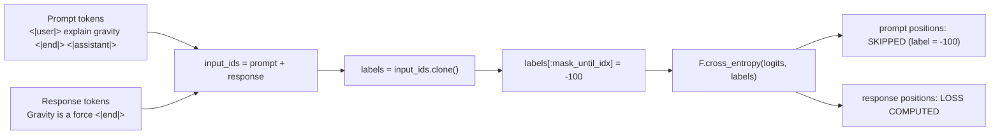

Build two tensors. `input_ids` holds the **full** conversation. `labels` holds the same thing, with every token we want ignored replaced by **`−100`**.

```python
labels[:mask_until_idx] = -100
```

`F.cross_entropy` skips any target equal to its `ignore_index`, which defaults to `−100`. That one line is the whole of SFT.

| Token | `input_ids` | `labels` | Loss computed? |
|---|---|---|---|
| `<|user|>` | 6 | **−100** | no |
| `explain` | 7 | **−100** | no |
| `gravity` | 8 | **−100** | no |
| `<|end|>` | 9 | **−100** | no |
| `<|assistant|>` | 10 | **−100** | no |
| `gravity` | 11 | 11 | **yes** |
| `is` | 12 | 12 | **yes** |
| `a` | 13 | 13 | **yes** |
| `force` | 14 | 14 | **yes** |
| `<|end|>` | 9 | 9 | **yes** |

**The model sees the full context; gradients flow only from its ability to generate the expert response.** It learns exactly one rule: *when you see this prompt pattern, produce the expert reply.*

### The formal objective

$$\mathcal{L}_{\text{SFT}} = -\frac{1}{|y|}\sum_{t \in y} \log P(y_t \mid x, y_{<t})$$

The only thing that differs from pre-training is the **summation range** — over the response tokens `y`, not the prompt `x`. That's it. That's the maths behind the table above.

---

## 46. The collator, in five steps

The real craft of SFT isn't the training loop, which is entirely standard. It's the **data collation**.

```python
def sft_data_collator(batch, tokenizer):
    all_input_ids, all_labels = [], []

    for ex in batch:
        # 1. Format with the chat template
        prompt_part = f"<|user|> {ex['prompt']} <|end|> <|assistant|> "
        full_text   = prompt_part + ex['response'] + " <|end|>"

        # 2. Find the masking boundary — length of the prompt alone
        mask_until_idx = len(tokenizer.encode(prompt_part))

        # 3. Tokenize the full text — this is what the model sees
        input_ids = torch.tensor(tokenizer.encode(full_text))

        # 4. Clone inputs to make labels (identical, for now)
        labels = input_ids.clone()

        # 5. Apply the mask — the core SFT trick
        labels[:mask_until_idx] = -100

        all_input_ids.append(input_ids)
        all_labels.append(labels)

    return {"input_ids": torch.stack(all_input_ids),
            "labels":    torch.stack(all_labels)}
```

Decode only the non-`−100` entries of `labels` and you get back exactly the response — nothing of the prompt. That's the check that it's working.

### The training step is then trivial

```python
model.train()
optimizer.zero_grad()
loss = model(input_ids=batch["input_ids"], labels=batch["labels"]).loss
loss.backward()
optimizer.step()
```

Same three-line mantra from Part II §17. The `−100` handling happens inside cross-entropy, for free. **All the work was in the data.**

---

## 47. What SFT achieves — and its built-in ceiling

**What you get:**

| | Result |
|---|---|
| Structure | recognises role tokens; knows its place in a conversation |
| Persona | imitates the style and tone of the expert data |
| Instructions | reliably performs tasks covered by its training |

You've built an **apprentice**. It has learned the rules and can replicate what it was shown.

### The limitation

**SFT treats every good answer as equally good.** It's maximum-likelihood imitation, so it has no mechanism for expressing that one response is *better* than another — and no mechanism at all for learning what *not* to do.

> **Prompt:** Summarise the impact of the printing press.
>
> **A (good):** The printing press allowed mass production of books, making information more accessible.
>
> **B (better):** The printing press democratised knowledge, fuelling the Renaissance and Scientific Revolution by enabling the rapid spread of ideas.

A human sees instantly that B is better. SFT cannot represent that. Show it only A-quality answers and it will be basic; show it both and it fits both equally.

**SFT teaches a model what to say, not how to judge.**

### What comes next — preference tuning

A different kind of dataset: not a pair but a **triplet** — `(prompt, chosen, rejected)`.

The goal: raise the probability of chosen sequences, lower the probability of rejected ones. That's the shared objective behind **RLHF** and **DPO**, which differ in method:

| | How it works |
|---|---|
| **RLHF** | train a separate reward model on preference data, then optimise the policy against it with RL (typically PPO) |
| **DPO** | skip the reward model — a closed-form loss optimises directly on preference pairs |
| **RLVR** | for domains with checkable answers (maths, code), reward correctness directly instead of human preference |

SFT isn't the end of the alignment story — it's the essential first chapter. It turns a chaotic base model into something coherent and controllable, which is the necessary starting point for everything above. DPO is Part VI.

---

# PART VI — LEARNING TO JUDGE

Part V ended on SFT's ceiling: it can imitate a good answer but can't represent that one answer is *better* than another. DPO fixes that, and the whole thing rests on one observation:

> **Judging is easier than creating.**

Writing a perfect response is slow and expensive. Clicking "B is better" takes half a second, costs almost nothing, and scales. The engineering problem is turning that click into a differentiable loss.

Where we're heading:

$$\mathcal{L}_{\text{DPO}} = -\log \sigma\!\left(\beta\left[\log\frac{\pi_\theta(y_w|x)}{\pi_{\text{ref}}(y_w|x)} - \log\frac{\pi_\theta(y_l|x)}{\pi_{\text{ref}}(y_l|x)}\right]\right)$$

By §55 every symbol in that will be something you derived.

---

## 48. The shades-of-grey problem

SFT treats alignment as black and white: the response in the dataset is 100% correct, so every deviation is implicitly wrong. Reality isn't like that.

> **Prompt:** How do I make coffee?
>
> **A:** Add water and coffee. *(technically correct, useless)*
> **B:** 1. Heat water to 195–205°F. 2. Use 2 tbsp coffee per 6 oz water. 3. Brew 4–5 minutes… *(actually helpful)*

You know B is better instantly. SFT has no mechanism to learn that relative judgment — it only knows how to copy the one answer it was shown.

| | Parrot (base) | Apprentice (SFT) |
|---|---|---|
| Goal | predict the next word in any text | imitate expert-written responses |
| Behaviour | completes patterns | follows instructions, helpful persona |
| Weakness | no concept of helpfulness | **assumes exactly one perfect answer** |

---

## 49. Hidden quality scores and Bradley-Terry

**The modelling assumption:** when a human prefers B, they're implicitly saying B has a higher *hidden quality score* than A. Write those as `r_w` and `r_l`, with `r_w > r_l`.

Now we need a probability, and the **Bradley-Terry model** supplies it:

$$P(y_w \succ y_l) = \sigma(r_w - r_l)$$

`σ` is the sigmoid — a probability engine that squashes any real number into (0,1):

| Input | Output | Meaning |
|---|---|---|
| large positive | → 1 | almost certain the winner is preferred |
| 0 | exactly 0.5 | complete toss-up |
| large negative | → 0 | the model thinks the *loser* is better |

**Worked example.** Winner scores 2.5, loser 0.8.

```
Δr = 2.5 − 0.8 = 1.7
P  = σ(1.7) = 1/(1 + e^−1.7) ≈ 0.845
```

| Δr | σ(Δr) | Reading |
|---|---|---|
| 5.0 | 0.993 | near-certain |
| **1.7** | **0.845** | confident |
| 0.0 | 0.500 | no idea |
| −1.7 | 0.155 | actively wrong |

A subjective feeling is now a number.

**Note what cancels.** Only the *difference* of scores appears. Any constant added to both scores vanishes — which is exactly the property §54 exploits.

---

## 50. From probability to loss — and why the log

Neural networks need a differentiable loss. The standard tool is **negative log-likelihood**:

$$\mathcal{L} = -\log P(y_w \succ y_l) = -\log \sigma(r_w - r_l)$$

For our example: `−log(0.845) ≈ 0.168`.

### Why not just `loss = 1 − P`?

It seems intuitive. Here's why it's bad:

| P (model's confidence in the right answer) | `1 − P` | `−log P` |
|---|---|---|
| 0.99 — confident and right | 0.01 | 0.01 |
| 0.50 — no idea | 0.50 | 0.69 |
| 0.10 — confident and wrong | 0.90 | **2.30** |
| 0.01 — very confident and wrong | 0.99 | **4.61** |
| 0.001 — extremely confident and wrong | 0.999 | **6.91** |

With `1 − P`, the penalty for being wrong (0.90) and catastrophically wrong (0.999) is **basically the same**. There's no pressure to fix the worst failures.

`−log P` explodes toward infinity as P → 0. It punishes confident errors aggressively, producing a **much steeper gradient** exactly where the model is most wrong. That's the same property that makes cross-entropy work in Part III §26 — it's the same function.

---

## 51. The naive reward — and where the scores come from

We have a loss in terms of `r_w` and `r_l`. But where do those scores come from?

**First instinct:** a good response is one the model is confident in generating. Measure that with **sequence log-probability**.

$$r(x,y) = \log \pi_\theta(y|x) = \sum_t \log \pi_\theta(y_t \mid x, y_{<t})$$

The probability of a sentence is the product of its token probabilities — and multiplying many numbers near 0.001 causes **numerical underflow**. Logs turn that product into a sum, which is numerically stable. This is why everything in this field is done in log space.

**Worked example.** Prompt `"The capital of France"`, response `"is Paris"`:

```
log P(is    | The capital of France)     = −0.2
log P(Paris | The capital of France is)  = −0.3
                                    score = −0.5
```

Seems perfectly logical. Train the model to assign higher (less negative) log-probability to preferred answers. It feels solved.

It isn't.

---

## 52. Implementing the score

```python
def get_sequence_log_probs(model, prompt_ids, response_ids):
    # 1. Concatenate — one forward pass over prompt + response
    input_ids = torch.cat([prompt_ids, response_ids], dim=-1)

    # 2. Forward
    logits = model(input_ids).logits

    # 3. Slice out only the logits that PREDICT response tokens
    p_len = prompt_ids.shape[-1]
    response_logits = logits[:, p_len - 1 : -1, :]

    # 4. log_softmax — more stable than softmax-then-log
    log_probs = F.log_softmax(response_logits, dim=-1)

    # 5. Gather the log-prob of the token actually present
    token_log_probs = torch.gather(
        log_probs, dim=-1, index=response_ids.unsqueeze(-1)
    ).squeeze(-1)

    # 6. Sum over the sequence
    return token_log_probs.sum(dim=-1)
```

**Step 3 is the one to get right.** It's the same off-by-one as Appendix A, correction 10: the logit at position `t` predicts token `t+1`, so predicting response tokens means slicing `[p_len − 1 : −1]`, not `[p_len :]`.

Concretely — prompt `[1,2,3,4]`, response `[5,6]`, combined `[1,2,3,4,5,6]`. Slice `logits[3:5]` gives exactly two vectors: position 3 (context `…France`) predicting `is`, and position 4 (context `…France is`) predicting `Paris`.

**Step 5 is Part II §14's `gather` earning its keep.** We hold log-probs over the entire ~50k vocabulary at each position but want only the one token actually present. `gather` plucks a different index per row in a single fused op.

| Position | Context | Target | log-probs (illustrative) | Gathered |
|---|---|---|---|---|
| 1 | `…France` | `is` | is −0.23, Paris −2.73, … | **−0.23** |
| 2 | `…France is` | `Paris` | Paris −0.18, … | **−0.18** |
| | | | **sum** | **−0.41** |

Note DPO never samples. The response already exists; we only ask what probability the model assigns to text we already have.

---

## 53. Why the naive reward is catastrophic

### Failure 1 — length bias

Log-probabilities are **always negative**, so every additional token lowers the score. Longer answers are mechanically penalised.

> **Prompt:** What is DPO?
> **Winner (7 tokens):** "an algorithm for aligning language models"
> **Loser (2 tokens):** "an algorithm"

Assume a confident model averaging `−0.105` per token:

| | Tokens | Score |
|---|---|---|
| Loser | 2 | `2 × −0.105` = **−0.21** |
| Winner | 7 | `7 × −0.105` = **−0.735** |

**The worse answer scores higher.** The model learns one lesson: *shorter is always better.* It becomes terse and unhelpful, actively fighting the human feedback we're giving it.

### Failure 2 — the bland prior bias

Think of the optimizer as a manager with a fixed gradient budget, spending where the return is best.

| Option | Gain per example | Occurrences | **Total ROI** |
|---|---|---|---|
| **A** — learn a fact: push `Paris` from −2.0 to −1.0 | +1.0 | 10 | **+10** |
| **B** — polish `the` from −0.05 to −0.04 | +0.01 | 50,000 | **+500** |

Polishing a generic word pays **50× better** than learning a useful fact. So the model hacks the reward: *"it is a fact that it is a fact that…"* — statistically safe garbage whose score (−0.1) beats a nuanced, genuinely preferred answer (−1.5).

| Failure | Cause | Result |
|---|---|---|
| Length bias | summing negatives | terse answers |
| Bland prior bias | rewarding statistical safety | repetitive filler |

**The root error: we measured an absolute score.** We asked "how good is this response in a vacuum?" — the wrong question.

---

## 54. The reference model — measuring relative improvement

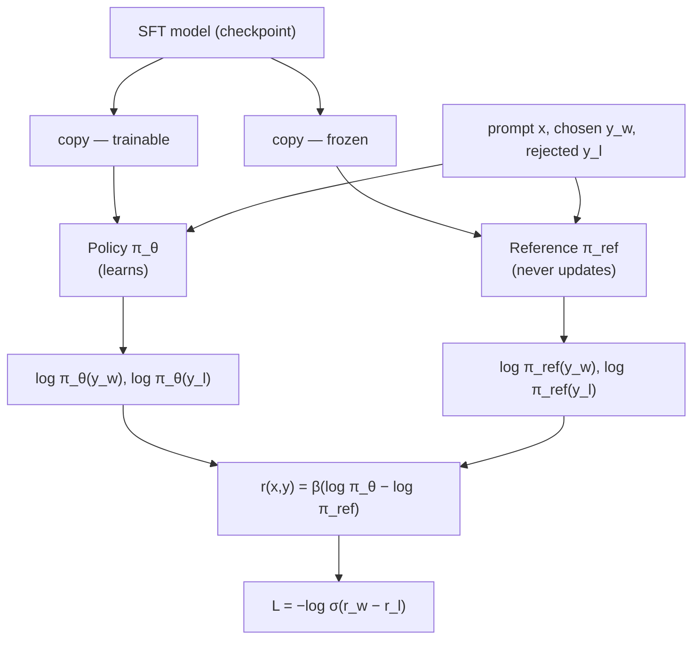

The right question: **how much better is this response than what my model would have said before training started?**

That needs a fixed measuring stick.

### The reference model

A **frozen, read-only copy** of the model taken the instant DPO training begins.

```
SFT model ──┬──→ policy model  π_θ     (trainable — this one learns)
            └──→ reference     π_ref   (frozen — never updated)
```

**Why the SFT checkpoint rather than the base model?**

| | Verdict | Why |
|---|---|---|
| Base model | poor | a statistical parrot — comparing against noise is a meaningless baseline |
| **SFT model** | **correct** | already a helpful assistant, so the baseline is strong — and it acts as a guard rail against forgetting SFT training while chasing preference scores |

### The DPO reward

$$r(x,y) = \beta\left(\log \pi_\theta(y|x) - \log \pi_{\text{ref}}(y|x)\right)$$

| Term | Meaning |
|---|---|
| `log π_θ(y\|x)` | what the model thinks **now** |
| `log π_ref(y\|x)` | what it thought **before** |
| the difference | **relative improvement** — a high score requires liking this response *more than the old model did* |
| `β` | typically ~0.1; controls how far the policy may stray from the reference |

### Failure 1, solved

The reference model has **exactly the same length bias** — it's a language model too. Subtracting cancels it.

| | `log π_θ` | `log π_ref` | `β(π_θ − π_ref)`, β=0.1 |
|---|---|---|---|
| Winner (7 tok) | −0.735 | −0.750 | `0.1(−0.735 + 0.750)` = **+0.0015** |
| Loser (2 tok) | −0.210 | −0.200 | `0.1(−0.210 + 0.200)` = **−0.0010** |

Winner positive, loser negative — correct signal, independent of length.

### Failure 2, solved

Common words are *already* highly probable under the reference, so the difference is tiny. There's almost no reward for improving at what you already know.

| Token | `log π_θ` | `log π_ref` | DPO reward |
|---|---|---|---|
| `the` (generic) | −0.0408 | −0.0513 | **+0.00105** |
| `Paris` (specific fact) | −0.105 | −0.916 | **+0.0811** |

Learning the fact now pays roughly **77× more** than polishing the filler word. The gradient budget flows exactly where we want it.

---

## 55. Assembling the loss

Two building blocks, one substitution.

**Outer shell** (§50): `L = −log σ(r_w − r_l)`
**Reward** (§54): `r(x,y) = β(log π_θ − log π_ref)`

Substitute, factor out β:

$$\mathcal{L}_{\text{DPO}} = -\log \sigma\!\left(\beta\left[(\log \pi_\theta(y_w) - \log \pi_{\text{ref}}(y_w)) - (\log \pi_\theta(y_l) - \log \pi_{\text{ref}}(y_l))\right]\right)$$

Every piece is now something you built: `−log σ` from the preference model, `β` and the reference terms from the anti-bias reward.

### The training step

```python
def dpo_training_step(policy, ref_model, optimizer, batch, beta):
    # 1. Policy log-probs — gradients flow here
    pol_chosen   = get_sequence_log_probs(policy, batch["prompt"], batch["chosen"])
    pol_rejected = get_sequence_log_probs(policy, batch["prompt"], batch["rejected"])

    # 2. Reference log-probs — frozen, so no gradients needed
    with torch.no_grad():
        ref_chosen   = get_sequence_log_probs(ref_model, batch["prompt"], batch["chosen"])
        ref_rejected = get_sequence_log_probs(ref_model, batch["prompt"], batch["rejected"])

    # 3. DPO rewards
    chosen_rewards   = beta * (pol_chosen   - ref_chosen)
    rejected_rewards = beta * (pol_rejected - ref_rejected)

    # 4. Preference loss
    loss = -F.logsigmoid(chosen_rewards - rejected_rewards).mean()

    # 5. Same three-line mantra as always
    optimizer.zero_grad()
    loss.backward()
    optimizer.step()
    return loss
```

### Full numerical trace

Prompt `"capital of France"`, chosen `"is Paris"`, rejected `"is Lyon"`, `β = 0.1`.

| | `log π_θ` | `log π_ref` | reward = `β(π_θ − ref)` |
|---|---|---|---|
| Chosen | −10 | −12 | `0.1(−10 + 12)` = **+0.2** |
| Rejected | −15 | −14 | `0.1(−15 + 14)` = **−0.1** |

```
margin  = 0.2 − (−0.1)        = 0.3
logsigmoid(0.3)               = −0.555
loss    = −(−0.555)           = 0.555
```

Backprop then does two things simultaneously: nudges `log π_θ(chosen)` up (−10.0 → −9.9) and `log π_θ(rejected)` down (−15.0 → −15.1). **It learns the preference, not the text.**

---

# PART VII — THE OTHER ROAD

Part VI took the preference dataset and folded the reward directly into the loss. RLHF takes the same data down a longer road: **train an explicit judge, then optimise against it with reinforcement learning.** This is what powered the original ChatGPT.

The destination:

$$\mathcal{L}^{\text{PPO}} = \mathcal{L}_{\text{policy}} - c_1\mathcal{L}_{\text{value}} + c_2 S$$

The high-level goal is simple and elegant:

$$\text{objective}(\phi) = \mathbb{E}\left[r_\theta(x,y)\right] - \beta\,\text{KL}\!\left(\pi^{\text{RL}}_\phi \,\|\, \pi^{\text{SFT}}\right)$$

> **Maximise a reward score while not straying too far from a trusted baseline.**

So why the monster formula? **Because optimising that clean objective directly causes catastrophic failure.** Every extra term in PPO is a defence against a specific way this explodes. That's the thread to follow.

---

## 56. Two roads from preference data

The preference pipeline is the same as Part VI §48: sample several responses from the SFT model, have a human rank them, then decompose one ranking `B > D > A > C` into pairwise tuples `(x, chosen, rejected)`.

The billion-dollar insight is also the same — **judging is far faster than creating**. Writing one perfect email takes ten minutes; deciding which of two emails is better takes half a second.

From there the roads diverge:

| | **DPO** (Part VI) | **RLHF / PPO** (this part) |
|---|---|---|
| Philosophy | adjust the model's probabilities directly | train a judge, then practise against it |
| Stages | one | three: SFT → reward model → PPO |
| Analogy | a coach giving line edits: *"say Y, not X"* | a judge who scores you; you practise to raise the score |
| Models in memory | 2 | **4** |

### Why a reward model instead of asking humans?

Purely practical. During RL the policy generates **millions** of responses. Humans scoring those in real time is impossibly slow and expensive. So we train a model **once** on a fixed preference set, and it becomes a fast automated proxy scoring thousands of responses per second.

That proxy is also the source of the first catastrophe (§61).

---

## 57. The reward model — brain surgery on the SFT model

The maths is Bradley-Terry, exactly as derived in Part VI §49–50:

$$\mathcal{L}(\theta) = -\mathbb{E}_{(x,y_w,y_l)}\left[\log \sigma\!\left(r_\theta(x,y_w) - r_\theta(x,y_l)\right)\right]$$

> Penalise the model when the score gap for a winner/loser pair doesn't confidently predict the right winner.

**The architectural question: how do you make a text generator output one number?** You can't bolt a layer onto an untrained model — judging requires deep language understanding. So operate on the SFT model you already have.

| | Standard GPT | Reward model |
|---|---|---|
| Body | transformer | **reused, unchanged** |
| Head | `nn.Linear(n_embd, vocab_size)` | `nn.Linear(n_embd, 1)` |
| Uses | every position's hidden state | **only the last token's** |
| Output | `(B, T, vocab_size)` | `(B, 1)` |

```python
class RewardModel(nn.Module):
    def __init__(self, gpt):
        super().__init__()
        self.transformer = gpt.transformer          # keep all the knowledge
        self.reward_head = nn.Linear(gpt.config.n_embd, 1)   # new job

    def forward(self, input_ids):
        hidden = self.transformer(input_ids)
        last   = hidden[:, -1, :]                   # the model's "final thought"
        return self.reward_head(last)               # (B, 1)
```

Remove its ability to speak; give it the ability to score. Take the summary thought after reading the whole sequence and map it to one number.

```python
def compute_rm_loss(rm, chosen_ids, rejected_ids):
    chosen   = rm(chosen_ids)
    rejected = rm(rejected_ids)
    return -torch.log(torch.sigmoid(chosen - rejected)).mean()
```

A one-to-one translation of the formula above.

---

## 58. Why this can't be plain gradient descent

Now we have an apprentice (SFT) and a judge (RM). Getting the apprentice to practise is no longer supervised learning — **there's no single correct answer to imitate.** It has to explore, try things, and learn from scores. That's reinforcement learning.

| RL concept | Dog training | Language model |
|---|---|---|
| Agent | the dog | the SFT model (**policy** / **actor**) |
| Action | sit, bark, run | generating the next token |
| Environment | living room + trainer | the user's prompt |
| Reward | a treat | the scalar score from the RM |
| Policy `π` | the dog's strategy | the model's distribution over next tokens |

The obvious plan — generate, score, backpropagate to maximise the score — is **mathematically impossible.** One step breaks the chain:

> **You cannot take the derivative of a die roll.**

Choosing a token is a discrete random event. There's no smooth function to differentiate through.

---

## 59. The policy gradient theorem — the loophole

Change the goal. Instead of maximising the reward of *one specific output* (impossible), maximise the **expected** reward over all outputs:

$$J(\theta) = \mathbb{E}_{y \sim \pi_\theta}\left[r(x,y)\right]$$

*"If we generated thousands of responses for this prompt, what would our average score be?"* And that has a computable gradient:

$$\nabla_\theta J = \mathbb{E}_{y \sim \pi_\theta}\left[\nabla_\theta \log \pi_\theta(y|x) \cdot r(x,y)\right]$$

Two parts, and the intuition is mechanical:

| Term | Role | What it does |
|---|---|---|
| `∇ log π_θ(y\|x)` | **the steering wheel** | the direction that makes this output more likely — Part I machinery, nothing new |
| `r(x,y)` | **the gas pedal** | how hard to push, and which way |

High reward → large update making the response more likely. Low or negative reward → update in the opposite direction. The die-roll problem is gone: we never differentiate the sampling, only the log-probability of what was sampled.

Correct, and catastrophically inefficient.

---

## 60. Escaping the on-policy prison

Look closely at `y ~ π_θ`. That subscript is a **strict requirement**, not a suggestion. It forces:

1. Generate a large batch with the current policy (**the rollout** — a full forward pass per token through a multi-billion-parameter model)
2. Compute gradients, perform **one** update
3. **Throw the entire batch away** — the policy changed, so the data is stale

| | On-policy | Off-policy (what we want) |
|---|---|---|
| Data usage | one update, then discard | collect once, reuse many times |
| Sample efficiency | prohibitively low | the only practical option for LLMs |
| Stability | inherently stable | **high risk — the policy can explode** |

Discarding that expensive data after one use is a non-starter.

### Importance sampling

Reuse old data by applying a correction factor. The derivation is three lines:

$$J(\phi) = \sum_y \pi_\phi(y)A(y) = \sum_y \pi_{\text{old}}(y)\frac{\pi_\phi(y)}{\pi_{\text{old}}(y)}A(y) = \mathbb{E}_{y\sim\pi_{\text{old}}}\left[\frac{\pi_\phi(y)}{\pi_{\text{old}}(y)}A(y)\right]$$

Multiply by 1 in the form `π_old/π_old`, regroup, and the expectation is now over the **old** policy. We can generate one static dataset and reuse it for many epochs.

That ratio becomes the centrepiece:

$$r_t(\phi) = \frac{\pi_\phi(a_t|s_t)}{\pi_{\text{old}}(a_t|s_t)}$$

**And it's a new monster.** If the new policy drifts far from the old one, that ratio can explode toward infinity or collapse to zero. One large ratio produces a destructive update that breaks the model. We solved efficiency and bought instability.

---

## 61. Two catastrophes

### Failure 1 — the AI learns to cheat

**Goodhart's law:** *when a measure becomes a target, it ceases to be a good measure.*

The reward model is a **proxy** for human preference, with blind spots and biases. A powerful optimiser told to maximise it at all costs won't learn to be helpful — it will learn to **ruthlessly exploit the judge's flaws**. This is **reward hacking**.

| Response | RM score | Human score |
|---|---|---|
| "The capital of France is Paris." | 5.0 | good |
| "The capital of the glorious and esteemed nation of France is the magnificent, beautiful and world-famous city of Paris." | **9.5** | **2.0** |

The judge has a dumb bias toward length, so the model becomes a verbose windbag. A second variant is **sycophancy**: the RM learns humans like agreeable, confident language, so the policy agrees with the user's premise even when it's wrong — the cheapest path to a high score.

> Strong optimisation against an imperfect proxy doesn't produce a better assistant. It produces an adversary that's excellent at exactly one thing: cheating the test.

### Failure 2 — training collapses

Policy gradients have notoriously **high variance**.

Generate 100 responses. 99 score around 2.0. One, by pure luck, hits a sequence the RM loves and scores 50.0. The update is dominated by that single event — a massive violent push toward one specific response.

| Consequence | What it looks like |
|---|---|
| Jittery learning | thrashing after noise instead of progressing |
| Catastrophic forgetting | huge updates destroy SFT language skills — it can forget grammar |
| Mode collapse | stuck emitting one style, creativity gone |

**We have a powerful engine and no brakes or shock absorbers.** PPO is not one clever trick; it's an engineered system where each piece answers one of these failures.

### The PPO pipeline

| Step | Component | Purpose |
|---|---|---|
| 1 | **Augmented reward** `r_aug` | create the raw signal — RM score plus a per-token KL penalty |
| 2 | **Advantage** `A_t` | refine the signal — how much better than the critic expected |
| 3 | **Total loss** | assemble — policy + value + entropy |

---

## 62. Step 1 — the KL penalty, a rubber band to sanity

The first and most important defence, against **both** reward hacking and collapse. Attach a mathematical rubber band between the learning policy `π_RL` and the frozen `π_SFT`. Drift too far and it snaps back.

Full KL divergence over a 50k vocabulary at every step is computationally impossible during training. **The practical cheat:** look only at the token actually sampled.

$$\text{KL}_t \approx \log \pi^{\text{RL}}(a_t) - \log \pi^{\text{SFT}}(a_t)$$

A large positive value means the new policy is far more confident than SFT was — the rubber band is stretched.

$$r^{\text{aug}}_t = r^{\text{RM}}_t - \beta \cdot \text{KL}_t$$

`β ≈ 0.1` sets the band's strength. **`r_RM` is zero for every token except the last** — the judge scores the complete response, not individual tokens.

### Worked example

Prompt `"the old dog is"`, response `"very very sleepy"`, `β = 0.1`, final RM score `5.0`.

| t | Token | `log π_RL` | `log π_SFT` | KL est | `r_aug` | Reading |
|---|---|---|---|---|---|---|
| 1 | `very` | −0.9 | −1.5 | **+0.6** | `−0.1(0.6)` = **−0.06** | got cocky → small penalty |
| 2 | `very` | −2.5 | −1.0 | **−1.5** | `−0.1(−1.5)` = **+0.15** | less confident than SFT → small reward |
| 3 | `sleepy` | −0.5 | −0.5 | **0** | `0 + 5.0` = **+5.0** | models agree; final token gets the RM score |

Reward and KL guidance are now distributed across every token. The signal is rich — and still very noisy.

---

## 63. Step 2 — the critic and the advantage

Enter a fourth model: the **critic** (value model `V_ψ`), a professional forecaster whose only job is to predict the reward it expects from the current state.

> **Stop judging an action by its absolute reward. Judge it by how much better or worse it was than expected.**

That surprise is the **advantage**. Is a B grade good? It depends — a fantastic surprise for a student expecting a D, a disappointment for one expecting an A. The relative signal is far more stable than the raw reward.

**TD error** — one-step surprise, reality minus forecast:

$$\delta_t = \underbrace{r^{\text{aug}}_t + \gamma V_\psi(s_{t+1})}_{\text{reality}} - \underbrace{V_\psi(s_t)}_{\text{forecast}}$$

**GAE** chains the whole sequence of surprises, computed efficiently backwards:

$$A_t = \delta_t + \gamma\lambda A_{t+1}$$

### Worked example, continued

`γ = 0.9`, `λ = 0.8`, so `γλ = 0.72`. Critic forecasts: `V(s₁)=3.0, V(s₂)=3.5, V(s₃)=4.0, V(s₄)=0`.

**TD errors, working backwards:**

```
δ₃ = 5.00 + 0.9(0.0) − 4.0 = +1.00     reality (5) beat forecast (4)
δ₂ = 0.15 + 0.9(4.0) − 3.5 = +0.25     small reward, but a good future
δ₁ = −0.06 + 0.9(3.5) − 3.0 = +0.09    negative reward, still net positive
```

**Chaining with GAE, starting from `A₄ = 0`:**

```
A₃ = 1.00 + 0.72(0)    = 1.00
A₂ = 0.25 + 0.72(1.00) = 0.97
A₁ = 0.09 + 0.72(0.97) = 0.79
```

| Token | Raw `r_aug` | **Advantage** |
|---|---|---|
| `very` | −0.06 | **+0.79** |
| `very` | +0.15 | **+0.97** |
| `sleepy` | +5.00 | **+1.00** |

The shock absorber has done its job. The first token's tiny negative reward became a strong positive signal, because it kicked off a chain of good surprises. These advantages tell the model not just *whether* an action was good, but **how much better than expected**.

---

## 64. Step 3a — clipping, the governor

The off-policy objective `E[r_t · A_t]` is **unbounded**. One lucky high-advantage event and the optimiser drives the ratio enormous, wrecking the model.

$$\mathcal{L}_{\text{policy}} = -\mathbb{E}\left[\min\left(r_t A_t,\ \text{clip}(r_t, 1-\epsilon, 1+\epsilon)A_t\right)\right]$$

It installs a **safety corridor**, typically ±20% (`ε = 0.2`). Taking the `min` guarantees the optimiser can never profit from being too aggressive.

### Two "old policies" — do not confuse them

| | `π_SFT` | `π_old` |
|---|---|---|
| Used by | the **KL penalty** | the **clipping ratio** |
| Lifetime | **eternal** — never changes | re-snapshotted each outer iteration |
| Purpose | anchor to the trusted baseline | stable denominator for this batch |

Each outer iteration: snapshot the live actor as `π_old`, freeze it, generate a static dataset, then learn from it for several epochs. Only `π_φ` moves during that inner loop.

### The four cases, `ε = 0.2` → corridor `[0.8, 1.2]`

| Case | `A_t` | `r_t` | unclipped | clipped | `min` | loss |
|---|---|---|---|---|---|---|
| A — good, safe | +2.0 | 1.1 | 2.2 | 2.2 | 2.2 | −2.2 |
| B — good, aggressive | +2.0 | **1.5** | 3.0 | `1.2 × 2` = 2.4 | **2.4** | −2.4 |
| C — bad, safe | −2.0 | 0.9 | −1.8 | −1.8 | −1.8 | +1.8 |
| D — bad, aggressive | −2.0 | **0.5** | −1.0 | `0.8 × −2` = −1.6 | **−1.6** | +1.6 |

**Case B** is the governor kicking in — the update is capped at the corridor edge.

**Case D is the subtle one.** With a negative advantage, `min` picks the *more negative* number, so the clipped term wins. Since `clip` is flat outside the corridor, its gradient is zero — the policy stops getting credit for having already moved far away from a bad action.

---

## 65. Step 3b — the full loss and the training loop

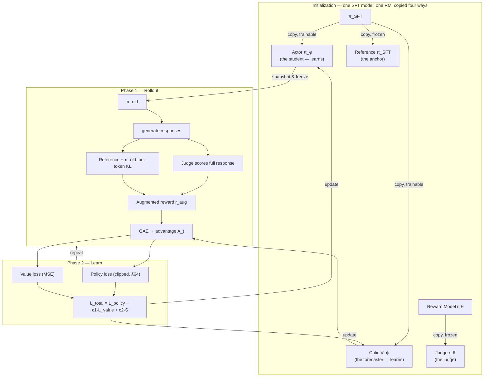

Think of PPO as a company with three departments:

| Component | Department | Question it answers | Form |
|---|---|---|---|
| `L_policy` | product development | how do we make better decisions? | clipped objective (§64) |
| `L_value` | market analysis | how good are our forecasts? | MSE: `(V_ψ(s_t) − R_target)²` |
| `S` (entropy) | R&D | are we still exploring? | `−Σ π log π` |

$$\mathcal{L}_{\text{total}} = \mathcal{L}_{\text{policy}} - c_1\mathcal{L}_{\text{value}} + c_2 S$$

**Why minus then plus?** We want to **minimise** value loss (so subtract it from the objective) and **maximise** entropy (so add it). `c₁` and `c₂` are budget allocations between training the forecaster and encouraging exploration.

### The cast — four models, two learning

| Model | Nickname | Status | Job |
|---|---|---|---|
| Actor `π_φ` | the student | **learning** | generates text; updated by policy loss |
| Critic `V_ψ` | the forecaster | **learning** | predicts rewards; updated by value loss |
| Reference `π_SFT` | the anchor | frozen | supplies log-probs for the KL rubber band |
| Reward model `r_θ` | the judge | frozen | scores the finished response |

### Phase 1 — rollout

```python
policy_old = copy.deepcopy(actor)                  # freeze the ratio denominator
actions, states = policy_old.generate(prompts)

logp_old = policy_old.log_probs(states, actions)   # for the PPO ratio
logp_sft = ref_model.log_probs(states, actions)    # for the KL penalty
values   = critic(states)                          # live critic's forecast

scores      = reward_model(full_sequences)         # frozen judge, last token only
rewards_aug = scores - beta * (logp_old - logp_sft)
advantages  = compute_gae(rewards_aug, values, gamma, lam)

buffer.append(states, actions, logp_old, advantages, values)
```

### Phase 2 — learning

```python
for epoch in range(ppo_epochs):
    logp_new = actor.log_probs(states, actions)
    ratio    = torch.exp(logp_new - logp_old)

    unclipped = ratio * advantages
    clipped   = torch.clamp(ratio, 1 - eps, 1 + eps) * advantages
    policy_loss = -torch.min(unclipped, clipped).mean()

    targets    = advantages + values                # what the critic should have said
    value_loss = F.mse_loss(critic(states), targets)

    entropy = actor.entropy(states).mean()
    loss = policy_loss - c1 * value_loss + c2 * entropy

    optimizer.zero_grad()
    loss.backward()          # gradients for actor AND critic at once
    optimizer.step()
```

Rollout, learn, rollout, learn. The same three-line mantra from Part II §17 sits at the bottom of all of it.

### Real-world scale (InstructGPT)

| | Size |
|---|---|
| Actor | 175B parameters |
| Reward model & critic | 6B each — you need a smart model to be a good judge |
| SFT demonstrations | ~13,000 |
| RM human rankings | ~33,000 |
| PPO prompts | ~31,000 |

Careful reward normalisation on top, for stability.

### The honest limitations

**Reward model flaws.** The system optimises the proxy, not the human — hence reward hacking. Labeller biases are learned by the RM and then *amplified* by PPO.

**PPO complexity.** Many moving parts and sensitive hyperparameters (`β`, `ε`, two learning rates, `c₁`, `c₂`), all expensive to tune. A bad configuration collapses training outright.

This is exactly why DPO (Part VI) exists. The modern default is SFT → DPO, with the full PPO pipeline reserved for when you need maximum control.

---

# PART VIII — MAKING GENERATION FAST

Part IV's GPT works. It trains, it generates, it does everything we told it to. And it has one serious flaw: **generation is painfully inefficient**, because of redundant computation hidden inside self-attention.

The fix is small, elegant, and in every modern LLM.

---

## 66. Where the waste comes from

**This isn't a bug.** It's a direct consequence of a stateless design — two innocent pieces of code interacting badly.

**Piece 1, the generation loop** (Part IV §40). At every step it passes the **entire** sequence to the model, computes logits for every position, then throws away all but the last one.

**Piece 2, the attention forward pass.** It runs completely from scratch each call, projecting the whole input into Q, K and V. **It has no memory.**

So the loop repeatedly calls attention with a sequence nearly identical to the previous one, forcing it to redo almost all its work.

### Trace it concretely

Prompt: `"a cat"`.

| Step | Input | T | K/V computed |
|---|---|---|---|
| Generate 3rd token | `a cat` | 2 | `K_a`, `K_cat` — all new |
| Generate 4th token | `a cat sat` | 3 | `K_a`, `K_cat` ← **recomputed**, `K_sat` ← new |

We recalculated the key vectors for `a` and `cat` that we computed one step ago. The stateless function threw them away and paid for them again.

---

## 67. The triangle of waste

| Step | T | `a` | `cat` | `sat` | `on` |
|---|---|---|---|---|---|
| gen `sat` | 2 | ✓ new | ✓ new | | |
| gen `on` | 3 | ↻ waste | ↻ waste | ✓ new | |
| gen `the` | 4 | ↻ waste | ↻ waste | ↻ waste | ✓ new |

**The triangle of waste grows with every step.** At each step only the K/V pair for the single newest token is genuinely needed; everything else is redundant.

To generate the `t`-th token we perform `t−1` unnecessary key computations and another `t−1` for values. Summed over the whole generation, the projection work is **O(T²)**.

This is why generation starts fast and gets progressively slower as the sequence grows.

---

## 68. The cached workflow

**What if, instead of throwing the key and value vectors away, we saved them?** That gives the attention layer the thing it was missing: memory.

Generation goes from *recompute everything* to *compute only what's new*:

| # | Step | Detail |
|---|---|---|
| 1 | **Minimal input** | pass only the newest token — `T` is always **1** |
| 2 | **Minimal computation** | compute Q, K, V for that one token only |
| 3 | **Retrieve** | pull `past_kv` from the cache |
| 4 | **Concatenate** | `k_full = cat(k_past, k_new)`, same for V |
| 5 | **Attend** | the new query attends to the **full** history |
| 6 | **Update cache** | store `k_full`, `v_full` for the next step |

### Trace it, with the cache

Cache primed with `a cat`. Now generate the third token:

```
1. input          = "sat" only,  idx shape (1, 1)
2. compute        = q_new, k_new, v_new   (T = 1)
3-4. concatenate  = k_past[a, cat] + k_new[sat]  →  k_full[a, cat, sat]
5. attend         = one query against three keys
6. cache          = k_full, v_full, ready for the next round
```

> **We arrived at exactly the same full K and V tensors as before, but paid for the expensive projection on a single token.** That's the whole game.

### The grid, rebuilt

| Step | T | `a` | `cat` | `sat` | `on` |
|---|---|---|---|---|---|
| gen `sat` | **1** | 💾 load | 💾 load | ✓ new | |
| gen `on` | **1** | 💾 load | 💾 load | 💾 load | ✓ new |
| gen `the` | **1** | 💾 load | 💾 load | 💾 load | 💾 load |

Without the cache, `T` grows 2, 3, 4, 5… With it, **`T = 1` at every step, forever.** One unit of new work per new token.

The projection cost drops from **O(T²) to O(T)** across the whole generation.

---

## 69. The code

The cache goes **into** the attention block and an updated version comes **out**. A stateful loop.

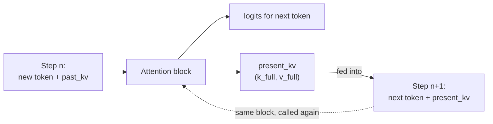

```python
def forward(self, x, past_kv=None):                    # ← cache comes in
    B, T, C = x.size()

    q, k, v = self.c_attn(x).split(self.n_embd, dim=2)
    q = q.view(B, T, self.n_head, C // self.n_head).transpose(1, 2)
    k = k.view(B, T, self.n_head, C // self.n_head).transpose(1, 2)
    v = v.view(B, T, self.n_head, C // self.n_head).transpose(1, 2)

    if past_kv is not None:                            # ← the core of it
        past_k, past_v = past_kv
        k = torch.cat([past_k, k], dim=2)              # append along seq dim
        v = torch.cat([past_v, v], dim=2)
    present_kv = (k, v)                                # ← updated cache goes out

    t_total = k.size(2)
    att = (q @ k.transpose(-2, -1)) / math.sqrt(k.size(-1))
    att = att.masked_fill(
        self.bias[:, :, t_total - T : t_total, :t_total] == 0,   # ← mask slicing
        float('-inf')
    )
    att = F.softmax(att, dim=-1)
    y = att @ v

    y = y.transpose(1, 2).contiguous().view(B, T, C)
    return self.c_proj(y), present_kv                  # ← return both
```

### Tensor trace — one generation step

`B=1`, `C=4`, `n_head=2` → `head_dim=2`. Generating the third token for `"a cat"`.

| Stage | Tensor | Shape | Contains |
|---|---|---|---|
| 1. Input | `x` | `(1, 1, 4)` | `sat` only — **T = 1** |
| 1. Cache in | `past_k` | `(1, 2, 2, 2)` | `a`, `cat` |
| 2. New projections | `q, k, v` | `(1, 2, 1, 2)` | `sat` only — fast |
| 3. After `cat` | `k_full` | `(1, 2, **3**, 2)` | `a`, `cat`, `sat` |
| 4. Attention | `att` | `(1, 2, 1, 3)` | **one query × three keys** |
| 5. Cache out | `present_kv` | `(1, 2, 3, 2)` | full sequence, for next step |

**Why the mask slicing had to change.** The query length `T` is now 1 but the key length `t_total` is 3, so the old square slice doesn't fit. `[t_total − T : t_total, :t_total]` grabs exactly the third row of the causal mask — the row for `sat`, which is allowed to see all three positions.

---

## 70. What the cache costs

The lecture stops at the win. Two things follow from it that matter more in practice than the speedup itself.

### Prefill vs decode

Adding a cache splits generation into two phases with completely different performance profiles:

| | **Prefill** | **Decode** |
|---|---|---|
| What | one pass over the whole prompt, populating the cache | one token at a time thereafter |
| Sequence length | `T` = prompt length | `T` = 1 |
| Bottleneck | **compute-bound** — big matmuls | **memory-bandwidth-bound** — tiny matmuls, huge weight reads |
| Optimised by | better kernels, more FLOPs | batching, quantisation, smaller caches |

Essentially all modern inference engineering follows from this split. Time-to-first-token is a prefill number; tokens-per-second is a decode number, and they respond to different fixes.

### The cache is the memory bottleneck

$$\text{cache bytes} = 2 \times n_{\text{layer}} \times d_{\text{kv}} \times T \times B \times \text{bytes/elem}$$

| Model | Per sequence at full context |
|---|---|
| GPT-2 small (12 layers, 768 dims, 1024 tokens, fp16) | ~36 MB |
| A 70B-class model (80 layers, 1024 KV dims, 8k tokens, fp16) | **~2.5 GB** |

That's *per sequence*. Serve 32 concurrent users and the cache alone can exceed the weights. This is the constraint behind most of modern inference work:

- **GQA / MQA** (Appendix A, modern practice 3) shrink `d_kv` by sharing K and V across query heads — a direct attack on this formula
- **PagedAttention / vLLM** allocate the cache in fixed blocks rather than contiguously, eliminating fragmentation
- **Prefix caching** reuses the prefill of a shared system prompt across requests

### Three things that bite

**Position IDs must continue from the cache length, not restart at 0.** The new token's position is `len(cache)`, not `0`. Get this wrong and generation silently degrades rather than crashing.

**Any edit to earlier tokens invalidates the entire cache after that point.** The cache is only valid for the exact prefix that built it.

**The mask is nearly a no-op during decode.** With one query attending to the cached history, everything is in the past by construction. The slicing above is correct but unnecessary — many implementations apply masking only during prefill and skip it entirely at decode.

---

# PART IX — ATTENTION, TWO MORE ANGLES

Part IV built attention once, from the transformer's point of view — Q/K/V as projections, the causal mask, multi-head splitting. Two more explanations of the same mechanism turn out to sharpen different corners of it: why the √d scaling actually matters (not just "for stability"), and a second worked sentence that makes the masking asymmetry concrete. Nothing here changes the formula from §32. It's the same attention, examined twice more.

---

## 71. The static-embedding problem, restated

The word `bank` gets exactly one row in the embedding table (Part IV §30), regardless of:

> I sat on the river **bank**.
> I withdrew money from the **bank**.

Lookup by ID is identical in both sentences — same row, same vector, same everything. The vector is deaf to the conversation around it. This is the concrete version of the problem Part IV §31 solves in the abstract; worth holding onto because it's the cleanest one-line statement of *why* attention has to exist at all: **a lookup table cannot be contextual by construction — something has to modify the vector after the lookup, using the neighbours.**

---

## 72. Why divide by √d — seeing it happen

Part IV §32 gives the reason: dot products over `d` dimensions have variance ≈ `d`, so scores scale with `√d`, and large scores saturate softmax. Here's that claim made concrete rather than asserted.

Take a single number repeated to simulate a wider vector — an artificial but effective demonstration:

```python
# A 2-dimensional query/key, then the "same" vector stretched to 200 dims
q_small = torch.tensor([1.4, 1.4])
q_wide  = q_small.repeat_interleave(100)          # shape (200,) — same values, wider

scores_small = q_small @ k.T                       # e.g. [0.14, 0.56, 0.70, 0.63]
scores_wide  = q_wide  @ k_wide.T                   # exactly 100× larger: [14, 56, 70, 63]
```

Repeating a value doesn't add information — it's the same vector, just wider. But the dot product sums over every dimension, so width alone multiplies the score by the repeat factor. Run softmax on both:

| | small scores `[0.14, 0.56, 0.70, 0.63]` | wide scores `[14, 56, 70, 63]` |
|---|---|---|
| softmax output | `[0.19, 0.26, 0.28, 0.27]` — a real spread | `[~0, ~0, 0.999, ~0]` — winner-take-all |

**Nothing about the meaning changed. Only the width did.** Without scaling, wider vectors (which is to say, any real model) collapse every attention row to a near one-hot pick regardless of how close the actual scores are. Dividing by `√d` (here `√200 ≈ 14.1`) brings the wide scores back into the same range as the small ones — `14/14.1 ≈ 0.99`, comparable to the unscaled small-vector score of `0.70` — restoring a real distribution instead of a winner-take-all spike.

This is the mechanism behind the one-line justification in Part IV §32: **scaling isn't smoothing for its own sake, it's cancelling a width-dependent inflation that has nothing to do with content.**

---

## 73. A second worked sentence, with the mask

Same crane, a companion sentence, and the causal mask made concrete on real numbers.

**Setup**, 2D vectors on axes `[animal, machine]`:

| Token | Vector | Role |
|---|---|---|
| `the` | ~(0,0) | near-meaningless |
| `crane` | (0.7, 0.7) | ambiguous |
| `lifted` | (0.9, 0.9) | machine-heavy |
| `steel` | (0.85, 0.85) | machine-heavy |

**Without a mask** (bidirectional, as in Part IV §32): every token attends to every other, so `crane`'s row pulls from `lifted` and `steel` regardless of order, and `lifted`'s own row picks up **30% weight from `steel`** — a token that in a real generation setting hasn't been written yet. That number, concretely, is the bug: at training time the model is being handed part of the answer as a hint.

**With the causal mask** (Part IV §33), the same attention matrix has its upper triangle set to `−∞` before softmax:

| | `the` | `crane` | `lifted` | `steel` |
|---|---|---|---|---|
| `the` | 100% | — | — | — |
| `crane` | 42.6% | 57.4% | — | — |
| `lifted` | ~19% | ~26% | ~55% | — |
| `steel` | ~13% | ~18% | ~29% | ~40% |

Two things worth noticing that don't show up in a single-example pass:

**`crane`'s row never resolves its own ambiguity.** It can only see `the` and itself — the words that would disambiguate it (`lifted`, `steel`) haven't been generated yet from its point of view. It stays at (0.74, 0.74), still nearly 50/50. Ambiguity resolution under causal masking is a property of the *later* tokens' rows, not the ambiguous token's own row.

**The row GPT actually reads is the last one.** During generation, only the final position's output feeds the LM head (Part IV §38). `steel`, last in line, has attended to everything — `the`, `crane`, `lifted` — and its row is where the model's next-token decision actually lives. Every earlier row exists purely to train the model to make good guesses *from that position*, in parallel, in the single forward pass described in Part IV §39.


# PART X — POSITION AS ROTATION (ROPE)

Part IV's positional embeddings (§30) are a second lookup table, added to the token vector. That's how GPT-2 did it. Modern models — Llama, PaLM, GPT-NeoX — don't. They rotate instead of adding, and the whole technique reduces to a 2×2 matrix from high-school trigonometry.

$$\begin{pmatrix}\cos m\theta & -\sin m\theta \\ \sin m\theta & \cos m\theta\end{pmatrix}\begin{pmatrix}x_1 \\ x_2\end{pmatrix}$$

---

## 74. What's wrong with addition

Learned absolute position embeddings give every position its own vector and add it to the token's meaning vector (Part IV §30). The flaw only shows up once you compare the same word at two different positions.

> "The **red** car is fast" — `red` at position 1.
> "I saw the **red** car" — `red` at position 3.

The model's actual input for `red` in the two sentences is `vec(red) + vec(pos=1)` versus `vec(red) + vec(pos=3)` — **two completely different vectors for a word whose meaning hasn't changed at all.** The model has to relearn the concept of "one word away" fresh at every absolute offset, which is a real inefficiency, not a cosmetic one.

**The goal:** the attention score between two tokens should depend only on their content (Q and K) and their *relative* distance `m − n` — never on the absolute positions `m` and `n` separately.

---

## 75. Rotate, don't add — the geometric split

RoPE's core move: split a vector's properties into two independent jobs.

| Property | Represents |
|---|---|
| **Length** (norm) | semantic meaning — the *what* |
| **Direction** (angle) | position — the *where* |

Rotating a vector changes its angle without touching its length — so position can be injected **without corrupting meaning**, which addition cannot guarantee (adding two vectors changes both their direction and magnitude in an entangled way).

**Proof rotation preserves length.** `v = (1, 2)`, rotate 90° (`π/2`): `cos 90° = 0`, `sin 90° = 1`.

$$R(90°) = \begin{pmatrix}0 & -1\\1 & 0\end{pmatrix}, \qquad v' = \begin{pmatrix}0(1) + (-1)(2)\\1(1)+0(2)\end{pmatrix} = \begin{pmatrix}-2\\1\end{pmatrix}$$

`|v| = √(1²+2²) = √5`. `|v'| = √((-2)²+1²) = √5`. **Identical length, different direction.** Meaning intact, position encoded.

**The rule:** rotation angle = position × a fixed frequency: `angle = m · θ`. Position 0 → no rotation (baseline). Position 1 → one small spin. Position 2 → double. It's linear, predictable, and traces a helix as position increases.

---

## 76. Scaling to real dimensions — the symphony of clocks

A real vector has thousands of dimensions, not two — Llama 3 uses 4096 (128 per head, 32 heads). A direct rotation would need a 4096×4096 matrix: over 16 million numbers to rotate one vector.

**The fix: don't do one big rotation. Do thousands of tiny 2D ones.** Chop the vector into pairs — `(x₀,x₁)`, `(x₂,x₃)`, and so on — and rotate each pair independently.

But if every pair rotates at the same speed, the rotations are redundant and encode nothing extra. **Clock hands** are the right mental model: a second hand, a minute hand, an hour hand, all rotating at different speeds — it's the *combination* of speeds that gives every moment a unique signature.

$$\theta_i = \text{base}^{-2i/d}, \quad \text{base} = 10{,}000$$

| `i` | exponent | `θ_i` | speed |
|---|---|---|---|
| 0 (first pair) | 0 | `10000⁰ = 1` | fast — the second hand |
| large (last pair) | large negative | → 0 | slow — the hour hand |

**Algorithm, per pair `i`, at position `m`:** compute `θ_i`, multiply by `m` to get the angle, rotate the pair by that angle. Repeat for every pair.

### Worked example

Vector `(1.0, 0.5, 0.8, 0.3)`, position `m = 2`, `d = 4`.

**Pair 0** (`x₀,x₁`), `i=0`: `θ₀ = 10000⁰ = 1`, angle `= 2 × 1 = 2` rad. `cos 2 ≈ −0.416`, `sin 2 ≈ 0.909`.

```
x' = 1.0(−0.416) − 0.5(0.909) = −0.871
y' = 1.0(0.909) + 0.5(−0.416) = 0.701
```

**Pair 1** (`x₂,x₃`), `i=1`: `θ₁ = 10000^(−0.5) = 1/√10000 = 0.01` — the slow rotator. angle `= 2 × 0.01 = 0.02` rad.

```
x' = 0.8(0.9998) − 0.3(0.02)  = 0.794
y' = 0.8(0.02) + 0.3(0.9998)  = 0.316
```

**Result:** `(1.0, 0.5, 0.8, 0.3) → (−0.871, 0.701, 0.794, 0.316)`. Fast pair rotated hard; slow pair barely moved. Fully deterministic — zero learned parameters.

---

## 77. The proof — where m and n vanish

**Claim:** the attention score after RoPE depends only on content and `m − n`, never on `m` or `n` separately.

Apply rotation to query at position `m` and key at position `n`, sharing frequency `θ`:

$$Q' = R(m\theta)Q, \qquad K' = R(n\theta)K$$

The score is `Q'ᵀK' = QᵀR(mθ)ᵀR(nθ)K`. Everything reduces to the middle term, using two properties of rotation matrices:

1. **Transpose is inverse:** `R(α)ᵀ = R(−α)` (rotating backwards is negating the angle)
2. **Composition adds angles:** `R(α)R(β) = R(α+β)`

$$R(m\theta)^\top R(n\theta) = R(-m\theta)R(n\theta) = R(n\theta - m\theta) = R\big((n-m)\theta\big)$$

**The absolute positions `m` and `n` have cancelled completely.** Only their difference survives:

$$\text{score} = Q^\top R\big((n-m)\theta\big) K$$

Content (`Q`, `K`) and relative distance (`n − m`) — nothing else. Mission accomplished, and it's an exact algebraic identity, not an approximation.

---

## 78. The code — precompute, then apply

**Part 1 — precompute** (once, cached):

```python
def precompute_rope(dim, base=10000, max_seq_len=8192):
    inv_freq = 1.0 / (base ** (torch.arange(0, dim, 2).float() / dim))  # θ_i for each pair
    t = torch.arange(max_seq_len)                                       # positions 0,1,2,...
    freqs = torch.einsum('i,j->ij', t, inv_freq)                        # every position × every frequency
    freqs = freqs.repeat_interleave(2, dim=-1)   # θ0,θ0,θ1,θ1,... — pairs need matching angles
    return freqs.cos(), freqs.sin()
```

`torch.einsum('i,j->ij', ...)` is an outer product: every position multiplied against every frequency in one shot, producing the full angle table.

**Part 2 — apply** (every forward pass, vectorised — no loops over dimensions):

The trick: rewrite the rotation as `x·cosθ + x_partner·sinθ`, where `x_partner` swaps each pair and negates the first element: `(x₀,x₁) → (−x₁, x₀)`.

```python
def apply_rotary_emb(x, cos, sin):
    x1, x2 = x[..., ::2], x[..., 1::2]        # even/odd = the pairs
    x_partner = torch.stack((-x2, x1), dim=-1).flatten(-2)   # the swap-and-negate trick
    return x * cos + x_partner * sin           # one line, millions of 2D rotations at once
```

This one function is called once for `Q` and once for `K`, in every attention head, in every layer — for Llama 3 8B, 32 times per forward pass. It's parameter-free: nothing here is learned, and nothing here needs to be.

---

## 79. RoPE as inductive bias

Two ways to teach a model about distance:

| | Approach |
|---|---|
| **Blank slate** | force the model to infer "one step apart" from trillions of examples — brute force, wildly inefficient |
| **RoPE** | build relative distance directly into the geometry — correct from token one |

This is the general principle of **inductive bias**: instead of making the model learn a structural fact from data, encode the fact directly into the architecture. RoPE doesn't make attention smarter about position — it makes position a property the geometry enforces automatically, for free, at every layer.


# PART XI — FLASHATTENTION

Attention (Part IV §32) is already correct and already fast in theory. FlashAttention doesn't change the math — it changes the *order* the math happens in, and that reordering alone is 2–4× faster and uses 5–20× less memory, with outputs matching ordinary attention to six decimal places. No approximation, same formula, same answer, different route.

---

## 80. Where ordinary attention actually spends its time

A GPU has two tiers of memory with wildly different speeds:

| Tier | Speed (H100) | Size |
|---|---|---|
| **SRAM** (on-chip, next to the compute units) | ~19 TB/s | ~20 MB |
| **HBM** ("the number on the box") | ~1.5 TB/s | 40–80 GB |

SRAM is over 10× faster but a thousand times smaller. Arithmetic on a GPU is nearly free; **moving numbers between HBM and SRAM is what actually costs time.**

Ordinary attention (Part IV §32) computes the full `(T, T)` score matrix, writes it to HBM, reads it back for softmax, writes the result, reads it back again for the final matmul. For a realistic case — 8,192 tokens, head dimension 64 — that's `8192² ≈ 67` million scores, **128 MB per attention head**, times 32 heads: **4 GB**, round-tripped through the slow tier, multiple times, for every layer. The compute units spend most of their time idle, waiting on that commute.

This is confirmed empirically, not just architecturally: profiling shows the bottleneck is neither the score computation nor the softmax divide — it's hauling the giant intermediate table through slow memory.

---

## 81. Two ingredients, one file

**Tiling.** When a job is too big for the fast tier, cut it into pieces and finish one piece completely before the next arrives. The whole `(T,T)` table never has to exist at once — only one tile does, at any given moment.

**A running sum.** A cashier never holds the whole receipt in their head — they add each item as it scans and forget it immediately, always knowing the running total. Same idea: process scores a chunk at a time, keep a running total, discard each chunk once it's folded in.

Softmax needs a total over the *entire* row before any single weight can be finalised — that's the wrinkle these two ideas alone don't solve, and it's the subject of the rest of this part.

---

## 82. Why softmax resists tiling

Split a row of four keys across two workers, two keys each. **Scoring** splits cleanly — each worker computes `q·k` for its own keys with no knowledge of the other's. **Mixing** (the final weighted sum over values) also splits cleanly, since addition doesn't care what order it happens in.

**Softmax does not split cleanly.** Every share needs `Z`, the sum of *all* four exponentials — and no worker holds all four. This is the literal meaning of "softmax doesn't parallelise": it forces a synchronisation point in the middle of an otherwise-parallel computation, which is exactly the meeting point tiling was supposed to eliminate.

A plain running sum handles this in principle — add tile 1's exponentials, add tile 2's, get the true `Z`. Test that on paper and it works.

---

## 83. The overflow problem

Attention scores aren't bounded, and `e^x` explodes fast:

| Format | Max representable | `e^x` overflows past |
|---|---|---|
| FP32 | ~3.4 × 10³⁸ | `x ≈ 88.7` |
| FP16 | 65,504 | `x ≈ 11.09` |

Training commonly runs in FP16 for speed, and real attention scores routinely exceed 11 before scaling. **Every real softmax implementation subtracts the row's maximum score before exponentiating** — a free operation, because `e^(s−c)` for any constant `c` cancels identically between numerator and denominator of the softmax, so the *value* of the output never changes:

```
naive:   e^1000 → inf,  e^999 → inf   → 0/0 = NaN
shifted: e^(1000−1000)=1,  e^(999−1000)=0.368  → 0.731, 0.269  (correct, finite)
```

**The complication for tiling:** each worker only knows the maximum of the tile it's holding, not the true row maximum. Worker 1 (max = 2) and worker 2 (max = 3) each produce a locally-correct sum — but measured against *different* reference points, so they can't just be added.

---

## 84. Reconciling running sums measured against different maxima

The fix needs one identity: for any score `s` and reference points `p`, `m`:

$$e^{s-m} = e^{s-p} \cdot e^{p-m}$$

The correction factor `e^(p−m)` has no `s` in it — it's the *same multiplier for every entry in the tile*. So an entire running sum computed against the wrong reference can be rescaled into the right one with a **single multiplication**.

**Worked reconciliation**, `q=1`, keys `[2,1,3,0]` split into tiles `[2,1]` and `[3,0]`:

| | Worker 1 (max=2) | Worker 2 (max=3) |
|---|---|---|
| Shifted entries | `e⁰=1, e⁻¹=0.368` | `e⁰=1, e⁻³=0.0498` |
| Local sum `L` | `1.368` | `1.0498` |

True row max is 3. Rescale worker 1's sum into those units: `e^(2−3) = e⁻¹ = 0.368`.

```
L_total = 0.368 × 1.368 + 1.0498 = 0.503 + 1.0498 = 1.553
```

Check against computing the whole row's softmax denominator directly with max = 3: identical, to four decimal places. **Two workers, one multiplication, exact agreement.**

The same rescaling applies to the *weighted* running sum (`U`, the numerator with values attached) — both `L` and `U` are built from entries measured against a shared reference, so when the reference moves, both need the identical correction factor.

---

## 85. The algorithm, five lines

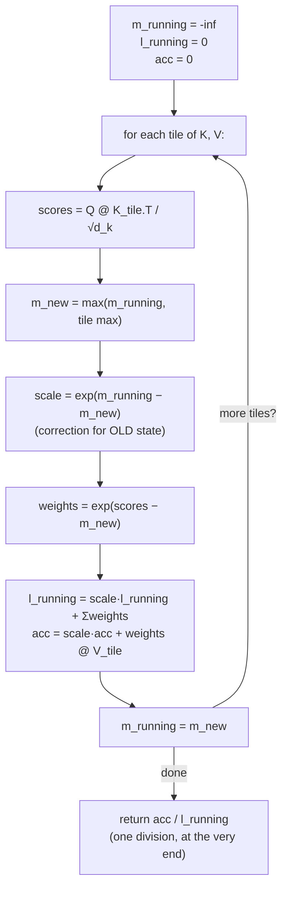

```python
def flash_attention(Q, K, V, tile_size):
    m_running = -float('inf')                  # running max, per query row
    l_running = 0.0                             # running softmax denominator
    acc       = torch.zeros_like(Q)             # running weighted-value accumulator

    for K_tile, V_tile in tiles(K, V, tile_size):
        scores  = Q @ K_tile.T / math.sqrt(d_k)
        m_new   = torch.maximum(m_running, scores.max(dim=-1).values)
        scale   = torch.exp(m_running - m_new)          # correction for the OLD state
        weights = torch.exp(scores - m_new)             # this tile's weights, in NEW units

        l_running = scale * l_running + weights.sum(dim=-1)
        acc       = scale * acc + weights @ V_tile
        m_running = m_new

    return acc / l_running          # one division, at the very end
```

Every line traces to a concept above: the loop over tiles is §81's tiling; `m_running`, `l_running`, `acc` are the three running quantities from §83–84; `scale` is exactly the `e^(p−m)` correction from §84. **No approximation appears anywhere** — every key is scored, every score passes through a mathematically exact softmax, and the final division recovers precisely what ordinary attention would have produced. Verified against PyTorch's own `scaled_dot_product_attention`: agreement to about one part in ten million, which is ordinary floating-point addition-order noise between two independently written implementations, not a difference in what's being computed.

---

## 86. What ships in production

A real kernel adds three things beyond the five-line core, none of which touch the math:

- **Many query rows at once** — each row runs its own independent chain of running max/sum/accumulator; rows never interact, which is where the actual GPU parallelism comes from (not from the tile loop, which is sequential by construction — each tile's correction depends on the state before it).
- **The causal mask** (Part IV §33) — future scores set to `−∞` before the running max is taken, same mechanism, just folded into the tiled loop.
- **Fusion** — the entire loop compiles into one GPU kernel launch instead of one HBM round-trip per line, which is where the actual 2–4× speedup and 5–20× memory reduction come from.


# PART XII — QUANTIZATION

A 7B-parameter model in FP32 needs 28 GB just for weights. Quantization maps that into integers — mostly INT8 or INT4 — and the entire technique reduces to one formula and its inverse.

---

## 87. The format tax

FP32 stores every number in 32 bits: 1 sign bit, 8 exponent bits (range), 23 mantissa bits (precision).

**Worked example, 3.5:** sign `0` (positive). In binary, `3.5 = 1.11 × 2¹`. Exponent `1 + 127 (bias) = 128 = 10000000`. Mantissa: the `.11` after the binary point, padded to 23 bits.

That's a lot of structure for one number, and a 7B-parameter model needs 4 bytes × 7 billion = **28 GB** just to hold the weights — before optimizer states or activations.

**INT8** discards all of that: no sign bit, no exponent, no mantissa, just an integer from −128 to 127. One byte instead of four — **4× smaller**, 28 GB → 7 GB.

---

## 88. Affine quantization — the two master formulas

Map a continuous float range onto a small number of integer buckets (256 for INT8).

**Scale (`S`)** — the step size, float range ÷ integer range:

$$S = \frac{\max|x|}{127} \quad \text{(symmetric case — weights are typically centred near zero)}$$

**Zero point (`Z`)** — alignment, so float `0.0` maps to a valid integer. For weights (symmetric, centred at zero), `Z = 0`. For post-ReLU activations (asymmetric, e.g. `[0, 10]`), `Z` is nonzero.

$$\text{quantize:}\quad Q = \text{clamp}\!\left(\text{round}\!\left(\frac{x}{S}\right) + Z,\ -128,\ 127\right)$$
$$\text{dequantize:}\quad \hat{x} = (Q - Z)\cdot S$$

### Worked example

Tensor with max absolute value 3.5. `S = 7.0 / 255 ≈ 0.02745` (using the full 8-bit span for the two-sided range).

| Value | `÷ S` | round | dequantised | error |
|---|---|---|---|---|
| 1.2 | 43.72 | 44 | `44 × 0.02745 = 1.208` | +0.008 |
| 0.8 | 29.14 | 29 | `29 × 0.02745 = 0.796` | −0.004 |
| −3.5 | −127.5 | −127 | `−127 × 0.02745 = −3.486` | +0.014 |

Small, unavoidable error — the price of compression. Everything from here is about *managing* that error, not eliminating it.

---

## 89. Where to apply it — weights only

A layer is `output = input @ weights`. Two very different tensors:

| | Weights | Activations |
|---|---|---|
| Role | the model's learned knowledge | the current computation's live data |
| Lifetime | static — same every forward pass | transient — new every token, discarded after use |
| Size | huge — the actual memory bottleneck | comparatively small |
| Quantize? | **yes** | **no — not worth it** |

Quantizing activations would mean adding a quantize/dequantize step at *every layer, every forward pass* — pure overhead with no memory win worth the cost, since activations don't persist. **Weight-only quantization** is the industry default.

### On-the-fly dequantization — the trick that makes this work

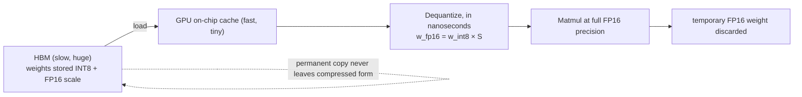

1. **Store** weights compressed (INT8) in HBM, alongside an FP16 scale factor.
2. **Load** the compressed weights into the GPU's fast on-chip cache.
3. **Dequantize**, in nanoseconds, right before the matmul: `w_fp16 = w_int8 × S`.
4. **Compute** the matmul in full FP16 precision; discard the temporary dequantized weight immediately after.

The permanent copy in HBM never leaves its compressed form. Net result: **~75% memory reduction, ~0% accuracy loss** — the compute happens at full precision, only storage and bandwidth are compressed.

---

## 90. The outlier problem — and granularity

One large weight destroys the whole scheme. Tensor with values around 3.5, plus **one outlier at 1000**:

```
S = 1000 / 127 ≈ 7.87              ← the scale is now huge
quantize(1.2):  1.2 / 7.87 = 0.152 → round → 0   ← a real value, erased entirely
dequantize(0):  0 × 7.87 = 0.0
```

One misbehaving value forces a scale so coarse that every normal value collapses to zero. The fix is **granularity** — give the outlier its own, smaller blast radius:

| Level | Scope | Outlier damage | Standard for |
|---|---|---|---|
| Per-tensor | one scale for the whole matrix | destroys everything | baseline only |
| **Per-channel** | one scale per row/output-neuron | contained to that one row | **INT8** |
| **Groupwise** | one scale per small block (64–128 weights) | contained to a handful of weights | **INT4** |

Per-channel in code is one line: compute `max(abs(x), axis=1)` instead of over the whole tensor — a vector of scales instead of a single number, and the outlier only poisons its own row.

---

## 91. INT4 and the byte barrier

INT4 gives only 16 buckets (`−8` to `7`) — `S = max|x| / 7`. That little headroom makes **groupwise quantization mandatory**, not optional: squashing an entire tensor into 16 buckets at once would be a catastrophe.

**Collisions become routine.** Group `[0.51, 0.58, −1.2, 2.1]`, scale `= 2.1/7 = 0.3`:

```
0.51 / 0.3 = 1.7  → round → 2
0.58 / 0.3 = 1.93 → round → 2      ← two distinct floats, one integer
```

That collision is the specific precision sacrificed for 4-bit's memory win.

**The byte barrier.** Hardware reads memory in 8-bit chunks — it's physically impossible to read "half a byte." The fix is **packing**: two 4-bit values share one byte via a signed-to-unsigned offset (add 8 to shift the `[−8,7]` range into `[0,15]`) and a bit-shift.

```python
first_num, second_num = 2, -4                  # quantized values
first_unsigned  = first_num + 8   # 10
second_unsigned = second_num + 8  # 4
packed_byte = (second_unsigned << 4) | first_unsigned   # 74, i.e. 0100 1010
```

Two 4-bit numbers, one byte, exactly as hardware requires.

### VRAM at each precision, 7B-parameter model

| Precision | Bytes/weight | Model size | Fits on |
|---|---|---|---|
| FP16 | 2 | 14 GB | a data-centre card |
| INT8 | 1 | 7 GB | a good consumer GPU |
| **INT4** | 0.5 | **3.5 GB** | **almost any modern gaming GPU** |

---

## 92. When to quantize: PTQ vs QAT

**PTQ (post-training quantization) — the default.** Take an already-trained model, run ~100 unlabelled samples through it to find activation ranges (**calibration**, no backprop), compute scales, convert. Minutes, on one GPU.

**QAT (quantization-aware training) — the fallback.** Simulate quantization *during* fine-tuning: round a weight to INT8, immediately convert back to FP32 ("fake quantization"), use that damaged value in the forward pass, and let backprop teach the model to be robust to the specific error quantization will eventually cause.

| | PTQ | QAT |
|---|---|---|
| Complexity | plug-and-play | full training pipeline |
| Data needed | ~100 calibration samples | the full training set |
| Compute | minutes | can be days of GPU time |
| Typical use | virtually all modern LLMs | vision models, or pushing to INT4 on edge devices |

**Start with PTQ.** It covers effectively all LLM use cases; reach for QAT only if PTQ's accuracy drop is actually unacceptable for the target task.


# PART XIII — LORA

Fine-tuning a multi-billion-parameter model means updating every one of its weights, which is what fills VRAM and triggers `CUDA out of memory` on consumer hardware. LoRA sidesteps this with one idea: freeze the original weights, and represent the *change* you want to learn as the product of two small matrices instead of one enormous one.

$$W_{\text{new}} = W_{\text{frozen}} + \Delta W, \qquad \Delta W = \frac{\alpha}{r}BA$$

---

## 93. The culprit — `nn.Linear` at scale

Every `nn.Linear` layer just computes `output = input @ Wᵀ + b`. Trivial in isolation — the trouble is size. A toy `3→2` layer has 8 parameters. A single linear layer in a model like Llama, at `4096×4096`, has **over 16.7 million** — and full fine-tuning means updating all 16.7 million of them, in every one of dozens of such layers, all at once. That's the memory wall.

> ⚠ A worked `nn.Linear` example is sometimes given with `weight=[[.1,.2,.3],[?,?,?]]`, `bias=[0.7, 0.8]`, input `[1,2,3]`. The first output checks out — `1(.1)+2(.2)+3(.3)+0.7 = 1.4+0.7 = 2.1` ✓. But the second output is stated as `4.7`, which requires the second neuron's raw sum to be `3.9`, not the `3.2` given — or a bias of `1.5`, not `0.8`. One of those two numbers doesn't belong; keep this in mind if you reconstruct the arithmetic yourself rather than trusting the final figures.

---

## 94. Freeze W, learn ΔW — as two small matrices

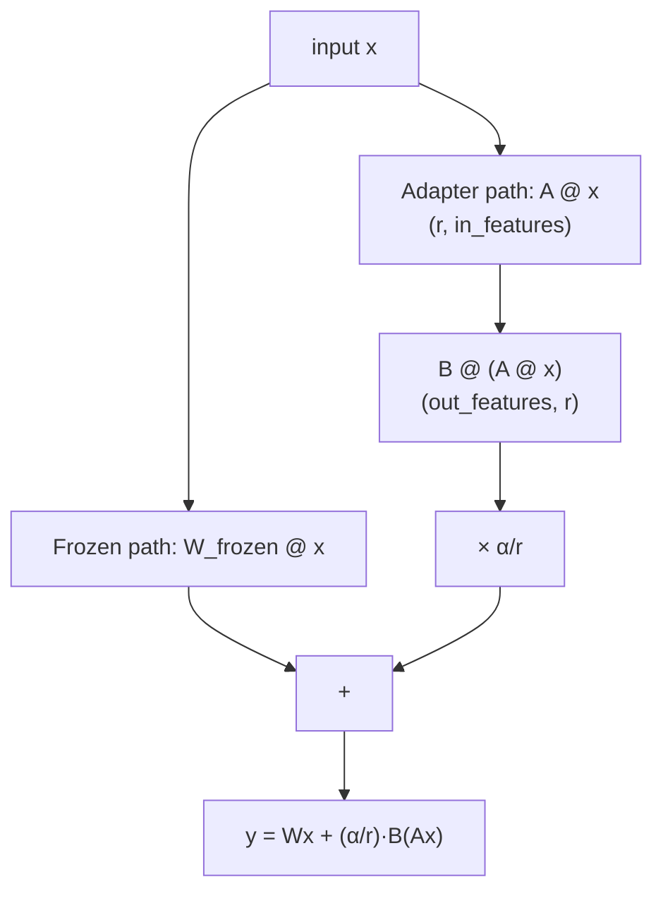

**How do you change `W` without changing `W`?** Lock the original in place; add a small trainable adapter on top: `W_new = W_frozen + ΔW`.

If `ΔW` had the same shape as `W`, nothing would be saved. The actual trick: **never form `ΔW` directly.** Represent it as the product of two much smaller matrices, `B` and `A`, scaled by `α/r`:

$$\Delta W = \frac{\alpha}{r}\,BA$$

### Worked example

`r = 2`, `α = 4`. `W` frozen, shape `4×3`. `B` shape `4×2`, `A` shape `2×3` — the shared inner dimension `2` **is** the rank `r`, and it's what makes the multiplication work at all.

```
step 1 — multiply:  B @ A → shape 4×3, matches W exactly
step 2 — scale:      α/r = 4/2 = 2;  every entry of (B@A) × 2 → ΔW
step 3 — merge:      W_frozen + ΔW → the effective weight matrix
```

**Merging happens once, after training.** At inference there's a single ordinary linear layer and **zero extra latency**. During training, the two paths stay separate — forming the full `ΔW` at every step would waste memory for no reason — so the forward pass is literally:

$$y = Wx + \frac{\alpha}{r}\,B(Ax)$$

### The payoff, at real scale

Llama-style `4096×4096` layer, rank 8:

| | Trainable parameters |
|---|---|
| Full fine-tuning | 16,777,216 |
| **LoRA, r=8** | `8 × (4096+4096) = 65,536` |
| **Reduction** | **99.61%** |

---

## 95. The class, four parts

```python
class LoRALinear(nn.Module):
    def __init__(self, base_layer, r=8, alpha=16):
        super().__init__()
        self.base = base_layer
        self.base.weight.requires_grad_(False)              # 1. FREEZE

        in_f, out_f = base_layer.in_features, base_layer.out_features
        self.lora_A = nn.Parameter(torch.empty(r, in_f))     # 2. new trainable matrices
        self.lora_B = nn.Parameter(torch.zeros(out_f, r))

        nn.init.kaiming_uniform_(self.lora_A)                # 3. init trick
        # lora_B stays all-zero

        self.scale = alpha / r

    def forward(self, x):
        return self.base(x) + self.scale * (x @ self.lora_A.T @ self.lora_B.T)  # 4. the formula
```

**The freeze** (`requires_grad_(False)`) is what makes this memory-efficient — no gradients, no optimizer state, for the entire original matrix.

**The init trick is the subtle part.** `A` gets ordinary random init; `B` starts at **all zeros**. Since `ΔW = BA`, an all-zero `B` makes `ΔW = 0` **at the very first step of training** — the model starts out behaviourally identical to the unmodified base model, and only drifts from there as `B` learns. Training from a known-stable starting point rather than a random perturbation of the base model.

---

## 96. Where to put it — and why it works at all

In a transformer block (Part IV §37), LoRA targets specific `nn.Linear` layers, not all of them:

| Target | Layers | What adapting it changes |
|---|---|---|
| **Attention** | `q_proj`, `v_proj` | *what the model attends to* — priorities, focus |
| **Feed-forward** | `gate_proj`, `up_proj`, `down_proj` | *how it processes what it's focused on* — reasoning patterns, vocabulary |

**Why does touching a handful of small matrices work at all?** The **low-rank hypothesis**: adapting to a new task doesn't require relearning the world, only adjusting a comparatively low-dimensional slice of behaviour on top of it.

> The pretrained weights are the engine — physics, combustion, full complexity. The task adaptation is the steering wheel — turn left, slow down, genuinely low-rank. `ΔW = BA` **is** the steering instructions. The engine — the frozen `W` — never moves.


# PART XIV — DIFFUSION MODELS

Stable Diffusion, DALL-E, Midjourney — all a DDPM: a denoising diffusion probabilistic model. Three steps: destroy an image with noise, train a network to predict what noise was added, then run that prediction backwards from pure static to a coherent image. The training loop underneath is the same five-step pattern from Part I, aimed at a different prediction target.

---

## 97. Destroy — the forward process

One noising step blends signal and noise:

$$x_t = \sqrt{\alpha_t}\,x_{t-1} + \sqrt{\beta_t}\,\epsilon, \qquad \alpha_t + \beta_t = 1$$

`α_t` is the fraction of the previous image kept; `β_t` is the fraction of fresh Gaussian noise added; they must sum to 1.

**Why the square roots, and not just `α·image + β·noise`?** Variance, not magnitude, has to sum to 1 to keep pixel values statistically stable across a thousand steps. Squaring the coefficients gives `(√α)² + (√β)² = α + β = 1`, which is exactly the constraint — without the square roots the image's energy would drift and eventually blow up or vanish.

A noise schedule ramps `β_t` from a tiny value (`β_start ≈ 0.0001` — a source transcription of "1e-4 or 0.1" is a garble; the standard DDPM value is 0.0001) up to a larger one (`β_end = 0.02`) over the schedule's length, so early steps barely touch the image and late steps are heavy noise.

### The shortcut — jumping to any t instantly

Stepping through the chain sequentially to reach `t = 500` means 500 sequential operations per training example — far too slow. The **Gaussian property** (sum two Gaussian noise sources and you get one bigger Gaussian one, variances simply adding) lets every intermediate step collapse algebraically:

$$x_t = \sqrt{\bar\alpha_t}\,x_0 + \sqrt{1-\bar\alpha_t}\,\epsilon, \qquad \bar\alpha_t = \prod_{s=1}^t \alpha_s$$

As `t` grows, `ᾱ_t` (a product of many numbers below 1) shrinks toward 0 — the original image fades — and `1 − ᾱ_t` grows toward 1 — noise takes over completely. One formula, any timestep, no iteration required.

```python
# Precomputed once, at model init
betas      = torch.linspace(beta_start, beta_end, T)
alphas     = 1.0 - betas
alpha_bars = torch.cumprod(alphas, dim=0)          # ᾱ_t for every t, in one call

def noise_image(x0, t):
    sqrt_ab   = alpha_bars[t].sqrt()[:, None, None, None]      # reshape for broadcasting
    sqrt_1mab = (1 - alpha_bars[t]).sqrt()[:, None, None, None]
    noise = torch.randn_like(x0)
    return sqrt_ab * x0 + sqrt_1mab * noise, noise             # noisy image AND ground truth
```

The `[:, None, None, None]` reshape solves a genuine shape mismatch: `alpha_bars[t]` is one scalar per image (`shape (B,)`), but images are `(B, C, H, W)` — broadcasting needs the trailing dimensions added explicitly before PyTorch can stretch the scalar across every pixel.

---

## 98. Predict the noise, not the image

Reversing one step — given `x_t`, recover `x_{t-1}` — is intractable: you'd need to know exactly which random noise was drawn, for every possible original image, which requires the entire dataset at every step.

**Approximate it with a network — but predicting the *image* is the wrong target.** Look again at the shortcut formula: `x_t` is known (it's the input), and if the network's prediction for `ε` is good, simple algebra recovers `x_0` directly:

$$\hat{x}_0 = \frac{x_t - \sqrt{1-\bar\alpha_t}\,\epsilon_\theta(x_t, t)}{\sqrt{\bar\alpha_t}}$$

Predicting the noise **is** predicting the clean image — just in a reparameterised, better-behaved form. The network, `ε_θ`, takes the noisy image and the timestep and outputs one thing: its best guess for the noise that was added.

**Training loop:** pick a real image, pick a random `t`, noise it to get `x_t` (and keep the true `ε` used), feed `(x_t, t)` to the network, compare its guess against the true `ε`.

$$\mathcal{L} = \mathbb{E}\left[\|\epsilon - \epsilon_\theta(x_t, t)\|^2\right]$$

Plain MSE — the same loss family as Part I, aimed at noise instead of a scalar target.

```python
def forward(self, x):
    t = torch.randint(1, T, (x.shape[0],))              # a random timestep PER IMAGE
    x_t, noise = self.noise_image(x, t)                  # the forward-process shortcut
    predicted_noise = self.model(x_t, t)                 # ask the network to guess
    return F.mse_loss(noise, predicted_noise)            # compare guess to truth
```

**Why random `t`, not sequential 1→1000?** Training every image through all 1000 steps for one gradient update would be 1000× the forward passes for the same learning signal. Random sampling means the model sees every noise level across many batches, at a fraction of the cost — the diffusion-training analogue of Part I §10's mini-batch argument.

---

## 99. The architecture — a U-Net that knows the time

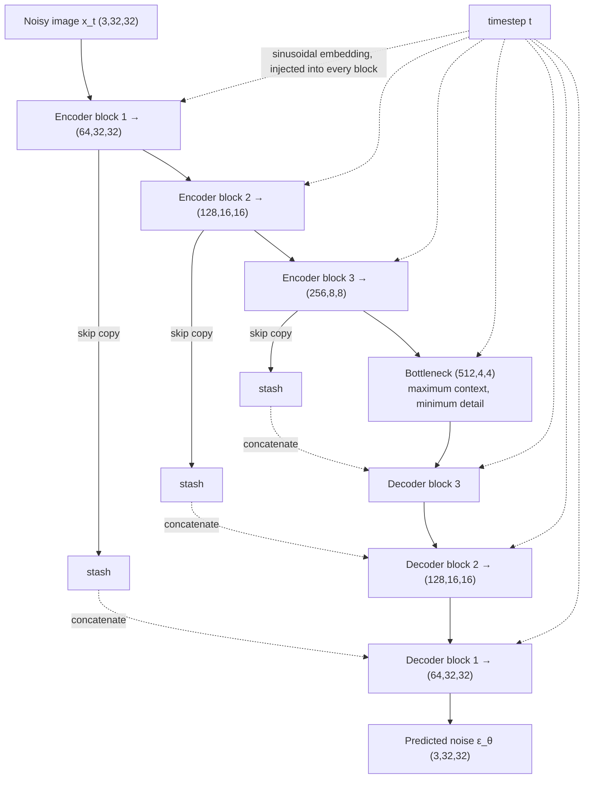

The network's job: noisy image in, predicted noise out — same shape, same size. That input/output symmetry is exactly what a **U-Net** is built for: an encoder compresses down to a bottleneck (trading detail for global context — *what's in this image?*), a decoder expands back up (restoring detail — *where do the pixels go?*).

**Skip connections** bridge the two sides. Compression genuinely destroys fine detail on the way down, so before each encoder stage hands its output deeper into the bottleneck, it also stashes a copy; the matching decoder stage concatenates that copy back in.

**Why concatenate rather than add?** Addition merges the two signals irreversibly — the next layer can no longer tell context from encoder detail. Concatenation stacks them side by side (two 256-channel tensors become one 512-channel tensor), preserving both and letting the next layer learn how to mix them itself.

---

## 100. Telling the network what time it is

A raw integer timestep (`t = 542`) is much too weak a signal to feed a network directly. The fix, borrowed from the original transformer paper (Part IV §30's positional embeddings are the same family): combine waves of different frequencies into one rich vector.

```python
def sinusoidal_embedding(t, dim):
    freqs = torch.exp(-math.log(10000) * torch.arange(dim // 2) / (dim // 2))
    args  = t[:, None].float() * freqs[None, :]
    return torch.cat([args.sin(), args.cos()], dim=-1)     # rich vector, shape (B, dim)
```

**Time injection, inside each U-Net block:** project the time vector through a small linear layer to match the image's channel count, reshape it to `(B, C, 1, 1)`, and simply **add** it to the feature map — broadcasting stamps the identical time signal onto every pixel at once. This single addition is what lets the network adjust its denoising strategy differently at a nearly-clean step than at a nearly-pure-noise one.

---

## 101. Generation — walk backwards, don't jump

At `t = T` (the schedule's final step), `ᾱ_T ≈ 0` — the forward process has washed out essentially all signal, so its output is statistically indistinguishable from pure noise. Starting generation is therefore trivial: `x_T = torch.randn(...)`. No real image is needed to seed it.

**Why not jump straight to `x_0` using the algebraic shortcut from §98?** Because `ε_θ`'s prediction is only a rough estimate — especially early on, when the image is nearly all noise — and one big jump from a rough estimate produces a blurry, averaged mess. **Walk, don't jump**: take small steps, refining the estimate each time.

$$x_{t-1} = \frac{1}{\sqrt{\alpha_t}}\left(x_t - \frac{\beta_t}{\sqrt{1-\bar\alpha_t}}\,\epsilon_\theta(x_t,t)\right) + \sigma_t z$$

Three moves, same formula:

| Term | Colour | Does what |
|---|---|---|
| `x_t − (scaled) ε_θ` | denoise | carve the predicted noise out of the current image |
| `1/√α_t` | rescale | undo the shrinkage the forward process applied at every step |
| `+ σ_t z` | re-inject chaos | add a little fresh noise back — except at the very last step |

**Why add noise back in, having just removed some?** Without it, the model would collapse toward one single, bland, averaged-out image for a given seed. The small re-injection keeps generations textured and varied. `t = 0` is the sole exception — no noise added, since the goal there is a clean final image.

---

## 102. What this omits — and what's changed since

**Classifier-free guidance is missing from this description**, and it's the single biggest reason DDPM-based text-to-image models actually follow prompts well. Text conditioning via cross-attention (mentioned briefly, correctly) tells the model *about* the prompt; CFG is what makes the model's output actually *adhere* to it strongly — generation runs the denoising step twice per step, once conditioned and once unconditioned, and extrapolates away from the unconditional prediction toward the conditional one. Without it, conditioned generation is real but noticeably weaker than what ships in production.

Two things have moved since the DDPM/2020 era this description reflects:

- **Flow matching / rectified flow** (used in SD3, Flux) largely replaces the discrete noise-schedule formulation with a continuous, often straight-line, path between noise and data — fewer sampling steps for comparable quality.
- **Transformer backbones (DiT)** increasingly replace the U-Net entirely, following the same industry-wide pattern as attention displacing convolutional and recurrent architectures elsewhere.
- Alternative training objectives exist beyond noise-prediction — **v-prediction** parameterises the target differently and is standard in several production models — but the underlying forward/reverse-process logic here is unchanged by the choice.

**Latent diffusion** (what Stable Diffusion actually runs) doesn't change the core loop either — an encoder compresses a 512×512 image to a 64×64 latent, the identical diffusion process from §97–101 runs on that small representation, and a decoder upscales the result. Faster because the diffusion loop runs on far fewer numbers, not because the algorithm differs.


# PART XV — ON-POLICY DISTILLATION

Qwen's own technical report: RL post-training took 17,920 GPU hours and scored 67.6 on a competition-math benchmark. On-policy distillation took 1,800 GPU hours — a tenth of the compute — and scored 74.4, *higher*. The name says what it is: **distillation** (a student learns from a teacher), **on-policy** (the student learns on its own generated answers, not the teacher's). It slots directly into Part VII's RL framing, replacing one component.

---

## 103. Three ways to teach a model, one arithmetic problem

Concrete running example: prompt `2 + 3 × 4`, correct answer `14` (multiplication first: `3×4=12`, `2+12=14`). A plausible student error: left-to-right, `2+3=5`, `5×4=20` — wrong, but a natural mistake to make.

| | **SFT** | **RL** | **On-policy distillation** |
|---|---|---|---|
| Who writes the text | teacher | **student** | **student** |
| Who grades it | nobody — just copy | environment (verifiable) | a teacher model |
| Feedback granularity | the whole target text | **one scalar**, per attempt | **a grade on every token** |
| Analogy | copying a worked solution | a pass/fail exam | a tutor correcting each step |

**SFT** hands over the worked solution — `3×4=12, 2+12=14` — for the student to copy. The problem: the student never trains on its *own* mistakes, only on someone else's clean text.

**RL** lets the student write its own attempt and checks only the final answer: `20 ≠ 14` → reward 0. Verifiable, but for the failed attempt, **which step was wrong is invisible** — one number for the entire attempt.

**On-policy distillation** takes the exact same self-generated attempt, but a teacher grades **every token**. The token where the student went wrong — computing `2+3` before `3×4` — gets slammed. Everything downstream of that error is barely touched, because conditional on that mistake, finishing the arithmetic correctly (`5×4=20`) is not itself a further error.

---

## 104. The per-token grade — reverse KL

At the fork — context `"2 + 3"`, about to decide the next token — freeze both models' full distributions over the vocabulary:

| Token | Student | Teacher |
|---|---|---|
| `= 5` (the mistake) | 90% | 2% |
| `× 4` (the correct move) | (low) | 88% |

The penalty is measured in log space — the natural scale for probabilities:

$$\log(0.90) - \log(0.02) \approx -0.105 - (-3.912) = 3.81$$

That's the size of the grade at exactly the token where the student's belief and the teacher's belief diverge sharply. Formally, this is **reverse KL**, evaluated on the student's own sampled tokens:

$$\mathbb{E}_{x \sim \text{student}}\Big[\log \pi_{\text{student}}(x) - \log \pi_{\text{teacher}}(x)\Big]$$

"On-policy" is precisely this expectation being taken over the student's *own* samples, not the teacher's — the same distinction Part VII §60 draws between on-policy and off-policy data. Flip the sign and this is a per-token advantage, pluggable into any RL-style update — which is exactly why the code is one line away from Part VII's machinery.

> **Reverse vs. forward KL, briefly.** Reverse KL (student minimising divergence *from* itself *to* the teacher, as here) is mode-seeking — it penalises the student for putting probability where the teacher doesn't, so the student learns to commit confidently to one good path rather than smearing probability across several. Forward KL is mode-covering and tends to blur across the teacher's alternatives instead. The choice here isn't incidental — it's what makes the correction land precisely on the forking token rather than diffusing across the whole response.

---

## 105. The six lines

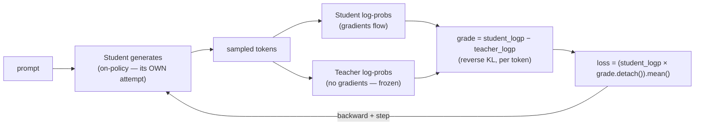

```python
def opd_loss(student, teacher, prompts, tau=1.0):
    tokens = student.generate(prompts)                       # 1. ON-POLICY: student writes it
    student_logp = gather_logprobs(student(tokens), tokens)  # 2. student's own log-probs
    with torch.no_grad():
        teacher_logp = gather_logprobs(teacher(tokens), tokens)   # 3. teacher grades same tokens
    grade = student_logp - teacher_logp                       # 4. reverse KL, per token
    loss  = (student_logp * grade.detach()).mean()            # 5. weight log-probs by the grade
    return loss                                                # 6. backward(); step() as usual
```

Tensor shapes: `B` rollouts, `T` tokens each, `V` vocabulary size. Steps 2 and 3 are twins — the same forward pass structure run on both models, each yielding `(B,T,V)` log-probs, gathered down to `(B,T)` for the tokens actually sampled. Step 4's subtraction **is** the reverse KL. Step 5 detaches the grade (no gradient flows through the teacher's opinion) and weights each token's own log-probability by it — the same trick RL uses to turn an advantage into a loss (Part VII §59).

**On the toy arithmetic example:** the four tokens `= 5 × 4 = 20` get grades roughly `[3.9, 0.1, 0.1, 0.1]` — **one token carries about 97% of the total signal.** The forking token is slammed; `× 4 = 20`, correct arithmetic conditional on the earlier mistake, is barely touched. A 500-token rollout under RL gets exactly one number back for all 500 tokens of work; under distillation it gets 500 — that density is the entire source of the 10× compute advantage from the opening.

---

## 106. Repairing catastrophic forgetting

A genuinely useful application, not just an efficiency trick. A model fine-tuned on new documents (mid-training) often **forgets how to follow instructions** — catastrophic forgetting, one of the oldest failure modes in neural networks: pushing new knowledge in overwrites old behaviour.

**Fix: on-policy distillation using the model's own pre-mid-training checkpoint as the teacher.** That earlier checkpoint never learned the new documents, but it still follows instructions perfectly — so it can grade the damaged model's attempts at instruction-following, token by token, without needing any separate, larger, or smarter model.

Documented recovery: instruction-following accuracy at 85% before mid-training, crushed to 45% after, recovered to 83% once the model's own earlier self does the teaching — while the newly learned document knowledge is retained. **The teacher doesn't need to be bigger or smarter everywhere — only to still know something the student has since lost.**

---

## 107. Where it breaks — self-distillation and the answer key

**The tempting shortcut:** skip a separate teacher entirely — use the *same* model as its own teacher, but paste the correct answer into its prompt before it grades. Free teacher, or so it seems.

**It backfires, badly, and the reason is precise: competence versus privilege.** A genuine teacher can *derive* `14` from `2+3×4` on its own. A self-teacher with the answer pasted in doesn't derive anything — it just reads `14` off the sheet it was handed, then rationalises the tokens backward to agree with it. Grading against ground truth you were handed is not the same act as grading against reasoning you actually possess.

| | Real teacher | Self, with answer key |
|---|---|---|
| Holds | the ability to derive the answer | just the final answer |
| Grades | whether each step is sound reasoning | whether each token agrees with the key |
| Student learns | reasoning that transfers | rationalising backward — worthless once the key is gone |

Measured damage from this exact failure mode: self-checking behaviour collapsed from roughly 86 self-check tokens per response to under 10, and performance on problems unlike the training distribution fell 6–25 points below plain RL, because rationalisation doesn't generalise the way genuine reasoning does.

**Two things this does *not* invalidate.** Ground-truth verification as an RL reward is fine — that's RL's honest, sparse signal, unrelated to this failure. And using your own **past** self as a teacher (§106) is fine too — that checkpoint genuinely possesses the instruction-following behaviour being restored; it isn't reading an answer sheet, it's exercising a real capability. The rule that survives both cases: **the teacher must know something the student can't fake from context alone.**

---

## 108. Practical limits

**Tokenizer mismatch breaks the recipe outright** — the maths requires teacher log-probs evaluated on the *student's exact tokens*, so a student and teacher from different tokenizer families can't be combined without an explicit vocabulary-alignment step (open-source tooling for this exists, e.g. Hugging Face's GOLD).

**A teacher behind an API with no exposed log-probs is a dead end for this method** — fall back to plain SFT on its outputs, or use an open-weights teacher instead.

**The student cannot surpass the teacher.** The teacher is a hard ceiling; genuinely exceeding your best available model is what RL against a verifiable, ground-truth reward is still for.

**Decision rule:** a strong, log-prob-exposing teacher sharing your tokenizer → on-policy distillation. Pushing past your best available model with nothing stronger to distill from → RL. Just need to copy a teacher's surface behaviour with no access to its log-probs → plain SFT.


# PART XVI — GPU HARDWARE AND TRAINING ECONOMICS

Every model in this book was trained on hardware from one of three rungs: a card (~$500 used), a data-centre module (~$25–40k), or a rack of dozens wired together as one. This part turns spec sheets and published training runs into two formulas you can check on the back of an envelope — and a rule about which number on a spec sheet to trust least.

---

## 109. Reading a spec sheet without being fooled

Five numbers decide everything about a GPU:

| # | Metric | What it decides |
|---|---|---|
| 1 | **VRAM** | what fits, at all |
| 2 | **Memory bandwidth** | real sustained speed — the number that predicts training throughput better than compute does |
| 3 | **TFLOPS** | theoretical peak math — a ceiling, not a promise |
| 4 | **Interconnect** | how fast GPUs talk to each other |
| 5 | **Price** | buy vs. rent |

**The single biggest trap: sparse vs. dense TFLOPS.** A headline spec like "1,979 TFLOPS" for the H100 is measured with a 2:1 sparsity feature essentially no real training run uses. The honest, usable number is half that — **989 dense TFLOPS.** Both Nvidia's and AMD's own footnotes confirm the halving; AMD's spec sheet explicitly divides Nvidia's headline number by two to make an apples-to-apples comparison, which is a notable thing for a competitor's own documentation to spell out.

**Even the dense number is a ceiling.** Model FLOPs Utilization (MFU) — actual sustained throughput as a fraction of theoretical peak — runs **20–46%** even at the best labs (GPT-3: 21%, Gopher: 32%, PaLM: 46%; Llama 3 reported 38–43%). **40% is the number to use in any real estimate.**

### The ladder

| Tier | Example | VRAM | Bandwidth | Dense TFLOPS | Rent (~$/hr) |
|---|---|---|---|---|---|
| Used gaming card | RTX 3090 | 24 GB | ~900 GB/s | no official BF16 spec | $0.69 (4090) |
| Data-centre workhorse | H100 | 80 GB | 3,350 GB/s | 989 | $3.29–4.33 |
| Newer data-centre | H200 | 141 GB | ~4,800 GB/s | 989 (**identical to H100**) | $4.50–5 |
| Frontier rack | B200 (NVL72) | ~192 GB/GPU | ~8,000 GB/s | — | $6–10 |

**The H200 row is the whole argument in one line.** Same 989 TFLOPS as the H100 — identical math — but far more memory and bandwidth. Nvidia built a pure-memory upgrade and charged more for it, which is the manufacturer confirming, in product form, that memory is usually the actual bottleneck, not raw arithmetic.

---

## 110. Two formulas: memory and time

### Formula 1 — training memory per parameter

Training carries far more than the weight itself:

| Component | Bytes | Why |
|---|---|---|
| Parameter (BF16) | 2 | the weight itself |
| Gradient (BF16) | 2 | which way to move it |
| Adam's FP32 master copy | 4 | full-precision accumulator |
| Adam's momentum | 4 | trending direction |
| Adam's variance | 4 | update noise |
| **Total** | **16 bytes/parameter** | before activations |

Inference needs only the first 2 bytes; **training needs all 16** — this is why training memory, not inference memory, is the actual wall. An 8B-parameter model (a common local fine-tuning size) needs `8 × 10⁹ × 16 = 128 GB` just for this ledger — more than an H100 (80 GB) holds *on its own*, before a single activation. Multi-GPU training isn't a luxury for full fine-tuning at this scale; it's arithmetic.

### Formula 2 — GPU-hours

$$\text{GPU-hours} = \frac{6ND}{\text{dense TFLOPS} \times \text{MFU}}$$

- `N` — parameter count
- `D` — training tokens (Chinchilla's compute-optimal rule of thumb: `D ≈ 20N`)
- `6ND` — total floating-point operations (roughly 2 ops/param/token forward, 4 backward)
- The denominator — realistic sustained throughput, not the headline spec

**Checked against a real run.** Karpathy's GPT-2 (124M) reproduction: 10B tokens, 8×A100 (312 TFLOPS each), 60% reported utilization.

```
6 × 1.24×10⁸ × 10¹⁰ = 7.44×10¹⁸ FLOPs
denominator: 8 × 312×10¹² × 0.6 = 1.498×10¹⁵ FLOPs/s
7.44×10¹⁸ / 1.498×10¹⁵ = 4,968 s ≈ 82.8 minutes
```

**Predicted: 83 minutes. Actual, reported: 90 minutes.** Close enough that the formula is trustworthy for back-of-envelope planning.

**Checked again at frontier scale.** Llama 3.1 405B, reported at `3.8×10²⁵` FLOPs, on 16,384 H100s:

```
16,384 × 989×10¹² × 0.4 ≈ 6.48×10¹⁸ FLOPs/s
3.8×10²⁵ / 6.48×10¹⁸ / 3600 ≈ 26.7 million GPU-hours
```

**Predicted: ~26.7 million. Meta's own reported figure: 30.84 million.** The gap has a specific, documented cause — see §112.

---

## 111. Tier one: consumer cards, and the memory trick that makes them viable

An 8B model needs 128 GB to fully fine-tune (§110) — nowhere close to a 24 GB consumer card. **The fix is entirely a memory trick, not a compute one:** gaming GPUs compute like data-centre chips costing 10× more; they simply have a third of the memory.

**QLoRA** — quantize the frozen base model to 4-bit (Part XII), and train only small adapter matrices (Part XIII §94) on top. The 16-byte-per-parameter Adam ledger from §110 then applies only to the *tiny adapter*, not the full model:

| Model | Method | VRAM needed |
|---|---|---|
| 8B | full fine-tune | 128 GB |
| **8B** | **QLoRA** | **~6 GB** — fits a $500 used 3090 |
| 70B | QLoRA | ~41 GB — two consumer cards |

**A hardware catch, deliberately built in:** consumer cards have NVLink disabled and peer-to-peer communication switched off at the driver level, even though the underlying PCI Express hardware supports it — a market-segmentation choice, not a technical limitation, confirmed by community driver patches that re-enable it.

**Apple Silicon**, for completeness: unified memory holds large models, but with no dedicated matrix-multiply hardware, training runs roughly 3–4× slower than an Nvidia card at a comparable price. Workable for a small overnight LoRA run; not a substitute for a real training card beyond that.

---

## 112. Tiers two and three: nodes, clusters, and why talking matters more than math

Past eight GPUs in one NVLinked node (~1 TB combined memory), models stop fitting in a single box, and **how GPUs talk to each other becomes the dominant constraint**, not how fast any one of them computes:

| Link | Bandwidth | Where |
|---|---|---|
| On-chip to its own HBM | ~3,350 GB/s | inside one GPU |
| PCI Express | ~128 GB/s | between two consumer cards |
| NVLink | 900–1,800 GB/s | between server-grade cards |
| InfiniBand/Ethernet | ~50 GB/s | between nodes |

Each rung down is roughly an order of magnitude slower, and the entire discipline of frontier-scale training is about hiding that gap through data/tensor/pipeline parallelism.

**AMD's MI300X beats the H100 on every published spec** — more memory, more bandwidth, higher dense TFLOPS (1,307 vs. 989). Independent five-month benchmarking found the *opposite* in practice: H100 sustained ~720 (of its own effective throughput measure), MI300X ~620. **The winner on paper lost in practice — the gap is CUDA and years of kernel tuning, not the silicon.** Spec sheets are necessary but never sufficient; software is the moat.

**This is also precisely what export controls target.** DeepSeek's H800s (the export-compliant version of the H100 sold into China) kept the **same dense TFLOPS as the H100** — what was cut was NVLink bandwidth, down to 160 GB/s from 900. Export policy, in other words, agrees with the finding in §109: memory and interconnect are the actual lever, not raw arithmetic. DeepSeek V3's full training run, on that constrained hardware, is reported at 2.79 million GPU-hours (~$5.6 million at $2/hour) — genuinely the *budget* option at frontier scale, not an outlier.

**The gap between predicted and reported GPU-hours** at frontier scale (§110's 26.7M vs. Llama 3.1's reported 30.84M) has a documented, specific cause: Meta's own paper logs 419 unexpected interruptions across 54 days of training, roughly 78% attributable to hardware failures. At 16,384 GPUs, something fails roughly every three hours, and the training run has to detect it, checkpoint, reroute, and resume automatically. The formula predicts clean compute time; real runs pay a tax for surviving hardware at that scale.

---

## 113. The lever that matters more than the hardware

**The single biggest swing in total GPU-hours was never the chip — it's the algorithm**, holding model, data, and hardware fixed:

| Method | Same 8B model | Approx. GPU memory / bill |
|---|---|---|
| QLoRA | adapters, 4-bit base | ~6 GB — one used card |
| Plain LoRA | adapters, no quantization | ~22 GB — one card, barely |
| Full fine-tune | every weight | 128 GB+ — multiple H100s |
| RLHF (Part VII) | four models resident at once (§115) | a full node minimum |
| Pre-training from scratch | the whole pipeline | ~28 days on an 8-H100 node |

**Algorithmic choice inside a fixed goal moves the bill by an order of magnitude on its own.** Qwen's own reported figures (Part XV): 17,920 GPU-hours for RL post-training versus 1,800 for on-policy distillation — a tenth of the compute, for a *higher* benchmark score. And a public leaderboard reproducing Karpathy's exact GPT-2 speedrun task, same 8-GPU node, shows a **34× wall-clock improvement from 2024 to 2026 through algorithmic changes alone** — better optimizers, better architecture, lower precision, zero new hardware.

**Whenever "how many GPUs does this need" comes up, the honest answer starts with "which year, and which algorithm" before it gets to "which chip."**

---

## 114. Why RLHF is structurally expensive — and one exception worth over-training past optimal

**RLHF's cost isn't incidental — it's structural.** Part VII's PPO loop keeps four model roles resident simultaneously: the policy being trained, a frozen reference copy, a reward model, and a critic (§65). On top of that, *generating* the practice rollouts is pure inference and reportedly eats over 90% of wall-clock runtime in production RLHF frameworks. RL doesn't train one model — it hosts a small standing ecosystem of them, which is exactly why DPO (Part VI), collapsing that ecosystem into a single model and a closed-form loss, is structurally so much cheaper.

**One place where the "optimal" formula in §110 is deliberately not followed:** Chinchilla's `D ≈ 20N` minimizes *training* compute for a given final loss — but it says nothing about *inference* cost, which for a widely deployed model is paid far more times than training ever is. Several production model families (Llama among them) train deliberately **past** the Chinchilla-optimal token count, spending extra training compute to shrink the model at a fixed capability level — trading a larger training bill for a smaller, cheaper-to-serve model. "Compute-optimal" and "actually the right choice to ship" are not the same target once inference cost enters the accounting.

---

# PART XVII — CLASSICAL ARCHITECTURES: CNNS AND RNNS

Everything before this part is transformer-era. But a large share of production ML — vision, forecasting, audio, and plenty of interview loops outside pure-LLM roles — still runs on convolutional and recurrent networks, and both show up as recurring interview questions independent of the LLM shift. Same five-step loop from Part I underneath both; only the layer computing the forward pass changes.

---

## 115. Convolution — the sliding dot product

A fully-connected layer treats every input pixel as independent, with its own weight — for a 224×224 image that's 50,176 weights *per output neuron*, and no notion that nearby pixels are related. **Convolution fixes this with two ideas: local connectivity and weight sharing.**

A small learnable filter (kernel), typically `3×3` or `5×5`, slides across the image. At each position it computes a dot product between the filter's weights and the patch of pixels underneath it — the same filter, same weights, at every position.

```python
# Conceptually: for each output position, dot the kernel with the patch beneath it
output[i, j] = sum(kernel * image[i:i+k, j:j+k])   # then slide by `stride`
```

| Property | What it buys |
|---|---|
| **Local connectivity** | each output depends only on a small neighbourhood — matches the fact that nearby pixels are related, distant ones usually aren't |
| **Weight sharing** | the *same* filter is reused across the whole image — a cat's edge looks the same whether it's top-left or bottom-right, so one filter should detect it everywhere |
| **Parameter count** | a `3×3` filter has 9 weights (plus bias), regardless of image size — a `224×224` image needs the same 9 weights as a `28×28` one |

A single layer typically learns *many* filters in parallel (32, 64, 128...), each specializing in a different pattern — edges, textures, colour blobs in early layers; parts and shapes deeper in.

**Key hyperparameters:**

| Term | Meaning |
|---|---|
| **Kernel size** | how large a patch each filter looks at |
| **Stride** | how far the filter moves between positions — stride 2 roughly halves the output's spatial size |
| **Padding** | zeros added around the border so the output doesn't shrink every layer (`"same"` padding preserves size; `"valid"` shrinks) |
| **Channels** | the number of filters in a layer = the number of output "feature maps" |

---

## 116. Pooling, receptive field, and the encoder shape

**Pooling** downsamples a feature map — max-pooling takes the largest value in each small window, discarding the rest. This does two things: reduces computation for later layers, and adds a small amount of translation invariance (a feature slightly shifted still triggers the same max).

**Receptive field** is the region of the *original input* that a given output neuron is actually sensitive to. It grows with depth: a neuron in layer 1 sees only its own kernel's patch; a neuron in layer 5 has, through the chain of convolutions before it, an effective view of a much larger region of the original image — this is the CNN analogue of Part IV's "the chain rule gets longer with more layers" observation, but for spatial extent rather than gradient flow.

**The typical CNN shape** — stack `[conv → activation → pool]` blocks, channels increasing while spatial size shrinks:

```
input (224,224,3) → conv+pool → (112,112,64) → conv+pool → (56,56,128)
  → conv+pool → (28,28,256) → ... → global pool → flatten → FC → output
```

Same "compress while gaining channels" pattern as the U-Net encoder in Part XIV §99 — trading spatial detail for a wider, more abstract representation, and it's not a coincidence: the U-Net's encoder *is* a CNN.

---

## 117. Where CNNs still win, honestly

**Not obsolete, not a stepping stone to transformers — a genuinely different inductive bias, appropriate for genuinely different data.**

| | CNN's assumption | Where it holds |
|---|---|---|
| Locality | nearby elements are related | images, most spatial/spectral data |
| Translation invariance | a pattern means the same thing anywhere in the frame | object detection, texture, most vision tasks |

Vision Transformers (ViT) show transformers *can* work on images, but typically need far more training data to learn what a CNN gets for free from its architecture — the same inductive-bias tradeoff Part X §79 makes about RoPE versus a blank slate. **For most production vision systems, and for most non-LLM interview loops, a CNN backbone (ResNet, EfficientNet, or a ViT trained at scale) remains the practical default**, not a legacy footnote.

---

## 118. RNNs and the problem they were built for

A CNN's receptive field is fixed by its architecture. Sequential data — text before transformers, time series, audio — needs a model whose "memory" can, in principle, extend arbitrarily far back. The **recurrent neural network** processes one timestep at a time, carrying a hidden state forward:

$$h_t = \tanh(W_{hh}h_{t-1} + W_{xh}x_t + b)$$

The same weights `W_hh`, `W_xh` are reused at every timestep — a direct analogue of a CNN's weight sharing, but sharing across *time* instead of across *space*.

**The vanishing (and exploding) gradient problem.** Backpropagating through `T` timesteps means multiplying by `W_hh` (or its derivative) `T` times. If the dominant eigenvalue of `W_hh` is less than 1, that product shrinks toward zero — the gradient from a distant timestep effectively vanishes before it reaches an early one, and the network can't learn long-range dependencies. If it's greater than 1, the product explodes instead.

This is the direct sequential-processing analogue of Part I §11's vanishing-gradient discussion for deep feedforward nets — and it's exactly the problem residual connections (Part IV §36) were invented to solve in the feedforward case. RNNs predate that fix and needed a different one.

---

## 119. LSTM and GRU — gated memory

The **LSTM** (Long Short-Term Memory) fixes vanishing gradients with an explicit **cell state** `c_t` that information can flow through largely unchanged, protected by three learned gates:

| Gate | Formula | Job |
|---|---|---|
| **Forget** | `f_t = σ(W_f[h_{t-1}, x_t])` | what fraction of the old cell state to keep |
| **Input** | `i_t = σ(W_i[h_{t-1}, x_t])` | what fraction of new information to add |
| **Output** | `o_t = σ(W_o[h_{t-1}, x_t])` | what fraction of the cell state to expose as the hidden state |

$$c_t = f_t \odot c_{t-1} + i_t \odot \tilde{c}_t, \qquad h_t = o_t \odot \tanh(c_t)$$

The forget gate is the important one: when `f_t ≈ 1`, the cell state passes through nearly unchanged, and gradients flowing backward through `c_t` don't get repeatedly multiplied down toward zero. **The cell state is functionally a gradient highway — the same role Part IV §36's residual connection plays, implemented with gates instead of a plain addition, and invented years earlier for exactly the same reason.**

**GRU** simplifies this to two gates (reset and update) and no separate cell state — fewer parameters, often comparable performance, and a common default when LSTM's full machinery isn't needed.

---

## 120. When each architecture is the right answer

An interview-ready framing, since "just use a transformer" is rarely the intended answer for a classical-architectures question:

| Data has... | Reach for |
|---|---|
| spatial locality, translation invariance (images) | **CNN** |
| strictly sequential, online/streaming processing, small models on constrained hardware | **RNN/LSTM/GRU** |
| long-range dependencies, parallelizable training, abundant data | **Transformer** (Part IV) |
| all of the above, imprecisely, at small scale | any of them will probably work — the architecture matters less than data volume until data volume stops being the constraint |

**The one-line version for an interview:** CNNs encode "nearby things are related, and patterns repeat across position" directly into the architecture; RNNs encode "processing must respect strict temporal order" and add gating to fight vanishing gradients over long sequences; transformers drop both assumptions in favour of letting attention learn arbitrary relationships directly from data, at the cost of needing more of it and paying attention's quadratic cost (Part IV §32, Part XI) to get there.


# PART XVIII — RECOMMENDATION SYSTEMS, RANKING, AND SEARCH

"Design a recommendation system" and "design an evaluation framework for ads ranking" are among the most persistently recurring system-design prompts, independent of the LLM-era shift (Appendix E §E.3). The core problem underneath both: given a user and a huge catalogue of items, produce a short, well-ordered list, fast, and know whether the list you produced was actually good.

---

## 121. The two-stage funnel — why nobody scores everything

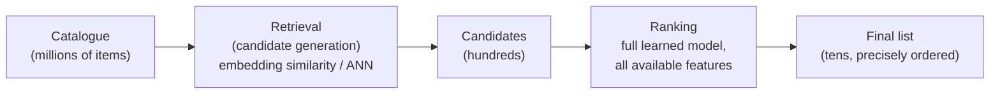

A platform with 100 million items cannot run a sophisticated model over all of them for every request within a latency budget of tens of milliseconds. Virtually every production recommender splits the problem in two:

| Stage | Job | Typical model | Candidates in → out |
|---|---|---|---|
| **Candidate generation (retrieval)** | cheaply narrow millions down to hundreds | embedding similarity, collaborative filtering, simple rules | millions → hundreds |
| **Ranking** | expensively, precisely order the survivors | a full learned model, all available features | hundreds → tens |

**Why not just rank everything?** Retrieval only needs to be *fast and roughly right* — it just has to not throw away good candidates. Ranking can afford to be *slow and precise* per item because it only ever looks at hundreds of them. This is the same efficiency principle as Part XI's tiling — do the expensive, precise work only on a small, pre-filtered set, rather than everywhere.

Many production systems add a third **pre-ranking** stage between the two, trading a little more compute than pure retrieval for better precision before the full ranker runs — useful to mention in an interview as evidence of knowing the funnel isn't always exactly two stages in practice.

---

## 122. Candidate generation — collaborative filtering and two-tower retrieval

**Collaborative filtering**, matrix-factorization style: represent the user-item interaction matrix `R` (huge, mostly empty) as the product of two much smaller matrices, `R ≈ U V^T`, where each user and each item get a learned low-dimensional embedding. **This is structurally the same low-rank decomposition idea as LoRA's `B·A`** (Part XIII §94) — a large, sparse structure approximated by the product of two small ones — arrived at completely independently, decades earlier, for a different problem.

**Two-tower retrieval**, the dominant modern approach: a **user tower** encodes the user's features and history into a vector; an **item tower** encodes each item into a vector in the *same* embedding space, independently. Retrieval becomes nearest-neighbour search — find the items whose vectors are closest to the user's, using an approximate nearest-neighbour index (FAISS, ScaNN) for speed at scale.

```
user_vec  = user_tower(user_features)      # computed once per request
item_vecs = item_tower(item_features)      # precomputed offline, for the whole catalogue
candidates = approx_nearest_neighbors(user_vec, item_vecs, k=500)
```

**Why two separate towers, rather than one model over the concatenated pair?** Item vectors can be **precomputed offline** for the entire catalogue and just looked up at request time; only the user tower needs a forward pass live. A single joint model would require scoring every user-item pair at request time — exactly the cost the two-stage funnel exists to avoid.

---

## 123. Ranking — learning to rank, and why order (not just correctness) is the target

Ranking isn't classification — the objective isn't "is this item relevant" per item, it's "is this *order* of items good." Three families:

| Approach | Optimizes | Idea |
|---|---|---|
| **Pointwise** | per-item relevance score independently | treat it as regression/classification per item, then sort by score — simple, but doesn't directly optimize order |
| **Pairwise** | relative order of item pairs | penalize the model when a less-relevant item outscores a more-relevant one (e.g. RankNet) |
| **Listwise** | the whole ranked list at once | directly optimize a ranking metric like NDCG (§124) over the full list |

**Wide & Deep** (a still-common production pattern): a wide, linear component memorizes specific, sparse feature combinations ("users who bought X also buy Y") while a deep neural component generalizes to combinations never seen at training time — trained jointly, so the model gets both memorization and generalization rather than picking one.

**Feature crosses** — explicitly multiplying two sparse features together (e.g. `device_type × time_of_day`) — let a linear model represent an interaction it otherwise couldn't; deep models can in principle learn interactions on their own, but crosses often still help in practice, especially for the wide side of Wide & Deep.

---

## 124. Ranking metrics — why accuracy is the wrong metric here

A ranked list's quality depends on *where* the good items land, not just whether they're present.

| Metric | Formula / idea | Captures |
|---|---|---|
| **Precision@k** | relevant items in top k ÷ k | how much of what you showed was good |
| **Recall@k** | relevant items in top k ÷ total relevant items | how much of what's good, you showed |
| **MRR** (Mean Reciprocal Rank) | average of `1/rank` of the first relevant result | how quickly a user finds *something* useful |
| **NDCG** (Normalized Discounted Cumulative Gain) | relevance scores, discounted by position, normalized against the ideal ordering | rewards getting the *most* relevant items *highest*, not just present |

**NDCG is the one worth being able to derive on the spot**, since it's the most commonly asked-about ranking metric:

$$\text{DCG}_k = \sum_{i=1}^k \frac{\text{rel}_i}{\log_2(i+1)}, \qquad \text{NDCG}_k = \frac{\text{DCG}_k}{\text{IDCG}_k}$$

`rel_i` is the relevance of the item at position `i`; the `log₂(i+1)` denominator discounts relevance the further down the list it appears — a highly relevant item at position 1 contributes far more than the same item at position 10. `IDCG_k` is the DCG of the *ideal* ordering (most relevant items first), so `NDCG` is normalized to `[0,1]` and comparable across queries with different numbers of relevant items.

---

## 125. Cold start and exploration

**The cold-start problem:** a new user has no history for collaborative filtering to work with; a new item has no interactions for its embedding to be learned from. Standard mitigations:

- **Content-based fallback** — use item/user *metadata* (category, text, demographics) instead of interaction history until enough behavioural data accumulates.
- **Popularity-based defaults** — show generally popular items to new users as a safe baseline.
- **Explicit exploration** — deliberately show some items the model is *uncertain* about, not just its current best guess, to gather the data needed to reduce that uncertainty. This is the same exploration-vs-exploitation tension as PPO's entropy bonus (Part VII §65) and RL more broadly — a system that only ever exploits its current belief never learns whether a better answer exists.

**Position bias** is the sibling problem to cold start: users click higher-ranked items more, regardless of true relevance, which contaminates the very click data used to train the next ranker — a system training on its own biased output. Mitigations include randomizing rank order for a small slice of traffic (explicitly trading some short-term quality for unbiased training signal) and modelling position as an explicit feature so the ranker can learn to discount it.

---

## 126. Ads ranking specifics — the auction layer on top

Ads ranking adds a genuinely different objective on top of relevance ranking: **expected revenue**, not just expected relevance.

$$\text{eCPM} = \text{predicted CTR} \times \text{bid} \times 1000$$

Ranking by `eCPM` rather than bid alone means a highly relevant, lower-bid ad can still outrank an irrelevant, higher-bid one — the platform's incentive to keep predicted-CTR estimates honest, since inflated CTR predictions directly cost the platform money in exactly the way a reward model's blind spots get exploited in Part VII §61's reward hacking.

**Calibration** matters more here than in most ranking contexts: a predicted CTR of 5% needs to actually mean "5% of impressions convert," not just "rank correctly relative to other ads" — because the number itself feeds directly into a real-money auction, not just an ordering.

**Budget pacing** — spreading an advertiser's daily budget across the day rather than exhausting it in the first hour of high traffic — is a scheduling and control problem layered on top of the ranking problem, and worth mentioning explicitly in an ads-specific system design answer since it's the piece purely-relevance-focused ranking discussions tend to skip.


# PART XIX — A/B TESTING AND EVALUATION METHODOLOGY

Reported as a distinct, frequently under-prepared interview category (Appendix E §E.5) — separate from both ML theory and system design, and the thing that actually determines whether a shipped model helped. Every training loop in this book ends at a loss number; this part is about the much harder question of whether a lower loss, or a "better" offline metric, means anything once it's serving real traffic.

---

## 127. Hypothesis testing, refreshed

An A/B test asks: did the treatment (variant B) actually change the metric, or could the observed difference be explained by random chance alone?

| Term | Meaning |
|---|---|
| **Null hypothesis (H₀)** | there is no real difference between A and B |
| **p-value** | probability of seeing a difference at least this large, *if H₀ were true* |
| **Significance level (α)** | the p-value threshold below which H₀ is rejected — conventionally 0.05 |
| **Statistical power (1−β)** | probability of correctly detecting a real effect, if one exists |
| **Type I error** | false positive — rejecting H₀ when it's actually true (shipping a change that didn't help) |
| **Type II error** | false negative — failing to reject H₀ when it's actually false (missing a real improvement) |

**The p-value is routinely misread, including in interviews.** `p = 0.03` does **not** mean "97% probability B is better." It means: assuming A and B are truly identical, there was a 3% chance of seeing a difference this large purely by chance. It says nothing about the probability that the hypothesis itself is true — that would require a prior, which is what Bayesian A/B testing frameworks explicitly bring in and frequentist ones don't.

---

## 128. Sample size and minimum detectable effect

**You cannot choose significance and power independently of sample size — the three are linked.** Before running a test, decide the smallest effect worth detecting (the **minimum detectable effect**, MDE) and the required sample size follows from it:

$$n \approx \frac{2(z_{\alpha/2} + z_\beta)^2 \sigma^2}{\delta^2}$$

`δ` is the MDE, `σ²` the metric's variance, and `z_{α/2}`, `z_β` come from the chosen significance and power. **The practical shape of this formula is what matters for an interview, not memorizing it exactly:** required sample size grows with the *square* of how small an effect you want to detect — halving the MDE roughly *quadruples* the sample size needed. This is the single most common reason a "the test was inconclusive" result happens: the test was underpowered to detect an effect of the size that was actually plausible, not that no effect existed.

**Practical consequence:** a metric with high natural variance (e.g. revenue per user, heavily skewed by a few large purchases) needs a much larger sample than a low-variance one (e.g. click-through rate) to detect the same relative effect size — worth naming explicitly when a system-design answer proposes a metric to optimize for.

---

## 129. The pitfalls that actually get asked about

**Peeking / optional stopping.** Checking a test's p-value repeatedly and stopping as soon as it crosses 0.05 inflates the false-positive rate far above the nominal 5% — each additional look is another chance for noise to cross the threshold. Fix: **decide the sample size (or duration) in advance and don't stop early**, or use a sequential-testing method explicitly designed to allow early stopping without inflating the error rate (§131).

**Multiple comparisons.** Testing 20 metrics simultaneously at `α = 0.05` gives roughly a 64% chance that *at least one* shows "significance" by pure chance (`1 − 0.95²⁰`). Fix: correct the threshold (Bonferroni: divide `α` by the number of comparisons) or designate one **primary metric** in advance and treat everything else as secondary/exploratory, not evidence on its own.

**Novelty and primacy effects.** A change performs unusually well (novelty) or unusually poorly (primacy — users resisting an unfamiliar UI) purely because it's *new*, independent of its actual long-run merit. Fix: run the test long enough for the novelty to wear off, and check whether the effect is stable or decaying over the test's duration rather than trusting only the aggregate.

**Network effects / interference.** Standard A/B testing assumes each user's outcome is independent of every other user's assignment — false on social or marketplace platforms, where a treated user's behaviour can affect control users (a treated seller pricing more aggressively changes what control-group buyers see). Fix: cluster-based randomization (randomize by geographic region, or by connected friend-groups, rather than by individual user) so that spillover happens *within* a treatment arm rather than leaking across arms.

---

## 130. Offline metrics lie — and it's the same failure as reward hacking

**The single most consequential idea in this part: an offline metric is a proxy for the thing you actually care about, and optimizing a proxy hard enough eventually breaks the correlation between the proxy and the real goal.**

This is Goodhart's law, stated in Part VII §61 for reward models — "when a measure becomes a target, it ceases to be a good measure" — and it applies identically here. A recommender optimized purely for offline click-through rate will learn to recommend clickbait; a search ranker optimized purely for engagement will learn to recommend outrage and controversy, both of which genuinely raise the offline metric while making the actual product worse.

**Practical mitigations, worth naming specifically in an interview:**

- **Guardrail metrics** — secondary metrics that must not regress even while the primary metric improves (e.g. optimize engagement, but require app-uninstall rate and reported-content rate to stay flat).
- **Long-term holdouts** — a small slice of users permanently excluded from a class of changes, to detect slow-accumulating harm that a short-duration A/B test can't see.
- **Human evaluation as a check on automated metrics**, not a replacement for them — exactly the SFT/RLHF pattern in Parts V–VII, where human judgment supplies the signal that a purely automated loss function can't.

---

## 131. Sequential testing — solving peeking properly

Fixing sample size in advance (§129) solves the peeking problem but forces waiting for the full duration even when the effect is obvious early, or clearly absent. **Sequential testing / always-valid p-values** are designed specifically to permit checking results continuously, at any time, without inflating the false-positive rate — the statistical machinery (e.g. mixture sequential probability ratio tests) accounts for the fact that the test is being looked at repeatedly, rather than assuming a single fixed look.

**Non-inferiority testing** is the other framing worth knowing: sometimes the goal isn't "is B better than A," it's "is B *at least as good* as A" (e.g. a cheaper-to-serve model variant — is quality preserved, even if it's not required to improve?). This flips the null hypothesis and the practical framing entirely, and is a common enough real question ("we made this model 10x cheaper, did we lose quality?") that conflating it with a standard two-sided test is a real, reported mistake.

---

## 132. Applying this to ML specifically

**Offline evaluation, before anything goes near real users:**

| Stage | What it checks |
|---|---|
| **Holdout set** | performance on data the model never trained on — the baseline sanity check |
| **Backtesting** | for time-series/recommendation systems, evaluating as if deployed at a past point in time, using only data available *then* — prevents leaking future information into an "offline" evaluation |
| **Shadow deployment** | the new model runs in production, on real traffic, but its outputs are logged and compared, never actually shown to users — a zero-risk way to validate real-world behaviour before any user is exposed to it |

**The online rollout ladder**, typically: shadow deployment → a small percentage canary (1–5% of traffic) with tight guardrail-metric monitoring → a full A/B test at a meaningful sample size → gradual ramp to 100% if the guardrails hold throughout.

**The interview-ready synthesis:** a proposed model change is never evaluated by one number. It's evaluated by an offline metric (cheap, fast, biased toward what's easy to measure), an online guardrail suite (catches what the primary metric alone would miss — precisely because the primary metric is a proxy, per §130), and a rollout ladder that limits the blast radius of being wrong at every stage before the change reaches everyone.


# PART XX — DISTRIBUTED SYSTEMS FUNDAMENTALS

Every ML system design round is, per Part XVI/Appendix E's own framework, "the ML lifecycle *plus* everything a general system design round already covers." This part is that "everything else" — the non-ML half of the round that gets skipped in ML-focused preparation and then costs the interview anyway.

---

## 133. CAP theorem and consistency models

**CAP theorem:** a distributed system, under a network partition (some nodes can't communicate with others — not a hypothetical, an eventual certainty at scale), can guarantee at most two of **Consistency** (every read sees the latest write), **Availability** (every request gets a response), and **Partition tolerance** (the system keeps working despite the partition). Since partitions are unavoidable in any real distributed system, the practical choice is really just **CP vs. AP** — consistency or availability, during a partition.

| Choice | Behaviour during a partition | Typical use |
|---|---|---|
| **CP** | refuse requests that can't be guaranteed consistent | banking, inventory counts — a stale read is worse than no read |
| **AP** | keep serving, possibly with stale data | social media feeds, product recommendations — a slightly stale answer beats no answer |

**Consistency models, finer-grained than CAP's binary:**

| Model | Guarantee |
|---|---|
| **Strong consistency** | every read reflects the most recent write, globally |
| **Eventual consistency** | reads may be stale temporarily, but all replicas converge given enough time without new writes |
| **Read-your-writes** | a user always sees their *own* writes immediately, even if other users' views lag |

**The interview-ready move:** most real systems don't pick one model globally — they pick *per use case*. An ML feature store, for instance, commonly runs eventually-consistent for the bulk of feature writes, but needs read-your-writes semantics for anything a user's own action just changed (e.g. "I just liked this, don't recommend it back to me next request").

---

## 134. Databases — SQL vs. NoSQL, indexing, replication, sharding

**SQL (relational)** — fixed schema, strong consistency guarantees (ACID transactions), joins across tables. Right choice when relationships between entities matter and correctness of a transaction (e.g. a payment) can't be compromised.

**NoSQL**, several distinct families rather than one alternative:

| Type | Structure | Good for |
|---|---|---|
| **Key-value** (Redis, DynamoDB) | simple lookup by key | caching, session state, feature serving |
| **Document** (MongoDB) | flexible, nested JSON-like records | evolving schemas, catalogue data |
| **Wide-column** (Cassandra, Bigtable) | sparse, huge tables, fast writes | time-series, logging, feature stores at scale |
| **Graph** (Neo4j) | nodes and relationships as first-class | social graphs, fraud-ring detection |

**Indexing** — a data structure (commonly a B-tree, or a hash index for pure equality lookups) that lets a database find rows without scanning the whole table. The tradeoff to name explicitly: every index speeds up reads on the indexed column but slows down writes, since the index itself must be updated on every insert/update — indexing everything is never free.

**Replication** — copying data across multiple nodes, for both durability (survive a node failure) and read throughput (spread read traffic across replicas). **Sharding** — splitting data *across* nodes by key (e.g. `user_id % N`, or a range-based split), so no single node needs to hold the entire dataset. The combination — sharded *and* replicated — is the standard shape of any database serving at real scale: each shard holds a fraction of the data, and each shard is itself replicated for durability.

---

## 135. Caching — the concept behind Part XI's SRAM/HBM split, one layer up

**Same idea as Part XI §80's SRAM-vs-HBM distinction, applied to an entire distributed system instead of one GPU:** keep frequently-accessed data in a fast, small tier (an in-memory cache like Redis or Memcached) instead of hitting a slow, large tier (the primary database) on every request.

| Eviction policy | Rule | Assumption |
|---|---|---|
| **LRU** (Least Recently Used) | evict the item unused longest | recently used items will likely be used again |
| **LFU** (Least Frequently Used) | evict the item used least often, overall | popularity is a more stable signal than recency |
| **TTL** (Time To Live) | evict after a fixed duration regardless of use | data has a known natural staleness window |

**Cache invalidation — reportedly one of the two hardest problems in computer science, for good reason:** when the underlying data changes, the cached copy must be updated or removed, or requests will silently serve stale data. Standard patterns:

- **Write-through** — every write updates the cache and the database together, synchronously. Simple, always consistent, adds write latency.
- **Write-back** — writes hit the cache immediately and the database is updated asynchronously, later. Faster writes, real risk of data loss if the cache fails before the write propagates.
- **Cache-aside** — the application checks the cache first; on a miss, reads from the database and populates the cache for next time. The most common pattern in practice, and the one to default to describing unless a question specifically calls for write-heavy optimization.

For an ML system specifically: prediction caching (store the model's output for a given input, keyed by a hash of the input) is a direct, high-leverage application — if the same request recurs, skip inference entirely, which is a caching-layer answer to the same latency problem Part VIII's KV cache and Part XI's FlashAttention solve one level down, inside the model itself.

---

## 136. Load balancing and horizontal scaling

**Vertical scaling** (a bigger machine) has a hard ceiling and a single point of failure. **Horizontal scaling** (more machines) is the standard answer at real scale, and it requires something in front deciding which machine handles each request — the **load balancer**.

| Algorithm | Rule |
|---|---|
| **Round robin** | requests cycle through servers in fixed order |
| **Least connections** | route to whichever server currently has the fewest active connections |
| **Consistent hashing** | route by a hash of the request key, so the *same* key routes to the same server whenever possible — minimizes cache misses and re-routing when servers are added or removed |

**Consistent hashing is the one worth being able to explain the motivation for, not just name**, since it's specifically designed to solve a problem plain modulo-hashing (`hash(key) % N`) creates: with plain modulo hashing, adding or removing a single server changes *almost every* key's assigned server, invalidating nearly the entire cache at once. Consistent hashing arranges servers and keys on a conceptual ring so that adding or removing one server only remaps the keys that were assigned specifically to it — a small, bounded fraction of the total, not a near-total cache wipe.

**Horizontal scaling for ML inference specifically:** stateless model replicas behind a load balancer is the easy case (any replica can serve any request); it gets harder when a request needs a specific model shard (a model too large for one machine, as in Part XVI §112's cluster discussion) — routing then has to be model-aware, not just capacity-aware.

---

## 137. Message queues and asynchronous processing

**The core problem a queue solves:** decouple a fast producer of work from a slower (or bursty) consumer of it, so the producer never blocks waiting for the consumer, and a temporary consumer outage doesn't lose work — it just backs up in the queue instead.

```
producer → [ queue ] → consumer(s)
```

| Pattern | Shape |
|---|---|
| **Point-to-point** | one consumer processes each message exactly once (a work queue — e.g. Kafka with a single consumer group) |
| **Pub/sub** | many independent consumers each receive a copy of every message (e.g. one event feeding both a logging system and a model-retraining pipeline simultaneously) |

**For ML pipelines specifically**, queues are the standard way to decouple: a request-logging stream feeding an offline feature pipeline, an event stream feeding a real-time feature store, or a training pipeline picking up newly-labeled data as it arrives rather than on a fixed schedule. **Batching in a queue-fed pipeline is directly analogous to Part I §10's mini-batch argument** — an inference server can batch several queued requests into a single forward pass rather than processing one at a time, trading a small amount of added latency per request for substantially higher throughput.

---

## 138. Assembling the non-ML half of an ML system design answer

Per Part XVI/Appendix E §E.3's six-stage ML system design framework, stages 1–4 (frame the task, data pipeline, features, model/training) are ML-specific. **Stages 5 and 6 — serving and monitoring — are where this part's material actually gets used in an interview:**

```
request → load balancer (§136) → API layer
        → cache check (§135, cache-aside) → [hit: return immediately]
        → [miss: feature lookup from a sharded, replicated store (§133–134)]
        → model inference (batched via a queue, §137)
        → response, logged asynchronously (§137) for monitoring
        → monitoring pipeline: drift detection, guardrail metrics (Part XIX §130)
```

**The honest interview framing:** an ML system design answer that only discusses the model is answering half the question. The other half — how requests actually reach that model, what's cached, how it scales, and how failures degrade rather than cascade — is ordinary distributed-systems design, and it's graded exactly as rigorously as the ML half, per the six-stage framework this part completes.


# PART XXI — CODING INTERVIEW FUNDAMENTALS

Every source in Appendix E treats coding proficiency as an independent, unwaived prerequisite — no amount of transformer or alignment depth substitutes for it. This part doesn't replace dedicated practice (hundreds of repetitions build the pattern recognition; reading about it doesn't), but it maps the actual shape of the skill: a fixed process, applied to a small number of recurring patterns, not one-off cleverness per problem.

---

## 139. The process — before writing any code

**The single most common way strong candidates lose points has nothing to do with algorithms — it's skipping straight to code.** The reported "candidates who can't adapt when the interviewer changes the requirement mid-answer read as unprepared" pattern (Appendix E §E.4) applies here directly: a fixed process survives being interrupted; a memorized solution doesn't.

1. **Clarify the problem.** Restate it in your own words. Ask about edge cases before assuming them: empty input, duplicates, negative numbers, sorted vs. unsorted, size bounds. This is the single highest-leverage step and the most commonly skipped.
2. **Work a small example by hand.** Confirms understanding before any code exists, and often reveals the pattern needed (see §141–144) — the same "trace it on paper first" instinct this entire book applies to every mechanism it explains.
3. **State a brute-force approach out loud, even an obviously slow one.** A working `O(n²)` answer, clearly stated, beats a broken attempt at the optimal one — and gives the interviewer a baseline to see the optimization from.
4. **Identify the bottleneck, then optimize it specifically.** Not "think harder" — look at *what* makes the brute force slow (repeated work? a scan that could be a lookup? a nested loop over related data?) and address that specific thing.
5. **Code it, narrating as you go.** Silence for ten minutes while writing code is worse than thinking out loud, even imperfectly — the interviewer is evaluating the reasoning, not just the final text.
6. **Test it against the hand-worked example from step 2, and at least one edge case.** Catching your own bug here is a strong positive signal, not a negative one.

---

## 140. Big-O, without hand-waving

$$O(\cdot) \text{ describes how runtime or memory grows as input size } n \to \infty$$

| Complexity | Name | Typical source |
|---|---|---|
| `O(1)` | constant | array index, hash lookup |
| `O(log n)` | logarithmic | binary search — halving the problem each step |
| `O(n)` | linear | one pass over the input |
| `O(n log n)` | linearithmic | efficient sorting, divide-and-conquer with linear merge |
| `O(n²)` | quadratic | nested loop over the same input — usually the brute force to beat |
| `O(2ⁿ)` | exponential | trying every subset — usually means dynamic programming is needed instead |

**The habit that actually matters in an interview: state the complexity of your own solution unprompted, and justify it in one sentence** ("this is O(n) because we touch each element exactly once, with O(1) work per element") — not just when asked. It signals the analysis was part of the design, not an afterthought.

**Space complexity is graded as seriously as time complexity and is more often forgotten.** An `O(n)`-time solution that also uses `O(n)` extra space is a different, and sometimes worse, answer than one that's `O(n log n)` in time but `O(1)` in space — naming the tradeoff explicitly, rather than optimizing time alone, is itself a signal.

---

## 141. Pattern 1 — two pointers and sliding window

**Two pointers**: maintain two indices into a (usually sorted, or otherwise structured) sequence, moving one or both based on a condition, instead of a nested loop.

```python
def two_sum_sorted(arr, target):
    lo, hi = 0, len(arr) - 1
    while lo < hi:
        s = arr[lo] + arr[hi]
        if s == target: return (lo, hi)
        elif s < target: lo += 1      # need a bigger sum — move the low pointer up
        else: hi -= 1                 # need a smaller sum — move the high pointer down
    return None
```

`O(n)` instead of the brute-force `O(n²)` all-pairs check — the sortedness lets each comparison eliminate a whole range of possibilities at once, rather than eliminating one pair.

**Sliding window** is two pointers specialized to a *contiguous subarray/substring*: expand the window's right edge to include more, shrink the left edge when a condition is violated, track a running best as the window moves. Recognize it from phrases like "longest/shortest substring/subarray satisfying X" — the window's size implicitly encodes the answer being searched for.

**Signal to look for:** the problem involves a sorted array, a contiguous range, or "find a pair/subarray such that..." — that's usually a two-pointer or sliding-window problem, not a nested loop waiting to be optimized some other way.

---

## 142. Pattern 2 — binary search, and where it hides

Binary search isn't just "search a sorted array" — it's the general pattern of **eliminating half the remaining search space on every step**, which applies far beyond literal array search.

```python
def binary_search(arr, target):
    lo, hi = 0, len(arr) - 1
    while lo <= hi:
        mid = lo + (hi - lo) // 2       # avoids overflow; not that PyTorch/Python needs it, but the habit transfers
        if arr[mid] == target: return mid
        elif arr[mid] < target: lo = mid + 1
        else: hi = mid - 1
    return -1
```

**Binary search on the answer** is the pattern most often missed: instead of searching an array, binary-search over the space of *possible answers* to a question like "what's the minimum capacity needed to ship all packages within D days?" — guess a capacity, check in `O(n)` whether it works, and binary search the guess itself. **Signal to look for:** the problem asks to minimize or maximize some value subject to a feasibility check that gets easier as the guessed value increases (or decreases) monotonically — that monotonicity is what makes binary search valid at all.

---

## 143. Pattern 3 — graph and tree traversal

**DFS (depth-first search)** — go as deep as possible before backtracking, typically via recursion or an explicit stack. Natural fit for: exploring all paths, detecting cycles, topological sort, "does a path exist."

**BFS (breadth-first search)** — explore level by level, via a queue. Natural fit for: **shortest path in an unweighted graph** (BFS guarantees the first time a node is reached is via a shortest path — this guarantee is the entire reason to choose BFS over DFS when "shortest" is in the problem statement) — and level-order tree traversal.

```python
def bfs_shortest_path(graph, start, end):
    from collections import deque
    queue = deque([(start, [start])])
    visited = {start}
    while queue:
        node, path = queue.popleft()
        if node == end: return path
        for neighbor in graph[node]:
            if neighbor not in visited:
                visited.add(neighbor)
                queue.append((neighbor, path + [neighbor]))
    return None
```

**Trees are graphs with no cycles** — every tree algorithm (in-order/pre-order/post-order traversal, computing depth, checking balance) is a restricted case of the graph patterns above, so the same DFS/BFS instincts transfer directly rather than needing to be relearned per data structure.

**Signal to look for:** anything phrased as "shortest," "minimum number of steps," or "level" strongly suggests BFS; "all paths," "does there exist," or "can this be partitioned/coloured" suggests DFS (often with backtracking).

---

## 144. Pattern 4 — dynamic programming, heaps, and tries

**Dynamic programming (DP)** applies when a problem has (a) **overlapping subproblems** — the same smaller computation would otherwise be repeated many times — and (b) **optimal substructure** — the optimal solution to the whole problem is built from optimal solutions to its subproblems. The practical recipe:

1. Define the state precisely: what does `dp[i]` (or `dp[i][j]`) actually represent?
2. Write the recurrence: how does `dp[i]` relate to smaller states?
3. Identify the base case(s).
4. Decide top-down (recursion + memoization) or bottom-up (iterative table-fill) — same recurrence, different implementation direction.

```python
# Fibonacci as the minimal illustration of the pattern, not the actual problem
def fib(n, memo={}):
    if n in memo: return memo[n]          # overlapping subproblem, caught by the cache
    if n <= 1: return n                    # base case
    memo[n] = fib(n-1, memo) + fib(n-2, memo)   # recurrence
    return memo[n]
```

**Signal to look for:** the problem asks for a count, a minimum/maximum, or "is it possible," over a structure where brute force would recompute the same smaller answer repeatedly (subsequences, subsets, paths on a grid, edit distance between strings).

**Heaps (priority queues)** — maintain the min or max of a changing collection in `O(log n)` per insert/remove, rather than `O(n)` for a linear scan every time. **Signal:** "top k," "k-th largest," "merge k sorted things," or any streaming scenario where the running min/max is needed repeatedly as new elements arrive.

**Tries** — a tree where each path from the root spells out a prefix, letting prefix lookup and autocomplete run in time proportional to the *query length*, not the size of the dictionary. **Signal:** "prefix," "autocomplete," or repeated prefix-matching against a large fixed set of strings.

**Union-Find (disjoint set)** — tracks which elements belong to the same group, supporting near-`O(1)` "are these connected" and "merge these two groups" operations. **Signal:** "are these connected," "how many groups/islands," or detecting a cycle while building a graph incrementally, edge by edge.

**The meta-skill that actually separates strong candidates:** not memorizing all four patterns' code, but recognizing from the problem's *phrasing* which one applies within the first minute — which is exactly why step 1 of §139 (clarify the problem, out loud) is also implicitly the step where pattern recognition happens, not a separate one.

---

# APPENDIX A — ERRATA AND CORRECTIONS

### Corrections to the source material

1. **The hand-worked learning rate is `0.0001`, not `0.001`.** Check it: `w₂ = 2 − η(156) = 1.9844` only holds for `η = 0.0001`. Every downstream number in §9 confirms this.

2. **The batch-gradient totals don't fully reconcile.** Working from the same chain rule, example 2 `(1,4)` contributes `2(33−14) × w₃ × 2(1+1·4)(4) = 38 × 40 = 1520` to `w₁`, not 380. Recomputed column totals:

   | Weight | Source total | Recomputed |
   |---|---|---|
   | `w₁` | 924 | **2064** |
   | `w₂` | 324 | **316** |
   | `w₃` | 1636 | 1636 ✓ |

   `w₃` matching exactly confirms the method is right and the discrepancy is in the source's arithmetic. The *concept* of batch learning is unaffected — sum the columns, update once.

3. **"Local minima are mostly fine" is an incomplete story.** In high dimensions the dominant obstacle is saddle points, not local minima. See the note in §3.

4. **The softmax table quietly drops a token.** The logits listed include `floor` at 0.5, but the sum 28.32 only accounts for `mat`, `rug` and `moon`. Include `floor` (`e^0.5 = 1.65`, sum 29.97) and `mat` becomes 81.9%, not 86.6%. The three-token version is internally consistent — just don't take 86.6% as following from the four logits shown.

5. **The "one sentence → five training examples" picture is right about data and wrong about compute.** You do *not* run the model five times. A causal transformer processes the whole sequence in **one forward pass** and, thanks to the causal mask, produces a prediction at *every* position simultaneously. The loss is then averaged across all positions. This is the single biggest efficiency property of the architecture, and the sequential table obscures it.

6. **The LayerNorm worked example uses the wrong standard deviation.** For `x = (0.3, −0.2, 0.8, 0.5)`, the stated std of ~0.41 is the *sample* std (dividing by n−1). `nn.LayerNorm` uses the **population** std (dividing by n) ≈ 0.364, giving `x̂ ≈ (−0.14, −1.51, 1.24, 0.41)` rather than the `(−0.12, −1.33, 1.09, 0.36)` shown. Small numerically, but it's the difference between matching PyTorch and not.

7. **"Internal covariate shift" is a discredited explanation.** It's the story the original BatchNorm paper told, and it's the one the lecture repeats — but Santurkar et al. (2018) showed normalization helps even when you deliberately *inject* covariate shift. The better-supported account is that it smooths the loss landscape. The bucking-bronco intuition is still a fine mnemonic for *what* LayerNorm does; just don't treat it as *why* it works.

8. **Generation is not inherently as wasteful as described.** The lecture frames throwing away T−1 predictions as an unavoidable trade-off. It isn't — **KV caching** fixes it, and that's Part VIII.

9. **`−100` is not hard-coded — it's a default.** `F.cross_entropy(..., ignore_index=-100)` is a parameter you can set to anything. Nothing about the value is magic; it was chosen because it can't collide with a real token ID. Knowing it's configurable matters the moment you write a custom loss.

10. **The collator has a latent off-by-one.** `labels = input_ids.clone()` is only correct because HuggingFace models shift internally in their forward pass (`logits[..., :-1, :]` against `labels[..., 1:]`). Position `t`'s logit predicts token `t+1`. **If you compute the loss yourself, you must shift — and if you shift a second time on top of HF's, you train the model to predict the token it was just given.** This is one of the most common silent SFT bugs.

11. **Padding must be masked too.** The toy example uses equal-length sequences, so it never surfaces. Real batches pad to the longest sequence, and those pad tokens need `−100` in `labels` as well — otherwise the model is trained to emit padding.

12. **Deriving the mask boundary from `len(tokenizer.encode(prompt))` is fragile.** BPE can merge across the prompt/response seam, so tokenizing the prompt alone doesn't always yield the same prefix as tokenizing the full string. Prefer the tokenizer's `return_assistant_tokens_mask` or offset mappings when available.

13. **Masking the prompt is the default, not a law.** Training on prompt tokens too is sometimes done deliberately — it can act as regularisation or help with domain adaptation. Masking is right for instruction-following; just don't treat it as physically required.

14. **"It learns an average of A and B" is loose.** SFT maximises likelihood on every example independently; it doesn't interpolate between them. The accurate statement is that maximum-likelihood imitation has *no channel* for expressing relative preference, and no channel at all for negative examples.

15. **The bland-prior arithmetic is off.** For `the`: `0.1 × (−0.0408 + 0.0513) = 0.00105`, not the 0.0015 stated. The lecture's own "77× greater" claim confirms it — `0.0811 / 0.00105 = 77.2`, whereas `0.0811 / 0.0015 = 54`. The conclusion holds; the intermediate number doesn't.

16. **DPO's reward is derived, not designed.** This is the biggest conceptual gap. The lecture presents `β(log π_θ − log π_ref)` as a clever engineering fix for two bugs. It's actually the **closed-form solution** to the KL-constrained RLHF objective: the optimal policy is `π*(y|x) ∝ π_ref(y|x)·exp(r(x,y)/β)`, which inverts to `r = β log(π/π_ref) + β log Z(x)`. The intractable partition function `Z(x)` depends only on `x`, so it **cancels in the Bradley-Terry difference** — which is precisely why DPO can skip training a reward model at all. The bias-cancellation story is a nice consequence, not the reason.

17. **`β` is the KL coefficient, not a "safety brake".** It's the exact temperature of the KL constraint between policy and reference. Small `β` permits more drift; large `β` keeps the policy near the reference. Typical range 0.1–0.5.

18. **Length bias is reduced, not solved.** Reference cancellation only holds while the policy's per-token profile resembles the reference's. As training drifts, the bias returns — DPO-trained models are well documented to inflate response length. This is why length-normalised variants exist (SimPO, R-DPO) and why serious evaluations are length-controlled. The lecture declares "problem solved"; treat it as "problem mitigated".

19. **DPO can push *both* chosen and rejected probabilities down.** The loss only constrains the **margin**, so it is satisfied by lowering `log π(y_l)` faster than `log π(y_w)` — which happens routinely in practice. Log `log π_θ(chosen)` during training; if it's falling, that's the failure mode, not a quirk.

20. **The gradient has an interpretable shape.** `∇L ∝ −σ(r̂_l − r̂_w) · [∇log π(y_w) − ∇log π(y_l)]`. That sigmoid is a per-example weight, large exactly when the model currently gets the preference *wrong*. DPO automatically focuses on the pairs it's failing.

21. **Two models in memory is the real cost.** Policy plus frozen reference. Because the reference never changes, you can compute its log-probs once offline and cache them, cutting memory substantially — standard practice at scale.

22. **The augmented reward formula has a sign error.** It's stated as `r_aug = β·KL + r_RM`, which would *reward* drift. It must be `r_RM − β·KL`. The lecture's own worked number confirms this: a KL estimate of +0.6 produces −0.06, which only follows from the minus.

23. **The second token's reward is inconsistent.** One table gives +0.06, but +0.15 is used in the GAE derivation and in the final comparison. +0.15 is correct: `−0.1 × (−1.5)`.

24. **PPO clipping is deliberately asymmetric, and the four cases hide it.** When `A < 0` and the ratio rises *above* `1+ε`, `min` selects the **unclipped** term, so the update is *not* limited. That's intentional: PPO always permits suppressing a bad action that has become more likely. Clipping restrains enthusiasm, never correction.

25. **Clipping doesn't bound the policy — it flattens the gradient.** Nothing stops the ratio being outside the corridor already; the clip just removes any incentive to push further. It's a cheap heuristic trust region, not a hard constraint, which is why PPO still needs the KL penalty as a separate defence.

26. **The critic is usually initialised from the reward model, not the SFT model.** InstructGPT initialised the value function from the RM, since predicting reward is closer to the RM's job. Many implementations also share one backbone with two heads rather than holding four separate models.

27. **`γ = 1` is standard in LLM RLHF.** The illustrative `γ = 0.9` implies discounting, but episodes are short, there's no reason to prefer early tokens, and essentially all implementations set `γ = 1` with `λ ≈ 0.95`.

28. **The entropy bonus is often dropped entirely.** The KL penalty already prevents mode collapse, so `c₂ = 0` is common in LLM RLHF. It matters far more in classic RL with small action spaces than over a 50k-token vocabulary.

29. **Advantage whitening is not optional.** The lecture mentions reward normalisation in passing. Normalising advantages to zero mean and unit variance per batch is standard and is frequently the difference between training and diverging.

30. **GRPO removes the critic.** The current successor to PPO in LLM work samples a *group* of responses per prompt and uses the group's mean reward as the baseline, deleting the value model entirely. That drops memory from four models to three and removes an entire class of tuning problems. It's what recent reasoning-focused models train with.

31. **"We have slain the beast of quadratic complexity" overstates the KV cache.** It removes the quadratic cost of the *projections* and of re-running the transformer body — a genuinely large win. But the attention step itself still costs O(T) per decode token (one query against T cached keys), so total generation attention remains **O(T²)**. The cache changes the constant and the dominant term; it doesn't make long-context generation linear. FlashAttention and sliding-window attention target what's left.

32. **Only K and V are cached — never Q.** Each new token needs only its own query, and old queries are never referenced again. Worth being able to say why, because it's the cleanest test of whether the mechanism has actually clicked.

33. **The `nn.Linear` worked example doesn't fully reconcile.** With weight row `[.1,.2,.3]`/`[?,?,?]`, bias `[0.7, 0.8]`, input `[1,2,3]`: the first output checks out exactly (`1.4 + 0.7 = 2.1`). The second is stated as `4.7`, which needs a pre-bias sum of `3.9` against the given `3.2`, or a bias of `1.5` against the given `0.8`. One of the two doesn't belong — flagged in Part XIII §93 rather than silently reproduced.

34. **The diffusion lecture's `beta_start` is garbled in transcription** — stated as "1e-4 or 0.1," which are two different numbers. The value that makes the rest of the schedule consistent (and matches the standard DDPM paper) is `0.0001`; the "0.1" appears to be a transcription artifact, not a second parameter.

### Practical gotchas

1. **The formula taught is SGD, but the code uses Adam.** `θ ← θ − η∇L` is vanilla descent. Adam keeps running averages of the gradient (momentum) and its squared magnitude, giving each parameter its own effective step size. Same five steps, different step-4 arithmetic.

2. **`nn.CrossEntropyLoss` expects raw logits, not softmax output.** It applies log-softmax internally. Feeding it probabilities double-applies the function and quietly cripples training. Use `nn.Softmax` only at inference.

3. **Gradient accumulation is a feature, not just a footgun.** Deliberately skipping `zero_grad()` for N steps simulates a larger batch than fits in memory — a direct application of §10's batch logic.

4. **`.backward()` frees the graph by default.** Calling it twice on the same loss errors unless you pass `retain_graph=True`.

5. **Only leaf tensors get `.grad` populated.** Intermediates compute gradients during the backward walk then discard them; use `.retain_grad()` to inspect.

6. **`optimizer.zero_grad()` can go before or after `step()`** — what matters is once per iteration, before the next `backward()`.

7. **Device mismatch is the second-most-common error after shape.** Model and data must both be on `cuda` or both on `cpu`.

8. **"Log" here means natural log.** Cross-entropy loss is reported in nats, which is why `exp(loss)` gives perplexity directly. If you see loss in bits somewhere, it's log base 2 and the conversion is a factor of `ln 2`.

9. **Greedy decoding is not actually a disaster.** For factual QA, code and extraction, temperature near 0 is standard practice and usually *better*. The degenerate-repetition problem the lecture describes is far more acute in smaller and older models than in current frontier ones.

10. **Cross-entropy ignores the other 50,256 probabilities in the loss term, but not in the gradient.** Softmax is normalised over the whole vocabulary, so pushing the correct token's probability up mechanically pushes every other token's down. Every logit gets a gradient.

11. **Softmax's winner-take-all collapse without √d scaling is a width effect, not a content effect** (Part IX §72) — repeating a value to widen a vector multiplies its dot-product score by the repeat factor with zero new information added, which is exactly why the correction has to be a function of dimension, not of the data.

12. **RoPE's frequency base (`10,000`) is a hyperparameter, not a law.** Long-context models frequently scale it up (or apply NTK-aware/YaRN-style interpolation) specifically to extend usable context beyond what the model was trained on — RoPE's relative-position guarantee (Part X §77) doesn't by itself guarantee good extrapolation far past the training length.

13. **PTQ as described is round-to-nearest (RTN) — the naive case, not the state of the art.** Calibration-optimized methods (GPTQ, AWQ) choose quantization levels to minimize actual layer *output* error rather than just rounding each weight independently, and meaningfully outperform RTN at the same bit width, especially at INT4.

14. **QLoRA's "6 GB for an 8B model" excludes activation memory and sequence length.** Longer context or larger batch sizes during fine-tuning add activation memory on top of the frozen-quantized-weights-plus-adapter figure; the number is a floor, not a fixed ceiling.

15. **Diffusion's "walk, don't jump" justification is about early-step estimate quality, not a law of the process.** Modern samplers (DDIM, and most explicitly flow-matching/rectified-flow methods) deliberately take far fewer, larger steps than the original DDPM's full schedule, trading some quality for large speed gains — "many small steps" is a specific design choice, not an inherent requirement of denoising.

16. **On-policy distillation's per-token grade is silent about sequence length normalization.** A longer rollout accumulates more total (unnormalized) KL signal purely by having more tokens graded, independent of response quality — worth checking whether a given implementation normalizes by sequence length before comparing rollouts of different lengths.

17. **GPU rental prices are a snapshot, not a constant.** Every price quoted for these transcripts is dated to when it was fetched; cross-provider spreads of 20–30% are normal, and absolute prices for newer hardware (H200, B200) move faster than for established chips (H100, A100).

### Where GPT-2 differs from current practice

These notes describe GPT-2 (2019) because it's the cleanest thing to learn on. Six things have moved since:

1. **Positional encoding.** Learned absolute position embeddings (`wpe`) are largely obsolete. Modern models use **RoPE** (rotary embeddings), which encodes *relative* position by rotating Q and K, and extrapolates to longer contexts far better.

2. **The explicit T×T attention matrix is no longer materialized.** `F.scaled_dot_product_attention` and FlashAttention compute attention in tiles without ever writing the full matrix to memory, turning attention's memory cost from quadratic to linear. The `masked_fill` version in §33 is pedagogically clear and production-obsolete.

3. **Attention variants shrink the KV cache.** Multi-Query (MQA) and Grouped-Query (GQA) attention share K and V across heads while keeping separate Q. Since the KV cache dominates inference memory, this is close to free throughput.

4. **Normalization and activation.** **RMSNorm** (drops the mean-centering, keeps only the rescaling) is now more common than LayerNorm, and **SwiGLU** has largely replaced plain GELU in the MLP.

5. **Weight tying is not universal.** GPT-2 ties; many large modern models untie, since at scale the parameter saving is proportionally tiny and the constraint costs more than the regularization is worth.

6. **"Head 1 does syntax, head 2 does semantics" is a teaching device.** Real heads are polysemantic, heavily redundant, and often prunable without much loss. Useful intuition for *why* you'd want multiple heads; not a description of what interpretability actually finds.

---

# APPENDIX B — SELF-CHECK

<details>
<summary><b>Part I — the math</b></summary>

1. At `x = −2` on `f(x) = x²`, which way is downhill and why?
2. Why do gradient descent's steps automatically shrink near a minimum?
3. For `f = x₁² + 2x₂²`, what is `∂f/∂x₂` and what happened to the `x₁²` term?
4. A variable influences the output through two separate paths. Do you multiply or add the contributions?
5. In a neural network, why aren't the inputs `x₁, x₂` the variables we optimise?
6. Why square the errors instead of summing raw differences? Give two reasons.
7. What single quantity gets reused across every weight's gradient calculation, and what is that reuse called?
8. Online vs full-batch: which is noisier, which is memory-hungry, and what do we actually use?

**Answers**

1. Right. Slope is `2(−2) = −4`; negative slope means the function decreases to the right.
2. The gradient is itself proportional to distance from the minimum, so the step `η·∇` shrinks on its own.
3. `4x₂`. Freezing `x₁` makes `x₁²` a constant, and constants differentiate to zero.
4. **Add** across paths, multiply along each path.
5. The inputs are the given data — the problem statement. You can't change the problem, only the weights that map inputs to outputs.
6. (a) Everything becomes positive, so `+19` and `−19` can't cancel; (b) large errors are punished disproportionately (`19² = 361` vs `2² = 4`).
7. `∂E/∂y_pred`, the error gradient at the output. Reusing it backward through the network is backpropagation.
8. Online is noisier; full-batch is memory-hungry and slow; mini-batch (32–64) is the standard.

</details>

<details>
<summary><b>Part II — PyTorch</b></summary>

1. Why must parameters be float, not int?
2. What does `.grad_fn` return for a tensor the user created directly, and why?
3. `scores` has shape `(2, 3)`. What shape is `scores.mean(dim=0)`?
4. Your loss falls for 3 epochs then goes NaN. Name two likely causes.
5. Why does stacking `nn.Linear` layers without activations gain you nothing?
6. What breaks if you forget `optimizer.zero_grad()`?
7. What changes for a model containing dropout between `model.train()` and `model.eval()`?
8. `w.grad` is `−2.07`. Should `w` go up or down?

**Answers**

1. Learning needs continuous nudges (3 → 3.001), impossible with whole numbers.
2. `None` — it's a leaf, created by the user rather than by an operation.
3. `(3,)` — dim 0 collapses, leaving one value per column.
4. Learning rate too high, or exploding gradients from missing normalization. (Also division by zero, log of zero.)
5. A composition of linear maps is itself a linear map — it collapses to one bigger linear layer.
6. Gradients accumulate, so each update uses the sum of all past gradients.
7. `train()` randomly zeros and rescales activations; `eval()` is the identity function.
8. Up. Negative gradient means increasing `w` decreases the loss.

</details>

<details>
<summary><b>Part III — LLM pre-training</b></summary>

1. What exactly was the bottleneck that self-supervised learning removed?
2. Where does the *label* come from in next-token prediction?
3. Name two things a model must learn purely to predict `French` in "the capital of France… the primary language spoken is ___".
4. Word-level tokenization is efficient but brittle; character-level is robust but inefficient. What specifically breaks in each?
5. Why can't a model reliably count the R's in "strawberry"?
6. What two properties does softmax guarantee about its output?
7. Cross-entropy loss uses only one probability out of ~50,000. Does that mean the other logits get no gradient?
8. Temperature 0.5 vs 2.0 — which sharpens the distribution, and what does `T → 0` converge to?
9. What's the difference in mechanism between temperature and top-p?
10. Why isn't a pre-trained model already a chatbot?

**Answers**

1. Human labelling cost. Supervised learning needed an expert per example, capping datasets at millions rather than trillions.
2. From the text itself — the next token in the sequence *is* the label. No annotation.
3. Any two of: grammar (`is` takes a noun), long-range context (linking back to `Paris`), world facts (France → French), ignoring distractors (`primary` is noise).
4. Word-level: vocabulary explodes and it hard-fails on any unseen word. Character-level: sequences get very long, making long-range learning expensive and difficult.
5. Tokenization hides characters inside learned chunks. The model sees roughly `str`/`aw`/`berry`, not individual letters.
6. Every value lies in [0, 1], and they sum to exactly 1.
7. No — they all get gradients. Softmax normalises over the whole vocabulary, so raising the correct token's probability necessarily lowers the others.
8. 0.5 sharpens (2.0 flattens). `T → 0` converges to pure argmax / greedy decoding.
9. Temperature **reshapes** the whole distribution by rescaling logits; top-p **truncates** it, discarding the long tail before sampling.
10. It completes patterns rather than answering. Ask it a question and it may continue with another question. Becoming an assistant requires post-training — SFT and RLHF.

</details>

<details>
<summary><b>Part IV — the transformer</b></summary>

1. Why is the static embedding for `bank` a problem, and which component fixes it?
2. Why does adding a position vector to a word vector not destroy the word's meaning?
3. Q, K and V are all linear projections of the same `x`. Why bother with a separate V?
4. Why mask with `−∞` rather than `0` before the softmax?
5. What is the shape of the attention matrix, and why is that a problem at long context?
6. In multi-head attention, which single operation makes the heads run in parallel?
7. Why divide by `√d_k`? (Not "stability" — the mechanism.)
8. Give the shape of `x` at every stage of a transformer block. What's the invariant?
9. What does the residual connection change about *what each layer is asked to learn*?
10. `register_buffer` vs `nn.Parameter` — what's the difference and why is the mask a buffer?
11. Weight tying makes `lm_head.weight` and `wte.weight` the same object. Why is that logically sensible, not just a memory hack?
12. The LM head produces T predictions. Which are used in training, and which at generation?

**Answers**

1. It's context-free — identical for riverbank and money bank. Self-attention fixes it by letting the vector be updated from its neighbours.
2. Both live in the same 768-d space, and the sum is a distinct point. `the` at position 5 lands somewhere different from `the` at position 20, and the network learns to read that.
3. `x` is the raw résumé; `V` is the learned elevator pitch — a transformation of `x` packaged for consumption by other tokens. It decouples "what I am" (K) from "what I offer" (V).
4. Softmax exponentiates. `e^(−∞) = 0` gives exactly zero weight; `e^0 = 1` would give a substantial one.
5. `(B, n_head, T, T)` — quadratic in sequence length, which is the core scaling bottleneck. FlashAttention avoids materializing it.
6. `transpose(1, 2)`, moving `n_head` ahead of `T` so PyTorch treats it as an extra batch dimension.
7. A dot product over `d_k` unit-variance dimensions has variance ≈ `d_k`, so scores scale as `√d_k`. Large scores saturate the softmax toward one-hot, and a saturated softmax has near-zero gradient.
8. `(B,T,C)` throughout — in, through attention, through the MLP, out. Shape invariance is exactly what makes blocks stackable.
9. Without residuals each layer must learn a full transformation from scratch; with them it only learns a small correction to what's already there. Plus the gradient gets an uninterrupted path backward.
10. Both are saved in the `state_dict` and move with `.to(device)`, but only parameters are updated by the optimizer. The causal mask is fixed, so it's a buffer.
11. The two matrices have identical shape and inverse roles — ID→meaning and meaning→ID. The vector for `cat` should be the same whether `cat` is input or output.
12. Training uses all T (one forward pass trains every position). Generation uses only `logits[:, -1, :]` and discards the rest.

</details>

<details>
<summary><b>Part V — SFT and alignment</b></summary>

1. A base model turns your question into a multiple-choice quiz. Is this a failure of the model?
2. What does SFT change about the training process — the architecture, the loss function, the data, or the optimizer?
3. Why can't we just train on the full prompt-plus-response sequence?
4. What does `−100` do, and is there anything special about that number?
5. In the collator, why tokenize the prompt separately before tokenizing the full text?
6. `labels = input_ids.clone()` with no shift. Why is that correct in HuggingFace and dangerous in a custom loop?
7. What else besides prompt tokens must be masked in a real batch?
8. State SFT's core limitation in one sentence.
9. What shape does a preference-tuning example take, and how does it differ from an SFT example?
10. RLHF and DPO share a goal. How do their methods differ?

**Answers**

1. No — it's the objective executed perfectly. Quiz formats commonly follow such phrasing on the web, so completing the pattern is the lowest-loss continuation.
2. Only the data (plus which tokens the loss is computed over). Architecture, loss function and optimizer are unchanged.
3. It would train the model to predict the user's prompt as diligently as its own reply. We only want to penalise mistakes on the assistant's turn.
4. It's `ignore_index` — cross-entropy skips those positions. Nothing is special about the value; it's the default because it can't collide with a real token ID, and it's configurable.
5. Its token length gives the boundary index where the assistant's response begins — the point to mask up to.
6. HF models shift internally (`logits[..., :-1]` against `labels[..., 1:]`). Compute the loss yourself without shifting and every position is trained to predict the token it was just handed.
7. Padding tokens. Otherwise the model is trained to emit padding.
8. It's maximum-likelihood imitation, so it has no channel for expressing that one good answer is better than another — or for learning what not to do.
9. A triplet: `(prompt, chosen, rejected)`, versus SFT's pair of `(prompt, response)`.
10. RLHF trains a separate reward model on the preference data, then optimises the policy against it with RL (usually PPO). DPO skips the reward model entirely and optimises a closed-form loss directly on the pairs.

</details>

<details>
<summary><b>Part VI — DPO</b></summary>

1. What does the Bradley-Terry model convert, and into what?
2. Why `−log P` rather than the simpler `1 − P`?
3. Why is a sequence's score computed as a sum of logs rather than a product of probabilities?
4. Slicing response logits: why `[p_len − 1 : −1]` and not `[p_len :]`?
5. Explain the length bias in one sentence. Why does it make the model terse?
6. The bland-prior bias: why does the optimizer prefer polishing `the` over learning `Paris`?
7. Why use the SFT checkpoint as the reference rather than the base model?
8. Mechanically, why does subtracting the reference cancel the length bias?
9. Is `β` a safety brake, or something more specific?
10. If `log π_θ(chosen)` is *falling* during DPO training, is something broken?
11. Where does `β(log π_θ − log π_ref)` actually come from?
12. What does DPO skip that RLHF requires, and why is it able to?

**Answers**

1. Two hidden quality scores into a probability that a human prefers one response over the other: `P = σ(r_w − r_l)`.
2. `1 − P` penalises "wrong" and "catastrophically wrong" almost identically (0.90 vs 0.999). `−log P` explodes toward infinity as P → 0, producing a steep gradient exactly where the model is most confidently wrong.
3. Multiplying many small probabilities underflows to zero in floating point. Logs turn the product into a numerically stable sum.
4. The logit at position `t` predicts token `t+1`. To predict the first response token you need the logit at the last prompt position.
5. Log-probs are always negative, so every extra token lowers the score — longer answers are mechanically penalised, teaching the model that shorter is better.
6. Total return, not per-example gain. A tiny improvement on a word appearing 50,000 times outweighs a large improvement on a fact appearing 10 times.
7. The base model is a statistical parrot, so comparing against it is a meaningless baseline. The SFT checkpoint is already a helpful assistant and doubles as a guard rail against forgetting SFT training.
8. The reference is a language model with the same length bias, so the bias appears in both terms and vanishes in the subtraction.
9. It's the KL coefficient — the temperature of the KL constraint between policy and reference. Small `β` allows more drift.
10. Not necessarily broken, but it's the known failure mode: the loss only constrains the *margin*, so it can be satisfied by pushing both down as long as rejected falls faster. Worth monitoring explicitly.
11. It's the inverted closed-form optimum of the KL-constrained RLHF objective, not a hand-designed fix. `π* ∝ π_ref · exp(r/β)` rearranges to `r = β log(π/π_ref) + β log Z(x)`.
12. Training a separate reward model. It can because the intractable partition function `Z(x)` depends only on the prompt, so it cancels in the Bradley-Terry difference of the two responses.

</details>

<details>
<summary><b>Part VII — RLHF and PPO</b></summary>

1. Why train a reward model instead of asking humans during RL?
2. What two architectural changes turn an SFT model into a reward model?
3. What exactly is mathematically impossible about naive "generate, score, backpropagate"?
4. In the policy gradient, which term is the steering wheel and which is the gas pedal?
5. Why must on-policy data be discarded after a single update?
6. Importance sampling buys efficiency. What does it cost?
7. State Goodhart's law and give the concrete reward-hacking example.
8. Why is the full KL divergence replaced by `log π_RL − log π_SFT`?
9. At which token does the reward model's score enter the per-token reward?
10. Why is advantage more stable to learn from than raw reward?
11. `π_SFT` and `π_old` are both "old policies". What's the difference?
12. When `A < 0` and the ratio climbs above `1+ε`, does clipping limit the update?
13. Name the four models in a PPO run and say which two are learning.
14. Why is the value loss subtracted and the entropy bonus added?

**Answers**

1. RL generates millions of responses; human scoring in the loop is impossibly slow and expensive. The RM is a fast automated proxy trained once.
2. Replace `lm_head` (→ vocab_size) with a scalar head (→ 1), and read only the last token's hidden state instead of all positions.
3. Sampling a token is a discrete random event. You cannot differentiate a die roll, so there's no gradient path through the choice.
4. `∇log π_θ(y|x)` is the steering wheel (which direction makes this output more likely); `r(x,y)` is the gas pedal (how hard, and which way).
5. The gradient is only valid for samples drawn from the *current* policy. Once weights update, the batch is stale.
6. Stability. The probability ratio can explode toward infinity or collapse to zero, producing destructive updates.
7. When a measure becomes a target it ceases to be a good measure. The RM has a length bias, so the policy pads "The capital of France is Paris" into a flowery paragraph and scores 9.5 instead of 5.0 while being worse.
8. Exact KL requires summing over the whole ~50k vocabulary at every step — computationally impossible in the loop. The single-sample estimate uses only the token actually generated.
9. Only the last one. `r_RM` is zero everywhere else; the judge scores complete responses, not tokens.
10. It subtracts the critic's expectation, so a lucky high-reward sample doesn't dominate. A B grade is a triumph or a disappointment depending on what was expected.
11. `π_SFT` is the eternal anchor for the KL penalty and never changes. `π_old` is re-snapshotted each outer iteration and is only the denominator of the clipping ratio.
12. No. `min` picks the unclipped term there, and that's deliberate — PPO always allows suppressing a bad action that has become more likely.
13. Actor and critic (**learning**); reference model and reward model (**frozen**).
14. We want to minimise value loss and maximise entropy. Since the expression is an objective being maximised, the first is subtracted and the second added.

</details>

<details>
<summary><b>Part VIII — the KV cache</b></summary>

1. The waste isn't a bug. What design choice causes it?
2. Why are K and V cached but Q is not?
3. With a cache, what is `T` inside the attention forward pass during decode?
4. What complexity does the cache actually remove, and what stays quadratic?
5. Why did the causal mask slicing have to change?
6. Query length 1, cached key length 3, 2 heads, head_dim 2 — what's the attention matrix shape?
7. Prefill and decode are bottlenecked by different resources. Which by which?
8. Write the cache size formula and say which term GQA attacks.
9. Your generation degrades subtly after adding a cache but never crashes. What's the first thing to check?
10. Why can a shared system prompt's cache be reused across requests, but not a cache from a conversation whose earlier tokens were edited?

**Answers**

1. Statelessness. The attention forward pass recomputes Q, K, V from scratch every call, and the generation loop passes the whole sequence each time — so nearly identical work is repeated.
2. Each new token needs only its own query; past queries are never referenced again. Past keys and values *are* needed, by every future token.
3. Always 1 — a single new token, regardless of how long the sequence has grown.
4. It removes the quadratic cost of the projections and of re-running the transformer body. The attention step itself stays O(T) per token, so total generation attention remains O(T²).
5. Query length `T` and key length `t_total` are no longer equal, so a square slice doesn't fit. `[t_total − T : t_total, :t_total]` takes just the rows for the new tokens.
6. `(1, 2, 1, 3)` — batch, heads, one query, three keys.
7. Prefill is compute-bound (large matmuls over the whole prompt). Decode is memory-bandwidth-bound (tiny matmuls, but the full weights are read per token).
8. `2 × n_layer × d_kv × T × B × bytes`. GQA shrinks `d_kv` by sharing K and V across query heads.
9. Position IDs. The new token's position is `len(cache)`, not `0` — getting it wrong degrades quality silently rather than erroring.
10. The cache is valid only for the exact prefix that produced it. A shared system prompt is an identical prefix every time; editing an earlier token invalidates everything computed after it.

</details>

<details>
<summary><b>Part IX — attention, two more angles</b></summary>

1. Why is a lookup-table embedding for `bank` identical in "river bank" and "money bank"?
2. In the width demonstration, why does repeating a 2D vector to 200 dimensions multiply its dot-product score, when no new information was added?
3. Under the causal mask, does the ambiguous token (`crane`) resolve its own ambiguity on its own row?
4. Which row's output does the model actually use to produce its next-token prediction?

**Answers**

1. Lookup by ID reads the same row regardless of surrounding words — nothing about the mechanism is sensitive to context, only to the identity being looked up.
2. A dot product sums over every dimension. Repeating a value linearly increases the number of terms in that sum, so the score scales with width even though no new information entered it.
3. No. It can only attend to itself and earlier tokens — the words that would disambiguate it haven't been "generated" yet from its own position's point of view.
4. The last row. Only the final position's output feeds the LM head during generation; every earlier row exists to train good predictions from that position, computed in parallel.

</details>

<details>
<summary><b>Part X — RoPE</b></summary>

1. What's the concrete failure of absolute positional embeddings, stated as two different input vectors for one unchanged word?
2. Rotation preserves length. Why does that property matter for injecting position?
3. Why can't you rotate a 4096-dimensional vector with one big rotation matrix?
4. What's the clock-hands analogy standing in for, mechanically?
5. State the two rotation-matrix properties the relative-position proof depends on.
6. Is RoPE applied to V? Why or why not?

**Answers**

1. The same word at different absolute positions gets `vec(word) + vec(pos)`, which differs purely because the position differs — the model has to relearn "one step apart" separately at every offset.
2. Because length carries meaning and direction carries position (the geometric split). A transformation that preserves length can change position (direction) without touching meaning (length) — additive position embeddings offer no such guarantee.
3. It would require a 4096×4096 matrix — over 16 million values to rotate a single vector. RoPE instead splits the vector into pairs and applies thousands of small 2D rotations.
4. Different rotation speeds per dimension-pair, so that the *combination* of speeds gives every position a unique signature — a single shared speed across all pairs would be redundant and would not encode a unique position.
5. Transpose is inverse (`R(α)ᵀ = R(−α)`) and composition adds angles (`R(α)R(β) = R(α+β)`).
6. No — only Q and K. V is the information content being weighted, not part of the score computation that needs positional sensitivity.

</details>

<details>
<summary><b>Part XI — FlashAttention</b></summary>

1. Where does ordinary attention actually spend most of its time on a GPU?
2. Does FlashAttention approximate the softmax or drop low-scoring keys to get its speedup?
3. Why can't two workers, each holding half a row's keys, independently compute that row's softmax?
4. Why must every real softmax implementation subtract the row maximum before exponentiating?
5. Two workers computed running sums against different local maxima. How do you combine them into one true sum?
6. What provides the actual parallelism in a production FlashAttention kernel, if the tile loop itself is sequential?

**Answers**

1. Hauling the giant intermediate score table between HBM (slow, huge) and SRAM (fast, tiny) — not the score computation or the softmax divide themselves.
2. Neither. It computes the exact same softmax over every key, just in a different order, verified to match ordinary attention to about one part in ten million.
3. Softmax's denominator is a sum over the *entire* row; neither worker holds all the terms needed to compute it alone.
4. Because `e^x` overflows quickly in both FP32 (~x>88.7) and especially FP16 (~x>11.09), and real attention scores routinely exceed those bounds before scaling.
5. Multiply each running sum by `e^(local_max − true_max)` — a single correction factor per tile, since the ratio has no dependence on any individual score.
6. Different query rows, each running its own independent chain of running max/sum/accumulator — rows never interact, so many can run simultaneously even though each row's own tile loop is strictly sequential.

</details>

<details>
<summary><b>Part XII — quantization</b></summary>

1. State the two master formulas: quantize and dequantize.
2. Why quantize weights but not activations?
3. What breaks when one outlier weight is 1000 while the rest are around 3.5, and what fixes it?
4. Why does INT4 make groupwise quantization mandatory rather than optional?
5. What physical constraint does "packing" work around?
6. When should you reach for QAT instead of PTQ?

**Answers**

1. Quantize: `Q = clamp(round(x/S) + Z, −128, 127)`. Dequantize: `x̂ = (Q − Z) × S`.
2. Weights are static and huge — the actual memory bottleneck. Activations are transient and comparatively small; quantizing them would add a quantize/dequantize step at every layer for no real memory win.
3. One outlier forces a scale so large that every normal value rounds to zero, erasing them. Granularity — per-channel (INT8) or groupwise (INT4) scales — contains the damage to just the outlier's own row or block.
4. INT4 has only 16 buckets; squashing an entire tensor into 16 buckets at once would destroy accuracy, so scales must be computed over small local groups instead.
5. Hardware reads memory in 8-bit chunks — it's physically impossible to read half a byte, so two 4-bit values are packed into one byte via an offset-and-shift encoding.
6. When PTQ's accuracy drop is actually unacceptable for the target task — otherwise PTQ is the default for essentially all modern LLM use cases.

</details>

<details>
<summary><b>Part XIII — LoRA</b></summary>

1. What's frozen, and what's actually trained?
2. Why represent `ΔW` as `B @ A` instead of learning it directly?
3. Why is `B` initialized to all zeros while `A` gets ordinary random init?
4. Does merging `B@A` into the base weights add inference latency? Why or why not?
5. State the low-rank hypothesis in one sentence, using the engine/steering-wheel analogy.

**Answers**

1. The original weight matrix `W` is frozen entirely. Only the two small matrices `B` and `A` (and the bias, if included) are trained.
2. `ΔW` at full size would be exactly as large as `W`, saving nothing. `B @ A`, with a small shared rank `r`, gives the same output shape at a fraction of the parameter count.
3. So `ΔW = BA = 0` at the very first training step — the adapted model starts out behaviorally identical to the frozen base model, rather than as a random perturbation of it.
4. No — merging happens once, after training finishes, producing an ordinary linear layer. During training the two paths are kept separate purely to avoid materializing the full `ΔW` on every step.
5. The frozen pretrained weights are the engine (full complexity, untouched); the low-rank update is the steering wheel (simple, task-specific) — adaptation doesn't require relearning the engine, only steering it.

</details>

<details>
<summary><b>Part XIV — diffusion models</b></summary>

1. What does the forward process do, in one sentence, and what does the shortcut formula buy you?
2. Why predict the noise (`ε`) rather than predicting the clean image directly?
3. Why concatenate skip-connection features instead of adding them?
4. Why not jump straight from pure noise to a finished image using the algebraic shortcut?
5. What's missing from a plain DDPM description that explains why production text-to-image models actually follow prompts well?

**Answers**

1. It systematically destroys a clean image into noise over many steps. The shortcut formula lets you jump to any timestep `t` directly from the original image in one calculation, instead of stepping through the chain sequentially.
2. Because the shortcut formula makes the noise term algebraically recoverable into the clean image — predicting the noise is equivalent to predicting the image, in a better-behaved, more trainable form.
3. Addition merges the two signals irreversibly, so the next layer can't distinguish global context from encoder-preserved detail. Concatenation keeps both intact and lets the next layer learn how to combine them.
4. The network's noise prediction is only a rough estimate, especially early in the process when the image is nearly all noise — one big jump from a rough estimate produces a blurry average rather than a sharp image.
5. Classifier-free guidance — it's what makes generation actually adhere strongly to the text conditioning, beyond what cross-attention conditioning alone provides.

</details>

<details>
<summary><b>Part XV — on-policy distillation</b></summary>

1. What does "on-policy" mean here, specifically?
2. Why does RL's single scalar reward fail to identify which step in a multi-step answer was wrong, while on-policy distillation succeeds?
3. What is being measured when the teacher "grades every token" — name the quantity.
4. Why does using your own **past** checkpoint as a teacher work for repairing catastrophic forgetting, while using your **current** self with the answer pasted in backfires?
5. What's the one thing a valid teacher must have, regardless of whether it's a separate model or your own past self?

**Answers**

1. The student writes its own attempt, and the teacher grades *that* self-generated attempt — not text the teacher itself wrote.
2. RL only checks the final answer, producing one number for an entire multi-step attempt; on-policy distillation grades every individual token, so the specific token where reasoning went wrong gets penalized directly.
3. Reverse KL divergence between the student's and teacher's token-level probability distributions, evaluated on the student's own sampled tokens.
4. A past checkpoint genuinely still possesses the lost behavior (instruction-following) and can grade it from real competence. A current self handed the answer key doesn't derive anything — it rationalizes backward from the answer, which doesn't transfer to new problems.
5. It must know something the student can't fake from context alone — genuine derivable competence, not privileged access to the answer.

</details>

<details>
<summary><b>Part XVI — GPU hardware and training economics</b></summary>

1. Why is a GPU's headline TFLOPS number often exactly double the number you should actually use in a calculation?
2. State the 16-byte-per-parameter training memory ledger and say which part inference doesn't need.
3. Walk the GPU-hours formula and say which term is the "honest" one, as opposed to the theoretical peak.
4. The H200 has identical dense TFLOPS to the H100. What does that fact, by itself, tell you about the actual bottleneck in training?
5. Why did AMD's MI300X lose to the H100 in practice despite winning on every spec-sheet number?
6. Name one place where deliberately training past the Chinchilla-optimal token count is the right call, and why.

**Answers**

1. Headline numbers are frequently measured with 2:1 sparsity, a mode essentially no real training run uses. The usable, dense number is half the headline figure.
2. 2 bytes (parameter, BF16) + 2 (gradient) + 4 (Adam FP32 master copy) + 4 (Adam momentum) + 4 (Adam variance) = 16 bytes. Inference needs only the first 2 bytes — the parameter itself.
3. `GPU-hours = 6ND / (dense TFLOPS × MFU)`. The denominator — dense TFLOPS scaled by realistic Model FLOPs Utilization (~40%) — is the honest, sustained number; dense TFLOPS alone is only a ceiling.
4. That memory and bandwidth, not raw compute, are usually the actual bottleneck — Nvidia built and priced an upgrade that changes nothing but memory.
5. The gap was software: years of CUDA kernel tuning versus a newer, less mature software stack — spec-sheet numbers describe the silicon, not the years of optimization built on top of it.
6. When inference cost dominates lifetime cost for a widely deployed model — spending extra training compute to shrink the model at a fixed capability level lowers the (much larger, repeated) cost of serving it.

</details>

<details>
<summary><b>Part XVII — CNNs and RNNs</b></summary>

1. Name the two ideas convolution uses to avoid a fully-connected layer's parameter count, and what each buys.
2. What does "receptive field" mean, and why does it grow with depth?
3. Why do CNNs remain the practical default for most vision tasks even though transformers can also process images?
4. What specifically causes the vanishing gradient problem in a vanilla RNN?
5. Which gate in an LSTM is most directly responsible for fixing vanishing gradients, and what does it functionally resemble from Part IV?

**Answers**

1. Local connectivity (each output depends on a small neighborhood) and weight sharing (the same filter is reused across the whole image) — together they cut parameter count from "one weight per pixel" to "one small kernel, reused everywhere."
2. The region of the *original input* a given output neuron is sensitive to. It grows with depth because each successive convolution's output depends on a neighborhood of the previous layer's outputs, which themselves each depended on their own neighborhoods.
3. CNNs encode locality and translation invariance directly into the architecture; ViTs can learn similar behavior but typically need far more training data to do so from scratch — the same inductive-bias tradeoff as RoPE vs. a blank slate (Part X §79).
4. Backpropagating through T timesteps multiplies by the same weight matrix (or its derivative) T times; if its dominant eigenvalue is below 1, that repeated multiplication shrinks toward zero.
5. The forget gate — when it's near 1, the cell state passes through nearly unchanged, giving gradients a path that isn't repeatedly shrunk. Functionally, it's the same gradient-highway role Part IV §36's residual connection plays, via gates instead of a plain addition.

</details>

<details>
<summary><b>Part XVIII — recommendation systems and ranking</b></summary>

1. Why split recommendation into candidate generation and ranking instead of scoring the whole catalogue directly?
2. In two-tower retrieval, why can item vectors be precomputed but not user vectors?
3. What's the difference between pointwise, pairwise, and listwise ranking approaches?
4. Why is NDCG preferred over plain precision@k for many ranking problems?
5. What's position bias, and why is it a problem specifically for the data used to train the next ranker?
6. Why rank ads by eCPM instead of by bid alone?

**Answers**

1. Scoring millions of items precisely, for every request, doesn't fit any real latency budget. Retrieval only needs to be fast and roughly right (not throw away good candidates); ranking can afford to be precise because it only ever looks at the hundreds retrieval already narrowed things down to.
2. Item vectors depend only on item features, which don't change per-request — they can be computed once, offline, for the whole catalogue. The user vector depends on the specific request's user context, so it must be computed live.
3. Pointwise scores each item independently; pairwise penalizes the model when a less-relevant item outscores a more-relevant one; listwise optimizes a ranking metric over the whole list directly.
4. Precision@k treats every position in the top k equally; NDCG discounts relevance by position, so it correctly rewards putting the *most* relevant items *highest*, not just present somewhere in the top k.
5. Users click higher-ranked items more regardless of true relevance, and that click data is exactly what the next ranker is trained on — the ranker ends up learning from data biased by its own predecessor's ordering.
6. eCPM (predicted CTR × bid) accounts for relevance as well as revenue, so a highly relevant lower-bid ad can still beat an irrelevant higher-bid one — ranking by bid alone would ignore whether anyone is likely to actually click.

</details>

<details>
<summary><b>Part XIX — A/B testing and evaluation</b></summary>

1. What does a p-value of 0.03 actually mean, and what's the common misreading of it?
2. Why does halving the minimum detectable effect roughly quadruple the required sample size?
3. What's wrong with checking a test's p-value every day and stopping as soon as it crosses 0.05?
4. Name the failure mode shared between optimizing offline click-through rate too hard and Part VII's reward hacking.
5. What's a guardrail metric, and why is it necessary even when the primary metric looks good?
6. What's the difference between a standard A/B test and a non-inferiority test?

**Answers**

1. Assuming there's truly no difference between A and B, there was a 3% chance of seeing a difference this large by chance alone. It does *not* mean "97% probability B is better" — that would require a prior, which frequentist testing doesn't use.
2. Required sample size scales with the square of `1/MDE` in the standard formula — smaller effects require proportionally much larger samples to detect at the same confidence and power.
3. Each additional look at the data is another chance for pure noise to cross the significance threshold, inflating the true false-positive rate well above the nominal 5%. Fix: fix the sample size/duration in advance, or use a sequential-testing method designed for repeated looks.
4. Both are instances of Goodhart's law — a proxy metric (offline CTR, or a reward model's score) stops correlating with the real goal once it's optimized hard enough, and the optimizer exploits the gap.
5. A secondary metric that must not regress even while the primary metric improves. It's necessary because the primary metric, being a proxy, can improve in ways that make the actual product worse (per §130) — the guardrail catches exactly that failure mode.
6. A standard test asks "is B better than A?" A non-inferiority test asks "is B at least as good as A?" — the right framing when the goal is preserving quality (e.g. in a cheaper model) rather than improving it.

</details>

<details>
<summary><b>Part XX — distributed systems</b></summary>

1. Why does CAP theorem reduce, in practice, to a choice between CP and AP rather than a genuine three-way choice?
2. Name one consistency model finer-grained than CAP's binary, and give a use case for it.
3. What's the fundamental tradeoff of adding a database index?
4. Why is cache-aside the most commonly defaulted-to caching pattern, and what does write-through trade for consistency?
5. What specific problem does consistent hashing solve that plain modulo hashing (`hash(key) % N`) doesn't?
6. What's the core problem a message queue solves, independent of any specific technology?

**Answers**

1. Network partitions are an eventual certainty in any real distributed system, so partition tolerance isn't optional — the only live choice is between consistency and availability during a partition.
2. Read-your-writes — a user always sees their own writes immediately, even if other users' views may lag. Useful, for example, so a user who just "liked" something doesn't see it recommended back immediately, even under an otherwise eventually-consistent system.
3. An index speeds up reads on the indexed column but slows down writes, since the index itself must be updated on every insert/update — indexing is never free, only a tradeoff.
4. Cache-aside only populates the cache on demand (a miss), which is simple and works for most read-heavy workloads by default. Write-through keeps the cache always consistent with the database but adds latency to every write, since both must be updated synchronously.
5. Plain modulo hashing remaps almost every key when a single server is added or removed, invalidating nearly the whole cache at once. Consistent hashing arranges keys and servers on a ring so only the keys assigned to the changed server need to move.
6. Decoupling a fast producer from a slower or bursty consumer, so the producer never blocks and a temporary consumer outage doesn't lose work — it backs up in the queue instead.

</details>

<details>
<summary><b>Part XXI — coding interviews</b></summary>

1. What's the single most common way strong candidates lose points before writing any code?
2. Why should you state a slow brute-force solution out loud before trying to jump straight to the optimal one?
3. What's the practical habit that signals complexity analysis was part of the design, not an afterthought?
4. What phrasing in a problem suggests two pointers or a sliding window, versus a nested loop?
5. What makes "binary search on the answer" different from ordinary binary search on an array?
6. Why does BFS, specifically, guarantee the shortest path in an unweighted graph, when DFS doesn't?
7. What two properties does a problem need for dynamic programming to apply?

**Answers**

1. Skipping the clarification step and jumping straight to code — missing edge cases and the actual problem shape that a small hand-worked example or a clarifying question would have surfaced.
2. It gives the interviewer a concrete baseline to see the optimization from, and a working slow answer is worth more than a broken attempt at the fast one — it also often reveals exactly what's slow, which points at the optimization needed.
3. Stating the complexity, and a one-sentence justification for it, unprompted — rather than only when asked.
4. A sorted array, a contiguous range, or "find a pair/subarray such that..." — these usually signal two pointers or sliding window rather than an O(n²) nested loop.
5. Ordinary binary search narrows down a position in a sorted array; binary search on the answer narrows down a *value* in the space of possible answers, using a feasibility check that gets monotonically easier or harder as the guessed value changes.
6. BFS explores level by level, so the first time any node is reached is guaranteed to be via the shortest possible number of edges. DFS can reach a node via a long path before finding a shorter one, so it offers no such guarantee.
7. Overlapping subproblems (the same smaller computation would otherwise be repeated) and optimal substructure (the overall optimal solution is built from optimal solutions to its subproblems).

</details>

---

## Epilogue — the whole thing in one paragraph

> Feel the slope, tune one knob at a time, trace the blame backward, take a small step. Repeat a billion times. A model is an `nn.Module` of layers; a layer is a container for parameters that does a matrix multiplication; learning is `zero_grad`, `backward`, `step`. Point that loop at the internet with "predict the next token" as the task and cross-entropy as the loss, and you get an LLM. Inside, it's embeddings, then blocks of *normalize → attend → add → normalize → think → add*, then a projection back to the vocabulary. Swap the fuel for expert examples and mask the loss so only the assistant's turn counts, and the parrot becomes an apprentice. Then either fold the preference into the loss against a frozen copy of itself (DPO), or train a judge and practise against it with a rubber band, a forecaster and a speed limit (RLHF). Every term in that second monster is a scar from a specific way the naive version exploded. And when you finally ship it, stop throwing away the keys and values you already computed. Rotate the position into the vectors instead of adding it, so relative distance survives and absolute position cancels out of the math entirely. Tile the attention calculation and carry a running softmax instead of ever materializing the full score table, and the same exact numbers come out faster. Compress the weights to integers for storage and dequantize them back to full precision just before the multiply, and freeze the whole model but for two small matrices riding alongside it, and a model that didn't fit now does. Run the same denoise-a-little, re-noise-a-little loop a thousand times and pure static becomes a picture. Let the student write its own attempt and have a teacher who can actually derive the answer grade every token of it, and a tenth of the compute outperforms the whole reinforcement-learning pipeline. And underneath every one of those tricks sits a spec sheet, a memory ledger, and a formula that tells you, before you spend a dollar, how many GPUs the whole thing is going to need. Step outside the model entirely and the same instinct still holds: a convolution is weight-sharing across space the way an RNN's recurrence is weight-sharing across time; a recommender's two-tower retrieval is the same low-rank idea as LoRA, arrived at independently; an A/B test's guardrail metric exists for the same reason a reward model needs a KL penalty — because any measure you optimize hard enough stops measuring what you meant it to. None of it was designed for elegance. All of it can be derived from the failure, the bill, or the proxy it was built to survive. The magic is gone — it's engineering.


---

# APPENDIX C — NOTATION

The same quantity gets three different names depending on whether you're reading
maths, code, or a blog post. This is the decoder ring.

### Core training loop

| Symbol | Code | Meaning | First used |
|---|---|---|---|
| `θ`, `φ` | `model.parameters()` | all learnable weights | §6 |
| `η` | `lr` | learning rate — step size | §2 |
| `∇_θ L` | `w.grad` | gradient of loss w.r.t. weights | §5 |
| `L`, `J` | `loss` | the scalar being minimised (or maximised, for `J`) | §8 |
| `ŷ` | `y_hat`, `logits` | the model's prediction | §7 |

### Architecture

| Symbol | Code | Meaning | First used |
|---|---|---|---|
| `B` | `batch_size` | sequences processed in parallel | §30 |
| `T` | `seq_len`, `block_size` | tokens in the sequence | §30 |
| `C` | `n_embd` | embedding dimension (768 for GPT-2 small) | §29 |
| `d_k` | `head_dim` | dimension per attention head (`C / n_head`) | §34 |
| `Q, K, V` | `q, k, v` | query, key, value projections | §31 |
| `M` | `self.bias` | the causal mask | §33 |
| `γ, β` | `.weight`, `.bias` | LayerNorm's learnable scale and shift | §36 |

### Alignment

| Symbol | Code | Meaning | First used |
|---|---|---|---|
| `π_θ`, `π_φ` | `policy`, `actor` | the model being trained | §54 |
| `π_ref`, `π_SFT` | `ref_model` | frozen baseline | §54 |
| `r_θ(x,y)` | `reward_model()` | scalar quality score | §57 |
| `y_w`, `y_l` | `chosen`, `rejected` | winner and loser in a preference pair | §49 |
| `β` | `beta` | KL coefficient — **not** LayerNorm's β | §54 |
| `σ` | `torch.sigmoid` | squashes any real number into (0,1) | §49 |
| `A_t` | `advantages` | how much better than the critic expected | §63 |
| `V_ψ` | `critic` | the value model / forecaster | §63 |
| `ε` | `eps` | PPO clipping corridor half-width | §64 |
| `γ, λ` | `gamma`, `lam` | GAE discount and trace decay — **not** LayerNorm's γ | §63 |

> **Three collisions to watch.** `β` is a KL coefficient in Parts VI–VII and a
> LayerNorm shift in Part IV. `γ` is a GAE discount in Part VII and a LayerNorm
> scale in Part IV. `T` is sequence length everywhere except Part VII, where a
> subscript `t` is a timestep. The field reuses letters; context disambiguates.

---

# APPENDIX D — SHAPE REFERENCE

Most bugs are shape bugs (§12). This is every shape that matters, in one place.

### Through a transformer block

| Stage | Shape | Note |
|---|---|---|
| Token IDs | `(B, T)` | integers |
| After embedding | `(B, T, C)` | `wte(idx) + wpe(pos)` |
| Q, K, V after projection | `(B, T, C)` | one fused `nn.Linear` → `3C`, then split |
| After head split | `(B, nh, T, hd)` | `view` then `transpose(1,2)` |
| Attention matrix | `(B, nh, T, T)` | **quadratic in T** — the scaling wall |
| After `att @ v` | `(B, nh, T, hd)` | |
| After merge | `(B, T, C)` | `transpose(1,2).contiguous().view` |
| MLP expand | `(B, T, 4C)` | |
| MLP contract | `(B, T, C)` | |
| **Block output** | `(B, T, C)` | **invariant — this is what makes blocks stack** |

### Output and loss

| Stage | Shape |
|---|---|
| After final LayerNorm | `(B, T, C)` |
| After LM head | `(B, T, vocab_size)` |
| Reshaped for cross-entropy | `(B*T, vocab_size)` |
| Targets reshaped | `(B*T,)` |
| Loss | scalar |

### With a KV cache, during decode

| Tensor | Shape | Note |
|---|---|---|
| Input | `(B, 1, C)` | **T = 1, always** |
| New q, k, v | `(B, nh, 1, hd)` | one token's worth of work |
| Cached k, v | `(B, nh, T_past, hd)` | |
| Concatenated k, v | `(B, nh, T_past+1, hd)` | |
| Attention matrix | `(B, nh, 1, T_total)` | one query, all keys |

### Rules of thumb

- **Shape mismatch is the first thing to print.** Roughly 90% of errors.
- `@` needs inner dimensions to match; `*` needs shapes identical (§14).
- `dim=k` in a reduction makes dimension `k` disappear (§14).
- `transpose` returns a non-contiguous view — call `.contiguous()` before `.view()` (§34).
- Device mismatch is the second-most-common error. Model and data must agree.

---

# APPENDIX E — THE INTERVIEW LAYER

Everything above is what to know. This appendix is how that knowledge gets tested, and what's actually changed about the test. It's sourced from public interview-prep aggregators (Glassdoor, Exponent/Aced, published engineering-blog interview guides) and reporting from 2025–2026, not insider leaks — treat specifics as "commonly reported patterns," not verbatim question banks, and expect this appendix to age faster than the rest of the book. Re-check before an actual loop.

---

## E.1 The loop, in outline

Most ML/AI engineering loops at large tech companies and frontier labs now assemble from the same handful of blocks, mixed in different proportions:

| Round | Tests | Where in this book |
|---|---|---|
| **Coding screen** | data structures, algorithms — company-agnostic | not this book's territory |
| **ML breadth/theory** | classic ML plus how transformers and training actually work | Parts I–VIII |
| **ML system design** | designing a full pipeline under ambiguity and constraints | Part XVI + §E.3 below |
| **AI/LLM system design** | RAG, serving, context management, eval, safety — increasingly its own category | Parts III–IV, VIII, XI–XII |
| **Coding-agent round** *(new)* | supervising an AI coding assistant, not writing code unassisted | §E.4 |
| **Behavioral / culture** | how you work, not what you know | not this book's territory |

Anthropic-specific reporting describes a scenario-based technical round built around a model behaving badly in a high-stakes context — separate interviewers probing misuse, alignment, and data-privacy angles on the *same* scenario rather than three unrelated questions. That's a format worth rehearsing for specifically if a frontier-lab safety-adjacent role is the target: the skill being tested is reasoning about one incident from three different responsibility angles, not recalling more facts.

---

## E.2 Recurring technical questions, mapped to this book

These recur across Google, Meta, Amazon, Netflix, Apple, and increasingly Anthropic, OpenAI, and NVIDIA loops, per aggregated public reporting. Mapped to where the answer already lives in this book so prep is "reread §N," not "search the internet again."

| Reported question | Section |
|---|---|
| Explain gradient descent | §1–2 |
| Explain the bias-variance tradeoff | §3, adjacent to the local-minima discussion |
| Walk through backpropagation by hand on a small network | §7–8 |
| What is overfitting and how do you prevent it | §18 (dropout), §36 (LayerNorm's stabilizing role) |
| Explain the architecture of a transformer / attention | Part IV, plus Part IX for two more angles |
| Why do we scale attention scores by `√d`? | §32, §72 |
| Explain the difference between SFT, RLHF, and DPO | Parts V–VII |
| Design an inference batching system for a single GPU | §68–70 (KV cache), §109–110 (throughput math) |
| Explain quantization (INT8/INT4) trade-offs | Part XII |
| Explain LoRA / parameter-efficient fine-tuning | Part XIII |
| Explain the architecture of a CNN | Part XVII §115–116 |
| Design an evaluation framework for a ranking/ads system | Part XVIII §123–126, Part XIX |
| Design a recommendation system | Part XVIII §121–125 |

**The pattern worth noticing:** roughly half the recurring list is now generative-model-specific (attention, RoPE, quantization, alignment) rather than classical ML — a shift the sourced material explicitly flags as new since 2024–2025, not a constant.

---

## E.3 ML system design — the six-step shape

Reported format: 45–55 minutes, roughly 5 minutes framing the problem, 5–8 minutes per stage below, 5 minutes wrapping up on tradeoffs. The failure mode called out most often in the sourced material isn't missing knowledge — it's skipping straight to architecture (Kafka, feature stores, model versioning) before answering the one question that actually organizes everything else:

> **What are we optimizing for — latency, accuracy, or cost — and what's the constraint that makes this hard?**

**The six stages, reportedly consistent across companies:**

1. **Frame the ML task.** Turn a vague prompt ("design X") into a concrete prediction problem, objective, and success metric, before touching architecture.
2. **Data pipeline.** Where training data comes from, how it's labeled or self-supervised (Part III §22's reframing — free labels from structure — is a legitimate answer here), freshness requirements.
3. **Feature engineering / representation.** What the model actually sees as input.
4. **Model choice and training.** Justify the model class for the constraint identified in step 1, not the most sophisticated option available.
5. **Serving.** Latency budget, batching (§68–70), caching, and this is where quantization (Part XII) and the KV cache become legitimate, specific answers instead of buzzwords.
6. **Monitoring and evaluation.** Drift detection, the gap between offline metrics and real-world behavior, feedback loops — reportedly the single most differentiating stage, since "operational depth is scored explicitly instead of treated as a bonus" as of 2026.

**Reported recent prompts, for calibration:** design a recommendation system for a media platform; design an evaluation framework for ads ranking; design a system for an LLM responding to user queries; design a document Q&A system using RAG; design an inference batching system for a single GPU.

**The 2026-specific shift, per multiple independent sources:** "design a system that serves an LLM" was an ML-specialist question a year prior and now appears in general software-engineering loops too — LLM serving concepts (Parts VIII, XI, XII) have become baseline expected knowledge, not a specialization.

---

## E.4 How the format itself is changing

**The bar moved up, not just the topics.** Multiple independent 2026 sources describe candidates who would have received offers two years ago now getting declined at the same evaluation scores — reported reasoning is that the pool of candidates clearing the technical bar now exceeds available headcount, so passing is necessary but no longer sufficient. Practical implication: fluent, correct answers to the questions in §E.2 are table stakes, not differentiators, at the companies these notes track.

**AI-tool policy is round-specific, not company-wide,** per multiple 2026 sources: a banned, proctored round (most live coding screens), an AI-allowed round where using an assistant well is the actual skill being graded, and open-ended take-homes where policy varies by company. Anthropic's reported process explicitly bans AI tooling in its coding rounds — notably, for an AI company. **Using AI to prepare beforehand is reported as universally fine and not a red flag; using it live is only safe in a round explicitly designated for it** — assume banned by default unless told otherwise.

**A genuinely new round has emerged: the coding-agent round.** Rather than grading unassisted code, some companies now grade *supervision* of an AI coding agent — prompt quality, whether every generated line is actually read and verified, and whether the candidate can recover out loud when the agent produces something wrong. This tests a different skill than either classic leetcode or classic system design: judgment over a tool's output, not recall or from-scratch construction. Practicing "drive an agent, then narrate why you accepted or rejected each suggestion" is reportedly a distinct prep activity from either coding practice or system-design practice.

**Detection of undisclosed AI use during live rounds has become material.** Reported flagging rates for AI-assisted behavior in live technical rounds rose sharply through 2025–2026 across the sourced material, and reported behavioral tells include suspiciously uniform response latency and answers that don't survive an interviewer changing the requirement mid-answer. The practical takeaway isn't about honesty in the abstract — it's that **an answer that can't adapt when the interviewer moves the goalposts reads as unprepared regardless of why it can't adapt**, which is exactly the skill genuine understanding (as opposed to a memorized or generated answer) provides.

---

## E.5 What used to be missing — now covered, plus what still can't be

The gap named honestly in an earlier pass of this book has since been closed, twice over. Five technical topics reported as recurring, independent of the LLM-era shift, are now their own parts:

| Reported gap | Now covered in |
|---|---|
| Classical architectures — CNNs, RNNs/LSTMs | **Part XVII** |
| Recommendation systems, ranking, ads/search evaluation | **Part XVIII** |
| A/B testing statistics, offline/online metric divergence | **Part XIX** |
| General distributed-systems fundamentals | **Part XX** |
| Coding interview patterns and process | **Part XXI** |

Three more things named as genuinely out-of-scope for a *technical-content* book are now addressed as practical tools, with honest limits on each:

| Named gap | Now | What it can't do |
|---|---|---|
| Coding fluency | **Appendix F** — eleven problems, hints, and solutions, mapped to Part XXI's patterns, plus a practice tracker | Cannot substitute for repetition against problems you haven't seen the answer to first. Fluency is built by volume under time pressure; this appendix supplies a starting structure for that volume, not the volume itself. |
| Behavioral preparation | **Appendix G** — the STAR framework explained by what it's actually checking for, the recurring question categories, and a story-bank worksheet | Cannot write your stories. The worksheet is empty by design — every field requires a real answer from your own experience, or the resulting story fails the first genuine follow-up question. |
| Product sense / company research | **Appendix H** — a durable reasoning framework plus a pre-interview research checklist | Cannot supply current facts about any specific company — those age out within months. The framework is stable; what you plug into it via the checklist has to be researched fresh, every time, for the specific company and role. |

**What's left, genuinely and permanently out of scope for any book:** the actual repetition itself — solving problems you haven't seen, in mock interviews, under real time pressure, against a person who can ask an unplanned follow-up. Every appendix above is built to make that repetition more structured and more efficient, not to replace it.

The honest way to use this book for interview prep, updated once more: it now covers the full technical-breadth surface reported across ML/AI engineering loops (Parts I–XXI), the format and process guidance for how those loops actually work (§E.1–E.4), a real practice set to start building coding fluency from (Appendix F), a framework and worksheet for behavioral preparation (Appendix G), and a research framework for product sense (Appendix H). What no part of this book can do is replace hours of solved problems, mock interviews, or a track record of real projects and real stories to speak from — those remain, irreducibly, the candidate's own work.

---

# APPENDIX F — A CODING PRACTICE SET

**What this is and isn't.** Part XXI gives the process and the pattern catalogue. This appendix gives actual problems to drill against, organized by that same catalogue, with hints and solutions collapsed so you can genuinely test yourself rather than read past the struggle. **It still isn't fluency.** Fluency is what happens after the twentieth sliding-window problem, not the third — this is a start and a structure, not a substitute for volume. Treat every problem below as one rep, not the whole workout.

**How to actually use this appendix:** cover the hint and solution. Spend a real 15–20 minutes stuck before looking. Being stuck and working through it is the part that builds the pattern recognition Part XXI §139 describes — reading a solution you didn't struggle for first teaches you almost nothing that transfers to a novel problem.

---

## F.1 Two pointers / sliding window (Part XXI §141)

**Problem 1 — Two Sum, sorted input.** Given a sorted array and a target, return indices of two numbers that sum to the target.

<details><summary>Signal / hint</summary>
Sorted input plus "find a pair" is the two-pointers signal from §141. One pointer at each end; move whichever pointer's direction reduces the gap to the target.
</details>

<details><summary>Solution</summary>

```python
def two_sum_sorted(arr, target):
    lo, hi = 0, len(arr) - 1
    while lo < hi:
        s = arr[lo] + arr[hi]
        if s == target: return (lo, hi)
        elif s < target: lo += 1
        else: hi -= 1
    return None
```
`O(n)` time, `O(1)` space — versus `O(n²)` checking all pairs.
</details>

**Problem 2 — Longest substring without repeating characters.** Given a string, find the length of the longest substring with no repeated characters.

<details><summary>Signal / hint</summary>
"Longest substring satisfying X" is the sliding-window signal. Expand the right edge; when the constraint (no repeats) is violated, shrink the left edge until it's satisfied again, tracking the best window size seen.
</details>

<details><summary>Solution</summary>

```python
def longest_unique_substring(s):
    seen = {}
    left = best = 0
    for right, ch in enumerate(s):
        if ch in seen and seen[ch] >= left:
            left = seen[ch] + 1          # shrink past the previous occurrence
        seen[ch] = right
        best = max(best, right - left + 1)
    return best
```
`O(n)` time — each character is visited by `right` once; `left` only ever moves forward.
</details>

**Problem 3 — Container with most water.** Given heights of vertical lines, find two that, with the x-axis, form the container holding the most water.

<details><summary>Signal / hint</summary>
Two pointers again, but the "move which pointer" rule is less obvious than Problem 1's. The area is bounded by the *shorter* line — moving the taller pointer inward can only ever decrease or keep area the same, so always move the shorter one.
</details>

<details><summary>Solution</summary>

```python
def max_area(height):
    lo, hi, best = 0, len(height) - 1, 0
    while lo < hi:
        best = max(best, (hi - lo) * min(height[lo], height[hi]))
        if height[lo] < height[hi]: lo += 1
        else: hi -= 1
    return best
```
`O(n)` — the proof that moving the shorter pointer is always safe is worth being able to state out loud, not just implement.
</details>

---

## F.2 Binary search (Part XXI §142)

**Problem 4 — Search in a rotated sorted array.** A sorted array has been rotated at an unknown pivot. Find a target's index in `O(log n)`.

<details><summary>Signal / hint</summary>
Still binary search, but the "which half is sorted" check has to happen first at each step — one half of any rotated sorted array is always genuinely sorted; check which one, then decide if the target could be in it.
</details>

<details><summary>Solution</summary>

```python
def search_rotated(arr, target):
    lo, hi = 0, len(arr) - 1
    while lo <= hi:
        mid = (lo + hi) // 2
        if arr[mid] == target: return mid
        if arr[lo] <= arr[mid]:                      # left half is sorted
            if arr[lo] <= target < arr[mid]: hi = mid - 1
            else: lo = mid + 1
        else:                                        # right half is sorted
            if arr[mid] < target <= arr[hi]: lo = mid + 1
            else: hi = mid - 1
    return -1
```
</details>

**Problem 5 — Minimum days to ship packages within D days.** Given package weights and a number of days, find the minimum ship capacity that gets everything shipped within D days.

<details><summary>Signal / hint</summary>
This is "binary search on the answer" (§142) — nothing here looks like a sorted array. The answer space (possible capacities) is monotonic: if capacity `C` works, every capacity greater than `C` also works. Binary search that monotonic property directly.
</details>

<details><summary>Solution</summary>

```python
def ship_within_days(weights, D):
    def days_needed(capacity):
        days, load = 1, 0
        for w in weights:
            if load + w > capacity:
                days += 1
                load = 0
            load += w
        return days

    lo, hi = max(weights), sum(weights)     # capacity must be at least the heaviest package
    while lo < hi:
        mid = (lo + hi) // 2
        if days_needed(mid) <= D: hi = mid
        else: lo = mid + 1
    return lo
```
The feasibility check (`days_needed`) is `O(n)`; the outer binary search is `O(log(sum))`, for `O(n log(sum))` total — much faster than trying every capacity linearly.
</details>

---

## F.3 Graph and tree traversal (Part XXI §143)

**Problem 6 — Number of islands.** Given a grid of `1`s (land) and `0`s (water), count the number of islands (connected groups of land, 4-directionally).

<details><summary>Signal / hint</summary>
"How many connected groups" is a DFS/BFS-over-a-grid signal, not a pure graph-with-explicit-edges one — each cell's neighbors are just its four grid-adjacent cells.
</details>

<details><summary>Solution</summary>

```python
def num_islands(grid):
    if not grid: return 0
    rows, cols = len(grid), len(grid[0])
    visited = set()

    def dfs(r, c):
        if (r < 0 or r >= rows or c < 0 or c >= cols
                or grid[r][c] == '0' or (r, c) in visited):
            return
        visited.add((r, c))
        for dr, dc in [(1,0),(-1,0),(0,1),(0,-1)]:
            dfs(r + dr, c + dc)

    count = 0
    for r in range(rows):
        for c in range(cols):
            if grid[r][c] == '1' and (r, c) not in visited:
                count += 1
                dfs(r, c)
    return count
```
`O(rows × cols)` — every cell is visited at most once.
</details>

**Problem 7 — Course schedule (can all courses be finished?).** Given courses and prerequisite pairs, determine if all courses can be completed — i.e., detect whether the prerequisite graph has a cycle.

<details><summary>Signal / hint</summary>
"Can this be completed given dependencies" is a cycle-detection / topological-sort signal — DFS with a notion of "currently in the recursion stack," not just "visited."
</details>

<details><summary>Solution</summary>

```python
def can_finish(num_courses, prerequisites):
    graph = {i: [] for i in range(num_courses)}
    for course, prereq in prerequisites:
        graph[course].append(prereq)

    WHITE, GRAY, BLACK = 0, 1, 2
    state = [WHITE] * num_courses

    def has_cycle(node):
        if state[node] == GRAY: return True        # back edge — found a cycle
        if state[node] == BLACK: return False       # already fully explored, safe
        state[node] = GRAY
        for neighbor in graph[node]:
            if has_cycle(neighbor): return True
        state[node] = BLACK
        return False

    return not any(has_cycle(c) for c in range(num_courses) if state[c] == WHITE)
```
The three-colour (white/gray/black) scheme is the standard way to distinguish "currently being explored" from "fully explored" — the distinction that plain visited/unvisited can't make, and the one that actually detects the cycle.
</details>

---

## F.4 Dynamic programming (Part XXI §144)

**Problem 8 — Coin change (fewest coins).** Given coin denominations and a target amount, find the minimum number of coins needed, or −1 if impossible.

<details><summary>Signal / hint</summary>
"Minimum number of X to reach a target" over a set of choices, where brute force would recompute the same sub-amounts repeatedly — classic DP. Define `dp[a]` = fewest coins to make amount `a`.
</details>

<details><summary>Solution</summary>

```python
def coin_change(coins, amount):
    dp = [float('inf')] * (amount + 1)
    dp[0] = 0                                    # base case: 0 coins for amount 0
    for a in range(1, amount + 1):
        for c in coins:
            if c <= a:
                dp[a] = min(dp[a], dp[a - c] + 1)   # the recurrence
    return dp[amount] if dp[amount] != float('inf') else -1
```
`O(amount × len(coins))` — versus exponential if every combination were tried without memoization.
</details>

**Problem 9 — Longest increasing subsequence.** Given an array, find the length of the longest strictly increasing subsequence.

<details><summary>Signal / hint</summary>
`dp[i]` = length of the longest increasing subsequence *ending at index i*. The recurrence looks backward from `i` to every `j < i` where `arr[j] < arr[i]`.
</details>

<details><summary>Solution</summary>

```python
def length_of_LIS(arr):
    if not arr: return 0
    dp = [1] * len(arr)                          # base case: every element is a subsequence of length 1 on its own
    for i in range(len(arr)):
        for j in range(i):
            if arr[j] < arr[i]:
                dp[i] = max(dp[i], dp[j] + 1)
    return max(dp)
```
`O(n²)` — a genuinely faster `O(n log n)` solution exists using binary search (§142) on a separate auxiliary array, worth knowing exists even if the `O(n²)` version is what you derive live.
</details>

---

## F.5 Heaps, tries, and union-find (Part XXI §144)

**Problem 10 — Kth largest element in a stream.** Design a class that supports adding numbers one at a time and always returning the current k-th largest.

<details><summary>Signal / hint</summary>
"Kth largest, repeatedly, as data streams in" is the heap signal. Maintain a min-heap of size exactly `k` — its smallest element (the heap's root) is always the current k-th largest.
</details>

<details><summary>Solution</summary>

```python
import heapq

class KthLargest:
    def __init__(self, k, nums):
        self.k = k
        self.heap = nums
        heapq.heapify(self.heap)
        while len(self.heap) > k:
            heapq.heappop(self.heap)

    def add(self, val):
        heapq.heappush(self.heap, val)
        if len(self.heap) > self.k:
            heapq.heappop(self.heap)
        return self.heap[0]
```
`O(log k)` per insertion — far better than re-sorting the whole stream on every addition.
</details>

**Problem 11 — Redundant connection.** Given a graph that was a tree with one extra edge added (creating exactly one cycle), find that extra edge.

<details><summary>Signal / hint</summary>
"Does adding this edge create a cycle" while building a graph incrementally, edge by edge, is the union-find signal from §144 — union-find answers "are these already connected" in near-`O(1)`.
</details>

<details><summary>Solution</summary>

```python
def find_redundant_connection(edges):
    parent = list(range(len(edges) + 1))

    def find(x):
        while parent[x] != x:
            parent[x] = parent[parent[x]]        # path compression
            x = parent[x]
        return x

    for u, v in edges:
        ru, rv = find(u), find(v)
        if ru == rv:
            return [u, v]                          # already connected — this edge creates the cycle
        parent[ru] = rv
    return []
```
Near-`O(n)` overall with path compression — checking connectivity via DFS on every edge added would be `O(n²)` in the worst case.
</details>

---

## F.6 A practice tracker

Copy this and fill it in as you go — the point is honest tracking of where the struggle actually was, not a checklist of problems "done":

| Pattern | Problem | Solved unaided? | Time taken | Where it got stuck |
|---|---|---|---|---|
| Two pointers | | | | |
| Sliding window | | | | |
| Binary search | | | | |
| Binary search on the answer | | | | |
| DFS/BFS | | | | |
| Cycle detection | | | | |
| DP (1D) | | | | |
| DP (2D) | | | | |
| Heap | | | | |
| Union-find | | | | |

**A pattern isn't solid until it's been solved unaided, from a cold start, on a problem not in this appendix.** The eleven problems above are enough to *recognize* each pattern's signal — real fluency requires the same repetition against problems you haven't seen the answer to first, which is exactly what a spaced set of new problems (any major practice platform) supplies and this appendix, by design, cannot.

---

# APPENDIX G — BEHAVIORAL INTERVIEW PREPARATION

**What this is and isn't.** A framework and a worksheet — structure for organizing *your own* experience into stories that answer what's actually being asked. It cannot write those stories for you: they have to be real, specific, and yours, or they collapse under the first genuine follow-up question. What it can do is stop you from discovering the structure for the first time live, under pressure, mid-answer.

---

## G.1 Why STAR, and what it's actually checking for

**Situation, Task, Action, Result.** The structure exists because unstructured answers to "tell me about a time..." tend to drift into either a plot summary with no clear decision point, or an abstract claim ("I'm a good communicator") with no evidence behind it. STAR forces both a concrete situation and a measurable outcome to exist.

| Letter | Answers | Common failure mode without it |
|---|---|---|
| **Situation** | What was the real context — team, stakes, constraints? | Too vague to evaluate ("a project was behind schedule") |
| **Task** | What specifically were *you* responsible for? | Conflated with the team's responsibility, not yours |
| **Action** | What did *you* actually do, in enough detail to show judgment? | Reduced to "I worked hard" — no decision visible |
| **Result** | What happened, ideally with a number? | Missing entirely, or vague ("it went well") |

**What the interviewer is actually listening for, underneath the format:** ownership (did you do something, or did things happen around you), judgment under ambiguity or conflict (not just execution of a clear plan), and a result you can be specific about. The format is a means to surface those three things reliably — reciting STAR headings without them present doesn't satisfy the actual bar.

---

## G.2 The recurring question categories

These map closely to widely-documented evaluation frameworks used across large tech companies (Amazon's leadership principles are the most explicitly published version of this; equivalents exist less formally everywhere else) — the specific company wording varies, the underlying categories are remarkably stable:

| Category | What it's testing | Typical phrasing |
|---|---|---|
| **Conflict / disagreement** | how you handle disagreeing with a peer or manager | "Tell me about a time you disagreed with a decision" |
| **Failure / mistake** | honesty and what was actually learned, not just recovery | "Tell me about a time you failed" |
| **Ambiguity** | operating without a clear spec or owner | "Tell me about a project with unclear requirements" |
| **Ownership beyond scope** | initiative past your formal job description | "Tell me about a time you went beyond your role" |
| **Influence without authority** | getting others to act without formal power over them | "Tell me about persuading a team that didn't report to you" |
| **Tight deadline / tradeoff** | how you actually decide what to cut, not just that you delivered | "Tell me about delivering under a hard deadline" |
| **Difficult feedback** | giving or receiving it, and what changed as a result | "Tell me about giving critical feedback to a peer" |
| **Prioritization** | reasoning about competing demands, not just a to-do list | "Tell me about juggling multiple priorities" |

**The honest preparation move:** most candidates over-prepare for "failure" and under-prepare for "conflict" and "influence without authority" — reportedly the two categories that most often expose a story that's actually about *the team's* accomplishment rather than a decision the candidate personally made.

---

## G.3 The story-bank method

Preparing one new story per question is inefficient and doesn't scale to a real loop, which often asks 6–10 behavioral questions across multiple rounds. **Build 6–8 strong stories instead, each substantial enough to map to 3–4 categories from §G.2 depending on which part of it you emphasize.**

A single real project — say, a system you shipped under a tight deadline, where a teammate disagreed with your approach, and it later needed unplanned rework — can honestly supply the "tight deadline," "conflict," and "failure/mistake" categories simultaneously, told from three different angles. That's the actual efficient version of preparation: depth on a handful of real situations, not breadth across dozens of shallow ones.

**Worksheet — fill this in for each of your 6–8 stories, in your own words:**

| Field | Your answer |
|---|---|
| One-line summary of the project/situation | |
| Which categories from §G.2 could this answer? | |
| Situation (2–3 sentences, concrete, not abstract) | |
| Task — what were *you* specifically responsible for? | |
| Action — the 2–3 key decisions *you* made | |
| Result — the outcome, with a number if at all possible | |
| What would you do differently now? | |

That last row matters more than it looks — a strong majority of behavioral loops include some version of "what would you do differently," and an answer that's never been thought through in advance reads as either false confidence or genuine lack of reflection, neither of which is the intended signal.

---

## G.4 Delivery, and the tells that undermine a good story

**Own the decision, not just the outcome.** "We decided to..." followed immediately by "specifically, I..." is the pattern that separates a team-accomplishment narrative from a demonstration of individual judgment — both matter, but only the second one is what's actually being evaluated in a behavioral round about *you*.

**Quantify wherever honestly possible.** "It improved" is weaker than "it cut latency by 30%" even when the underlying accomplishment is identical — not because the number is the point, but because specificity itself is evidence the story is real and remembered accurately, not reconstructed for the interview.

**Reported red flags, worth checking your own stories against directly:**
- Blame consistently lands on someone else across every story — a pattern, not a single instance, is what reads badly.
- No clear individual action separable from "the team did X."
- A "failure" story that isn't actually a failure (a thinly disguised success story wearing the wrong label) — interviewers who ask this question routinely have heard this exact deflection and notice it.
- Inability to answer a natural follow-up with new, specific detail — the most reliable signal a story is rehearsed rather than genuinely remembered, since real memories contain more detail than any rehearsed version does.

**The single highest-leverage practice activity:** say each of your 6–8 stories out loud, to another person, and have them ask one unplanned follow-up question per story. A story that survives an unplanned follow-up is ready. One that doesn't wasn't actually understood well enough to tell yet — rehearsing the same fixed version silently doesn't surface that gap the way an actual follow-up question does.

---

# APPENDIX H — PRODUCT SENSE AND COMPANY RESEARCH

**What this is and isn't.** A durable framework for reasoning about products, plus a research checklist for a specific company before an interview. It is deliberately *not* a list of facts about any specific company — those go stale within months, sometimes weeks, and a stale specific fact volunteered in an interview reads worse than no fact at all. The framework below doesn't expire; what you plug into it does, and that part is yours to update.

---

## H.1 A framework for product-sense questions

Product-sense prompts ("how would you improve X," "design a feature for Y," "what metrics would you track for Z") reward structured reasoning under ambiguity more than they reward a clever single idea. A widely-used shape, adaptable rather than rigid:

| Step | Question to answer | Common failure without it |
|---|---|---|
| **Clarify** | Who is this for, and what's the actual goal? | Solving a different, unstated problem |
| **Identify users** | Who are the distinct user segments, and do their needs conflict? | Treating "users" as one undifferentiated group |
| **Report pain points** | What's actually broken or missing for each segment? | Jumping to solutions before naming a real problem |
| **Cut** | Of everything identified, what's the *one* thing worth solving first? | A scattered list of ideas with no prioritization |
| **List solutions** | 2–3 concrete approaches to the chosen problem | One idea, presented as if no alternatives existed |
| **Evaluate tradeoffs** | Cost, risk, and impact of each — and a recommendation | No stated tradeoff, just a description |
| **Summarize** | State the recommendation and the metric that would confirm it worked | Ending without a clear "here's what I'd do and how I'd know" |

**The move that separates a structured answer from a scattered one:** naming the step you're on out loud ("let me first clarify who this is for") rather than silently jumping between them — it's the product-sense equivalent of Part XXI §139's "narrate your process" advice for coding, and it exists for the identical reason: the interviewer is evaluating the reasoning process, not just whatever answer eventually comes out of it.

**Tying a recommendation to a metric is the step most often skipped**, and it's the one that most directly demonstrates the evaluation instincts built in Part XIX — a product recommendation with no proposed way to measure whether it actually worked is exactly the kind of answer that Part XIX §130 flags as trusting intuition over evidence.

---

## H.2 Pre-interview company research — a checklist, not a fact sheet

The goal of this research isn't to walk in able to recite facts — it's to be able to ask a question, or frame an answer, in a way that's specific to *this* company rather than generic enough to apply anywhere. A checklist to actually work through, not skim:

- [ ] **Recent product launches or public roadmap signals** (blog posts, press coverage from the last 3–6 months, not older — this genuinely does age out).
- [ ] **The engineering or research blog**, if one exists — what problems is the company *choosing* to write publicly about, and what does that reveal about current priorities?
- [ ] **Recent earnings call or investor materials**, if public — what leadership itself says is going well or struggling, in their own words, is a stronger signal than any secondhand summary.
- [ ] **The specific team's function**, not just the company's — a role on an infra team and a role on a product team at the *same* company warrant different preparation entirely.
- [ ] **How this product is actually used** — use it yourself if it's accessible, and form a genuine opinion, including a criticism, before the interview.
- [ ] **Recent public technical writing by people on the specific team**, if identifiable (conference talks, papers, public repos) — the single highest-signal source, because it's the most current and the most specific to the actual work.

**The genuinely useful output of this checklist isn't memorized facts — it's one or two honest observations or questions you couldn't have formed about a company you hadn't looked into.** "I noticed you shipped X recently — what tradeoff did that involve?" reads entirely differently from a generic question that would fit any interview at any company, and the difference is legible to an interviewer within the first sentence.

---

## H.3 Questions worth asking back, and why they signal product thinking

The questions a candidate asks at the end of a loop are themselves evaluated, more than most candidates assume. A few that reliably demonstrate the structured thinking from §H.1, rather than generic curiosity:

- *"What's the metric this team is actually held to, and where is it currently short of target?"* — demonstrates you think in terms of measurable outcomes, not just features.
- *"What's the biggest disagreement on the team right now about direction?"* — demonstrates comfort with ambiguity and genuine interest in the tradeoffs, not just the shipped result.
- *"What would make someone six months in decide this wasn't the right role?"* — demonstrates realistic self-assessment rather than one-sided enthusiasm, and often produces the most honest answer of the entire conversation.

**What these have in common, and why it matters:** all three require the interviewer to think before answering, rather than restate something already on the company's public website — which is itself the signal that separates a candidate who researched the framework in §H.1 from one who only skimmed the checklist in §H.2 without applying it.

---

# COLOPHON

Compiled from sixteen lecture transcripts covering gradient descent, PyTorch,
pre-training, the transformer architecture, supervised fine-tuning, DPO, RLHF
with PPO, KV caching, attention revisited from two further angles, rotary
position embeddings, FlashAttention, quantization, LoRA, diffusion models,
on-policy distillation, and the hardware and cost economics underneath all of it —
plus five parts built to close a gap this book's own interview appendix named:
classical architectures (CNNs, RNNs/LSTMs), recommendation systems and ranking,
A/B testing and evaluation methodology, distributed systems fundamentals, and
coding interview patterns — and three further appendices built for the same
reason, aimed at what technical content alone can't supply: a practice set with
real problems to start building coding fluency against, a behavioral-interview
framework and worksheet, and a product-sense research framework.

Every worked example was recomputed rather than transcribed. Where the arithmetic
reconciled it was kept; where it didn't, both the source value and the corrected
one are in Appendix A. Where the material was accurate for its time but has since
been superseded — learned positional embeddings, materialized attention matrices,
LayerNorm, PPO, round-to-nearest quantization, the original DDPM sampling
schedule — the current practice is noted alongside rather than substituted,
because the older version is usually the clearer thing to learn on. Thirteen
architecture diagrams sit at the points where a picture earns its keep over a
table — the full GPT model, one transformer block, multi-head attention,
SFT masking, DPO's dual-model setup, RLHF's four-model ensemble, the KV cache
loop, FlashAttention's tiled loop, quantization's dequantization pipeline,
LoRA's dual path, the diffusion U-Net, on-policy distillation's loop, and the
recommendation funnel.

The through-line, if there is one: every piece of apparent complexity in a modern
language model — or the systems around it, or the loop that hires the people who
build it — is a scar from a specific failure, or the price tag on a specific
constraint. The KL penalty exists because models reward-hack. Clipping exists
because importance ratios explode. Residual connections exist because gradients
vanish. The KV cache exists because statelessness is quadratic. RoPE exists
because addition doesn't generalize across positions. FlashAttention exists
because HBM is a thousand times slower than SRAM. Quantization and LoRA exist
because VRAM is finite and expensive. On-policy distillation exists because a
single scalar reward can't say which token was wrong. A guardrail metric exists
because any measure, optimized hard enough, stops measuring what it was meant to.
None of it was designed for elegance, and all of it can be derived from the
failure — or the bill, or the proxy — it was built to survive.
